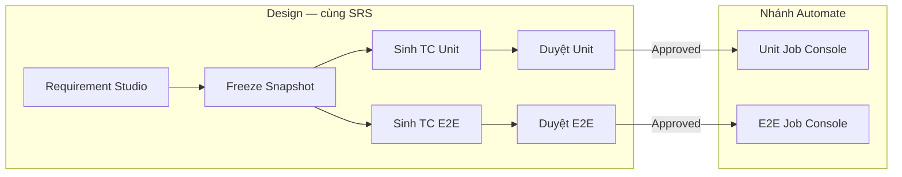

# AITest — Yêu cầu Input & Phân loại Test Case (Unit / E2E) + UX Flow

| | |
|--|--|
| **Vai trò** | Product requirements: input đầu vào, phân loại TC tại Requirement, UX Automate |
| **Đồng bộ với** | [`docs/E2E_TEST_ENGINE.md`](docs/E2E_TEST_ENGINE.md) · [`docs/UNIT_TEST_ENGINE_UX.md`](docs/UNIT_TEST_ENGINE_UX.md) · [`docs/AITEST_OUTPUT_LAYOUT.md`](docs/AITEST_OUTPUT_LAYOUT.md) · [`E2E_TESTING_AI_CLI_PLAN.md`](E2E_TESTING_AI_CLI_PLAN.md) |
| **Sản phẩm** | AITest Desktop — Design (Requirement Studio) → Automate (Unit Engine / E2E Engine) |
| **Ngày** | 2026-07-28 |

---

## 1. Câu trả lời ngắn: sinh code test từ đâu?

**Có — nhưng trong AITest không phải “prompt tự do + crawler trang web”.**

Công thức SoT:

```text
INPUT  = Approved Test Case (ý định) + Context kỹ thuật phù hợp loại test
OUTPUT = Mã test dưới AItest/{Kind}/… + chạy sandbox + sync báo cáo PostgreSQL
```

| Loại | Ý định (TC) | Context kỹ thuật | Output |
|------|-------------|------------------|--------|
| **Unit** | Hành vi 1 hàm/class/API handler | Source file (SUT) + context packet / related files | `AItest/UnitTest/{Module}/…` |
| **E2E** | User journey qua UI (nhiều màn) | Target URL + DOM/source inspect + (tuỳ chọn) storageState | `AItest/E2ETest/{Module}/pages|specs/…` |

AI CLI / API chỉ **Generate** khi TC đã **Approved** (BR-03). Không generate code từ chat Requirement Studio trực tiếp.

---

## 2. Chu trình sản phẩm AITest (IA)

```text
┌─────────────── Design ───────────────┐     ┌──────────── Automate ────────────┐
│ Requirement Studio                   │     │ /unit-test  → Unit Job          │
│  Docs → Knowledge → Freeze Snapshot  │────▶│ /e2e-test   → E2E Job           │
│  → Generate TC → Review → Approve    │     │ /activity   → Job Board         │
└──────────────────────────────────────┘     └─────────────────────────────────┘
                         │
                         ▼
                   PostgreSQL SoT
         (TC, workspace_runs, verify, reports)
```

**Sidebar Automate:** Unit test · E2E test · Chạy test.

---

## 3. Phân loại Test Case tại Requirement

Khi sinh / duyệt TC trong Requirement Studio, **gán `type` (và module) rõ** để Desktop route đúng engine.

### 3.1 Quy tắc phân loại

| Tiêu chí | → **Unit** | → **E2E** |
|----------|------------|-----------|
| Phạm vi | 1 module/hàm/service, không cần mở trình duyệt | Nhiều bước UI, điều hướng trang, form thật |
| Assert | Giá trị trả về, exception, mock dependency | URL, toast, bảng, nút enabled, trạng thái UI |
| Dữ liệu | Fixture/mock trong test | App đang chạy (`targetUrl`), có thể cần login |
| `type` gợi ý | `Unit`, `Functional` (hẹp), `API` (handler) | `E2E`, `UI`, `Journey`, `End-to-End` |
| Output folder | `AItest/UnitTest/` | `AItest/E2ETest/` |
| CTA sau Approve | **Chạy Unit Job** | **Chạy E2E Job** |

**Không nên:** một TC vừa “kiểm tra validate email ở service” vừa “user đăng nhập trên UI” — tách 2 TC (Unit + E2E).

### 3.2 Ví dụ cùng một Requirement: *“Quản lý Todo — API Backend + UI”*

#### A. Test Case kiểu **Unit** (ví dụ)

| Trường | Giá trị |
|--------|---------|
| **Title** | `getAllTodos` trả về danh sách rỗng khi DB không có bản ghi |
| **Type** | `Unit` |
| **Module** | `Todos` |
| **Precondition** | Repository được mock trả `[]` |
| **Steps** | 1. Gọi `TodoService.getAll()` · 2. Không ném exception |
| **Expected** | Trả về mảng rỗng; không gọi HTTP thật |
| **Test data** | — |
| **Engine** | `/unit-test` · cần **source** `todo.service.ts` |

| Trường | Giá trị |
|--------|---------|
| **Title** | Validate title Todo: chuỗi trống → lỗi validation |
| **Type** | `Unit` |
| **Module** | `Todos` |
| **Steps** | 1. Gọi `createTodo({ title: "" })` |
| **Expected** | Throw / trả `ValidationError` với message chứa “title” |
| **Engine** | Unit Job + SUT DTO/validator |

#### B. Test Case kiểu **E2E** (ví dụ)

| Trường | Giá trị |
|--------|---------|
| **Title** | Người dùng xem danh sách Todo sau khi mở trang Todos |
| **Type** | `E2E` |
| **Module** | `Todos` (hoặc `Yêu cầu API Backend` nếu map theo topic Studio) |
| **Precondition** | App FE chạy tại Target URL; (tuỳ chọn) đã login / có `storageState` |
| **Steps** | 1. Mở `/todos` · 2. Chờ bảng/list hiển thị · 3. Kiểm tra tiêu đề trang |
| **Expected** | Thấy heading “Todos”; list visible (có thể empty state) |
| **Test data** | `baseURL=http://localhost:3000` |
| **Engine** | `/e2e-test` · **không** bắt buộc gắn 1 file SUT Unit |

| Trường | Giá trị |
|--------|---------|
| **Title** | Thêm Todo mới qua UI và thấy item trong danh sách |
| **Type** | `E2E` / `Journey` |
| **Module** | `Todos` |
| **Steps** | 1. Mở `/todos` · 2. Nhập title · 3. Bấm Thêm · 4. Thấy item mới |
| **Expected** | Item hiển thị đúng title; không còn empty state |
| **Engine** | E2E Job → POM `todos.page.ts` + `add-todo.spec.ts` |

#### C. Test Case **không** nên nhầm loại

| TC (sai) | Vì sao sai | Sửa |
|----------|------------|-----|
| Type=`E2E`, steps chỉ “gọi GET /api/todos expect 200” | Không có thao tác UI | Đổi `API`/`Unit` hoặc viết lại steps UI |
| Type=`Unit`, steps “mở Chrome, click Đăng nhập” | Cần browser | Đổi `E2E` |
| Title tiếng Việt journey nhưng type=`Functional` chung chung | Desktop khó filter E2E | Đặt `type=E2E` hoặc tag Journey |

### 3.3 Mapping field TC → Engine (SoT)

| Field TC (PG) | Unit dùng | E2E dùng |
|---------------|-----------|----------|
| `title`, `steps`, `expected_result` | Prompt generate unit | Prompt generate POM/spec |
| `module` | Folder dưới `UnitTest/` | Folder dưới `E2ETest/` |
| `type` | Filter / planProfile unit | Filter `isE2eTc` trên `/e2e-test` |
| `precondition`, `test_data` | Setup/mock hints | Auth, URL, seed hints |
| `review_status=Approved` | Bắt buộc trước Generate | Bắt buộc trước Generate |

---

## 4. Input đầu vào — đồng bộ hệ thống thực tế

Không còn mô hình “crawler + Excel + Figma visual” như SoT MVP. Input theo **nhóm đã ship / roadmap**.

### 4.1 Nhóm chung (cả Unit & E2E)

| Input | Nguồn trong AITest | Bắt buộc |
|-------|-------------------|----------|
| Project + AI Ready (API Key / AI CLI) | Settings AI · `AiBackendConnection` | Có |
| Project root (local path) | Source root bar / workspace path map | Có (chạy job) |
| Approved Test Case | Requirement Studio → Review | Có |
| Module | TC.module | Khuyến nghị |

### 4.2 Input riêng **Unit**

| Input | Nguồn | Ghi chú |
|-------|-------|---------|
| Source under test | Context packet / Agent retrieve / workspace | Path + nội dung SUT |
| Related sources | Packet / IDE boost (opt) | Import graph |
| Stack inspect | `ProjectInspector` | jest/vitest/pytest… |
| Compile / test / coverage commands | Inspect + user override | VerifyApplyConsole |

### 4.3 Input riêng **E2E** (MVP Playwright TS)

| Input | Nguồn UI `/e2e-test` | API | Ghi chú |
|-------|---------------------|-----|---------|
| **Target URL** | Ô Target URL | `targetUrl` | VD `http://localhost:3000` |
| **DOM / interactive map** | Tự gọi Inspect trước Generate | `POST /e2e-inspect` → `domSnapshot` | HTML tĩnh hoặc parse FE source |
| **FE source (tuỳ chọn)** | workspace / paste | `sourceCode` / paths | Bổ sung khi URL chưa render đủ |
| **storageState** | Checkbox fixtures | `storageStateRel` | Bypass login lặp |
| **seed / teardown** | Ô lệnh optional | `seedCommand`, `teardownCommand` | Host chạy trước/sau |
| **Viewport / visual baseline / throttling** | — | — | **Ngoài MVP** (xem §8) |

### 4.4 Output chuẩn

```text
[{pkg}/]AItest/
├── UnitTest/{Module}/….test.*
├── E2ETest/{Module}/
│   ├── pages/*.page.ts
│   ├── specs/*.spec.ts
│   ├── fixtures/          # storageState.json…
│   └── playwright.config.ts
├── Reports/ · Coverage/ · Metadata/
```

---

## 5. Pipeline kỹ thuật (đã map code)

### Unit (đã ship U0–U5)

```text
Approved TC → Chạy Unit Job → Staging → Verify (+ Auto-Repair ≤3)
  → Coverage sync → PG → Apply AItest/UnitTest/ → cleanup staging
```

### E2E (E0–E5 MVP)

```text
Approved TC (e2e) → Target URL + project root → Chạy E2E Job
  → Inspect → Generate POM+Spec → Headless (+ Auto-Heal ≤3)
  → Artifact sync (path video/trace) → PG → files dưới AItest/E2ETest/
```

| Phase | Việc | Module chính |
|-------|------|--------------|
| E1 | Inspect | `e2e_dom_inspector` · `POST /e2e-inspect` |
| E2 | Generate | `generate_e2e` · AI CLI chat multi-file |
| E3 | Env | storageState · seed/teardown |
| E4 | Run + heal | `e2e_orchestrator` · `POST /e2e-sandbox-repair` |
| E5 | Artifacts | `e2e_artifact_sync` · `POST /e2e-artifacts-sync` |

---

## 6. UX / UI — ý tưởng & thiết kế flow trải nghiệm

Mục tiêu: **một Requirement → nhiều TC đã phân loại → một cú bấm Job đúng engine**, trạng thái pipeline luôn đọc được, lỗi Windows/Playwright không “im lặng”.

### 6.1 North-star UX (song song Unit)

Giống Unit Engine: **Job Console theo pipeline strip**, không dashboard dày.

```text
[ Chọn TC Approved ] [ Env tối thiểu ] [ Chạy Job ]
        │
        ▼
 Inspect → Generate → Headless → Heal → Artifacts → Apply
        │
        ▼
 File list (POM/Spec) · Log · Link report / mở folder artifacts
```

### 6.2 Flow trải nghiệm đề xuất (end-to-end người dùng)



**Bước người dùng (E2E):**

1. **Requirement** — Freeze → chọn **E2E** (+ Target URL) → Generate → lọc/duyệt E2E.
2. **Deep-link** từ Review: nút *Chạy E2E Job* → `/e2e-test?testCaseId=…` (mirror Unit).
3. **Gate sẵn sàng** (banner): project root · AI Ready · Target URL · (app đang chạy?).
4. **Chạy E2E Job** — pipeline strip chạy tuần tự; mỗi phase có trạng thái Pass / Skip / Fail + thời gian.
5. **Kết quả** — danh sách file; nếu Fail: log Playwright + lần heal; artifacts paths; CTA *Mở folder test-results* / *Xem report*.

**Bước người dùng (Unit):** giữ VerifyApplyConsole hiện tại — không trộn form Target URL vào Unit.

### 6.3 Phân bố màn hình (wireframe ý tưởng)

**A. Requirement — Tạo TC + Review**

- Tab **Tạo test case:** Segmented Unit | E2E; E2E bắt buộc Target URL (+ auth/module tuỳ chọn).
- Tab **Duyệt:** filter Segmented Tất cả | Unit | E2E; cột Engine; sau Approve CTA Job theo type.

**B. E2E Job Console (`/e2e-test`) — layout đề xuất**

| Vùng | Nội dung | Ghi chú UX |
|------|----------|------------|
| **Top bar** | Project · root path · AI status | Cùng Source root với Unit |
| **Trái / trên** | Select TC (filter type E2E) · Module | Search theo title |
| **Env card** | Target URL · storageState · seed/teardown | Thu gọn “Nâng cao” cho seed |
| **Pipeline strip** | 6 bước như hiện tại, **clickable** xem log phase | Fail → highlight phase đỏ |
| **Primary CTA** | **Chạy E2E Job** | Disabled + lý do nếu thiếu URL/root |
| **Kết quả** | Tabs: Files · Log · Artifacts | Không nhét video player MVP — chỉ path + mở OS |
| **Heal** | Chip “Đã heal N lần” khi PASS sau repair | Copy Unit Auto-Repair |

**C. Empty / error states (quan trọng)**

| Tình huống | UI |
|------------|-----|
| `elements=0` sau Inspect | Warning: “App chưa chạy hoặc HTML tĩnh rỗng — vẫn Generate từ TC; khuyến nghị bật FE / thêm source” |
| Playwright / `npx` lỗi Windows | Error rõ: loại exception + gợi ý cài `@playwright/test`, không message rỗng |
| TC không phải E2E | Empty select + link “Đổi type tại Review” |
| PASS | Toast ngắn + focus tab Files |

### 6.4 Nguyên tắc thiết kế UI (khớp rule sản phẩm)

- **Một việc / một section:** Env · Pipeline · Kết quả tách bạch.
- **Brand/IA:** Automate = Unit + E2E ngang hàng trên sidebar; không tạo “E2E Studio” thứ hai trong Design.
- **Ít card:** form env phẳng; pipeline là strip, không dashboard KPI.
- **Mirror Unit:** cùng ngôn ngữ “Job”, “Heal/Repair”, “Apply”, “Artifacts/Coverage sync”.
- **Tiếng Việt** trên CTA và empty state; log kỹ thuật giữ nguyên tiếng Anh từ Playwright.

### 6.5 Roadmap UX (sau MVP console hiện tại)

| Ưu tiên | Việc |
|---------|------|
| P0 | Deep-link từ Review TC E2E; gate banner rõ; error message không rỗng |
| P1 | Tab Files preview POM/Spec + mở IDE opt-in | **Done** (EX5) |
| P2 | E2E Job Board tab cạnh Unit Jobs (`/activity`) |
| P3 | Live highlight browser (DevTools) — ngoài MVP |
| P4 | Visual baseline / viewport matrix — ngoài MVP |

---

## 7. Checklist QA khi viết TC trong Requirement

- [ ] Mỗi TC chỉ phục vụ **một** engine (Unit *hoặc* E2E).
- [ ] `type` đúng: `Unit` / `E2E` (tránh `Functional` chung nếu sẽ chạy E2E).
- [ ] `module` ngắn (1–2 segment) — path `AItest/…/{Module}/`.
- [ ] Unit: steps nói về **hàm/API/state**, có thể chỉ SUT.
- [ ] E2E: steps nói về **màn hình / click / fill / URL**; ghi precondition URL hoặc login.
- [ ] Approved trước khi bấm Job.
- [ ] E2E: FE (hoặc staging) đang listen đúng Target URL trước Headless.

---

## 8. Ngoài phạm vi (cố ý không đưa vào MVP AITest)

- Cypress / Selenium / Appium adapters  
- Visual pixel-diff / Figma baseline  
- Network throttling / multi-device matrix  
- Natural-language prompt thay thế Approved TC  
- Upload binary video vào PostgreSQL (chỉ metadata + path)  
- Web crawler tự sinh TC không qua Requirement Studio  

---

## 9. Tóm tắt

| Câu hỏi | Trả lời trong AITest |
|---------|----------------------|
| Sinh code từ TC + code? | **Có** — TC Approved + context đúng loại (SUT *hoặc* URL/DOM) |
| Phân loại ở đâu? | **Requirement** — field `type` (+ module) trước Approve |
| Unit vs E2E? | Unit = logic/SUT · E2E = journey UI + Target URL |
| UX chính? | Hai Job Console mirror nhau; deep-link từ Review; pipeline strip + error rõ |

**Công thức vận hành:**

```text
Requirement (phân loại TC)
  → Approve
  → Unit Job  |  E2E Job
  → AItest/UnitTest  |  AItest/E2ETest
  → Báo cáo PostgreSQL
```

---

## 10. Phases triển khai (Implementation Roadmap)

Trạng thái: **E0–E5 skeleton đã có code** (API + console mỏng `/e2e-test`). Các phase dưới đây là **lộ trình đóng sản phẩm** — làm tuần tự, mỗi phase có DoD rõ.

```text
[Done] E0 Docs/API skeleton
[Done] E1–E5 Inspect · Generate · Env · Sandbox · Artifacts (MVP)
   │
   ▼
 XP0 Stabilize (Windows / lỗi rỗng / Playwright)
   → R1 Requirement: phân loại TC + CTA
   → [Done] EX1 E2E Console UX parity Unit
   → [Done] EX2 WorkspaceRun + Job Board E2E
   → [Done] EX3 Staging Apply / cleanup
   → [Done] EX4 Batch E2E + Inspect+ (Playwright render · meta · report open)
   → [Done] EX5 Polish (preview · IDE opt-in · UX SoT)
   → (Later) Visual / multi-browser
```

### Tổng quan

| Phase | Tên | Mục tiêu | Ước lượng | Phụ thuộc |
|-------|-----|----------|-----------|-----------|
| **E0–E5** | Skeleton | API + orchestrator + page tối thiểu | **Done** | — |
| **XP0** | Stabilize | Job Headless chạy được trên Windows; error message đủ đọc | **Done** (2026-07-28) | E4 |
| **R1** | Requirement typing | TC phân loại Unit/E2E tại Studio + deep-link CTA | **Done** (2026-07-28) | Docs §3 |
| **EX1** | E2E Console UX | Gate banner, pipeline/log/artifacts tabs, empty states | **Done** (2026-07-28) | XP0 |
| **EX2** | Job Board E2E | `workspace_runs.test_type=e2e` + tab Activity | **Done** (2026-07-28) | EX1 |
| **EX3** | Staging & Apply | Overlay `.ai-test` → Apply `AItest/E2ETest` + cleanup | **Done** (2026-07-28) | EX1 |
| **EX4** | Batch & Inspect+ | Nhiều TC E2E; inspect giàu hơn (Playwright render) | **Done** (2026-07-28) | EX2–EX3 |
| **EX5** | Polish | Preview file, IDE open opt-in, copy heal chip | **Done** (2026-07-28) | EX1 |
| **LATER** | Visual / matrix | Viewport, baseline — **ngoài MVP** | — | EX4 |

---

### Phase XP0 — Stabilize Headless (P0 kỹ thuật) — **DONE 2026-07-28**

**Vấn đề đã gặp:** `e2e sandbox repair failed:` (message rỗng) — Windows `SelectorEventLoop` + `npx.cmd`.

| # | Việc | DoD | Status |
|---|------|-----|--------|
| XP0.1 | Reuse `resolve_command` + sync/Popen fallback trong `e2e_orchestrator` | `npx playwright` chạy được trên Win | Done |
| XP0.2 | `exc_detail` trong route `/e2e-sandbox-repair` | Client luôn thấy type exception | Done |
| XP0.3 | `check_playwright_ready` + hint cài `@playwright/test` | Fail fast có hướng dẫn | Done |
| XP0.4 | Cwd = thư mục chứa `playwright.config.ts` | Spec relative `specs/…` | Done |
| XP0.5 | Regression tests XP0 | pytest pass | Done |

**Exit:** Một TC E2E Approved chạy hết pipeline trên Windows (PASS hoặc FAIL có log Playwright thật / hint cài rõ).

---

### Phase R1 — Requirement: phân loại TC + CTA — **DONE 2026-07-28**

| # | Việc | DoD | Status |
|---|------|-----|--------|
| R1.1 | UI Review: cột Engine chip `Unit` \| `API` \| `E2E` | QA thấy engine trước Duyệt | Done |
| R1.2 | Prompt Generate-TC: tách Unit vs E2E | Rules + system_prompt + session_pool | Done |
| R1.3 | Sau Approve: CTA **Chạy Unit/E2E Job** theo type | `ReviewQueuePanel` + Requirements card | Done |
| R1.4 | Tooltip + form type options | `TC_TYPE_OPTIONS` · `ENGINE_TOOLTIP` | Done |
| R1.5 | Normalize type on approve | `normalize_engine_type` Journey/UI→E2E | Done |
| R1.6 | Tách luồng Sinh/Duyệt Unit \| E2E (cùng SRS) | Unit = generate cũ; E2E = URL + `preferredEngine=e2e`; Review filter | Done |

**Code:** `desktop/src/lib/testEngine.ts` · `FreezePanel.tsx` · `ReviewQueuePanel.tsx` · `vietnamese_labels.py` · `tc_generation_rules.py` · `job_context_stash.py` · `jobs.py`

---

### Phase EX1 — E2E Job Console UX (parity Unit) — **DONE 2026-07-28**

| # | Việc | DoD | Status |
|---|------|-----|--------|
| EX1.1 | Gate banner: root · AI Ready · Target URL · “FE đang chạy?” | CTA disabled + lý do tiếng Việt | Done |
| EX1.2 | Pipeline strip: trạng thái từng phase + duration; click xem log phase | Fail highlight đỏ | Done |
| EX1.3 | Tabs **Files / Log / Artifacts** | Không chỉ 1 textarea | Done |
| EX1.4 | Empty: Inspect 0 elements → warning rõ (§6.3.C) | Vẫn cho Generate | Done |
| EX1.5 | Chip “Đã heal N lần” khi PASS sau repair | Mirror Unit Auto-Repair | Done |
| EX1.6 | Source root bar trên E2E page (reuse component Unit) | Không bắt user sang Unit để gắn path | Done |

**Code:** `E2ETestPage.tsx` · `E2eGateBanner.tsx` · `E2ePipelineStrip.tsx` · `E2eResultTabs.tsx` · `e2eJobState.ts`

**Exit:** Console đủ dùng hàng ngày cho 1 TC; lỗi/empty không “bí”.

---

### Phase EX2 — WorkspaceRun + E2E Job Board — **DONE 2026-07-28**

| # | Việc | DoD | Status |
|---|------|-----|--------|
| EX2.1 | Mỗi E2E Job ghi `WorkspaceRun` (`test_type=e2e`) + verify summary | SoT PG giống Unit | Done |
| EX2.2 | Activity: tab **E2E Jobs** (hoặc filter loại) | List run, status, link lại console | Done |
| EX2.3 | Campaign/module batch metadata (tối thiểu 1 module) | “Chạy lại module” deep-link | Done |

**Code:** `e2eWorkspace/auditSync.ts` · `E2ETestPage` · `JobsPage` · `audit.py` (`testType` / `kind` filter)

**Exit:** Lead/QA xem lịch sử E2E trên `/activity?tab=e2e-jobs` không cần đọc log máy local.

---

### Phase EX3 — Staging Apply & cleanup — **DONE 2026-07-28**

**Choice documented:** staging-first + Apply confirm. Sandbox may write `AItest/` for heal; FE snapshots → rollback → user **Apply** from `.ai-test/workspace/{runId}/overlay` → path jail `AItest/E2ETest/` → cleanup staging.

| # | Việc | DoD | Status |
|---|------|-----|--------|
| EX3.1 | Staging dưới `{pkg}/.ai-test/workspace/{runId}/` trước Apply | Mirror Unit staging | Done |
| EX3.2 | Apply gate: checklist path `AItest/E2ETest/…` | Path jail | Done |
| EX3.3 | Cleanup staging sau Apply thành công | Không để rác overlay | Done |
| EX3.4 | Không ghi đè production ngoài AItest | Assert path jail | Done |

**Code:** `e2eWorkspace/stagingApply.ts` · `E2ETestPage` Apply CTA · `assert_e2e_aitest_target_rel` · `E2EOrchestrator.write_files`

**Exit:** Flow Apply giống Unit; sandbox heal ghi tạm + rollback; Apply confirm ghi thật.

---

### Phase EX4 — Batch Jobs & Inspect nâng cấp — **DONE 2026-07-28**

| # | Việc | DoD |
|---|------|-----|
| EX4.1 | Batch: chọn nhiều TC E2E trong module → queue Generate/Headless | Pause/resume cơ bản | Done |
| EX4.2 | Inspect: optional Playwright Chromium render (không chỉ HTTP GET tĩnh) | `elements > 0` trên SPA | Done |
| EX4.3 | Lưu `targetUrl` / env theo project meta | Không nhập lại mỗi lần | Done |
| EX4.4 | Báo cáo HTML Playwright link từ Artifacts tab | Mở folder / open path | Done |

**Exit:** Module Todos chạy batch E2E; Inspect hữu ích với React SPA.

---

### Phase EX5 — Polish — **DONE 2026-07-28**

| # | Việc | DoD | Status |
|---|------|-----|--------|
| EX5.1 | Preview nội dung POM / Spec trong tab Files | Read-only | Done |
| EX5.2 | “Mở trong IDE” opt-in (không block job) | Giống Unit deprecate-happy-path | Done |
| EX5.3 | Docs UX SoT: `docs/E2E_TEST_ENGINE_UX.md` (mirror UNIT_TEST_ENGINE_UX) | Phase checklist shipped | Done |

**Exit:** Trải nghiệm gần parity Unit U5.

---

### Later (không lên sprint MVP)

- Visual baseline / Figma diff  
- Multi-browser matrix / throttling  
- Cypress·Selenium adapters  
- Live canvas highlight chuột  

---

### Thứ tự sprint gợi ý

| Sprint | Phases | Kết quả người dùng |
|--------|--------|-------------------|
| **S1** | XP0 + R1.3 (deep-link tối thiểu) | E2E Job chạy được trên Win; vào đúng TC |
| **S2** | R1 còn lại + EX1 | Phân loại TC + console dùng được |
| **S3** | EX2 + EX3 | Lịch sử PG + Apply sạch |
| **S4** | EX4 + EX5 | Batch + SPA inspect + polish |

### Definition of Done chung mỗi phase

- [ ] Docs phase cập nhật trạng thái (Done) trong file này hoặc `docs/E2E_TEST_ENGINE.md`
- [ ] Test tự động (pytest / node:test) cho logic mới
- [ ] Không phá Unit happy path
- [ ] Demo 1 luồng trên project mẫu (Todos hoặc app nội bộ)
