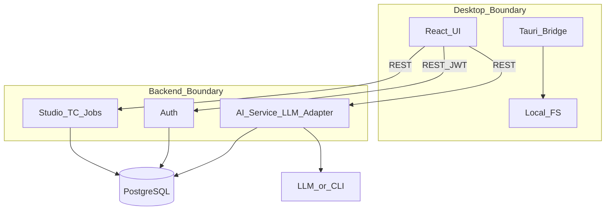
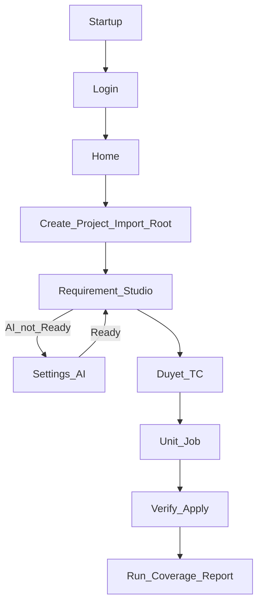
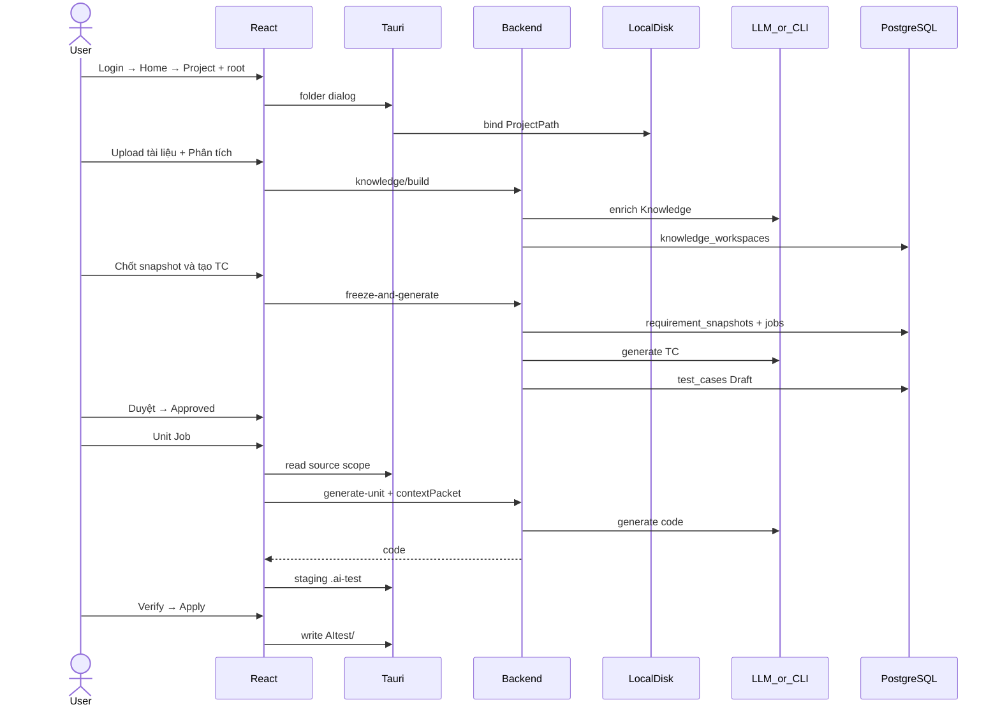

# AI Test Desktop Tool — Kiến trúc & Flow hệ thống

| | |
|--|--|
| **Sản phẩm** | AI Test Desktop Tool |
| **Version** | **12.0** |
| **Ngày** | 27/07/2026 |
| **Kiến trúc** | **Hybrid** — Desktop App (React + Tauri) + Python Backend (REST) + PostgreSQL |
| **Stack sản phẩm** | React + Tauri · Python FastAPI · PostgreSQL · LLM Adapter (API Direct / AI CLI) |
| **Stack dự án người dùng** | **Không ràng buộc** — C#, TypeScript, Python, Go, Java, … |
| **AI** | LLM Adapter — gọi từ **Backend** (`API_DIRECT` hoặc `AI_CLI`) |
| **Client chính** | Desktop App trên PC |

> AITest **không hardcode** toolchain repo khách. **Design:** Requirement Studio (Tài liệu → Phân tích → Snapshot → Test Case → Duyệt). **Automate:** Unit Job từ TC **Approved** + project root **local** (staging `.ai-test/` → Verify → Apply `AItest/`). Backend **không** đọc filesystem máy user và **không** lưu snapshot full repo trên PostgreSQL.

---

## 0. Quyết định kiến trúc

**Nguyên tắc:** Desktop là nơi làm việc hàng ngày; Backend tập trung dữ liệu, Auth và gọi AI; PostgreSQL là Source of Truth (SoT).

| Tầng | Trách nhiệm | Không làm |
|------|-------------|-----------|
| **Desktop (React + Tauri)** | UI Design/Automate/Insight, đọc/ghi source local, staging/verify/apply, chạy test | Lưu SoT dài hạn; **không** gọi LLM vendor trực tiếp |
| **Python Backend (REST)** | Auth, Project, Requirement Studio, TestCase, AI Service, Job, Report meta | **Không** đọc filesystem máy user |
| **PostgreSQL** | Project, Workspace Requirement, Knowledge, Snapshot, TC, Job, Execution, Coverage, Connection | Snapshot / full repo source |
| **LLM** | Sinh TC / mã unit / Phân tích Knowledge (qua Adapter) | Persist dữ liệu Platform |

```text
                    AI Test Desktop App
        ┌─────────────────────────────────────┐
        │  React — Design · Automate · Insight │
        └──────────────────┬──────────────────┘
                           │ IPC
        ┌──────────────────▼──────────────────┐
        │  Tauri (Native Bridge — Rust)       │
        │  Folder Dialog · FS · Process       │
        └──────────────────┬──────────────────┘
                           │ REST + JWT
        ┌──────────────────▼──────────────────┐
        │  Python Backend                     │
        │  Auth · Studio · TC · AI · Jobs     │
        └──────────────────┬──────────────────┘
              ┌────────────┴────────────┐
              ▼                         ▼
        PostgreSQL          OpenAI / Anthropic / Gemini / Ollama / AI CLI
```

**Vì sao hybrid**

| Nhu cầu | Xử lý tại |
|---------|-----------|
| Đọc `D:\Project\…`, staging, Apply `AItest/`, spawn lệnh test | **Desktop (Tauri)** |
| User, Requirement Studio, TC, Job, báo cáo tập trung | **Backend + PostgreSQL** |
| Gọi AI (API Key / CLI, Prompt, audit) | **Backend** |
| QA / Dev / Lead máy khác cùng thấy TC | **PostgreSQL** qua API |

---

## 1. Tổng quan hệ thống

```text
┌─────────────────────────────────────────────────────────────┐
│  Desktop App (máy QA / Dev / Lead)                          │
│  React (UI)  ◄──►  Tauri — FS · Dialog · Process            │
└────────────┬────────────────────────────┬───────────────────┘
             │ REST + JWT                  │ Local Disk
             ▼                             ▼
┌────────────────────────┐      ProjectPath (source + .ai-test + AItest/)
│  Python Backend        │
└───────────┬────────────┘
            ├──────────────► PostgreSQL
            └──────────────► LLM (API Direct hoặc AI CLI)
```

| Thành phần | Công nghệ | Vai trò |
|------------|-----------|---------|
| Desktop UI | React (Vite) | Màn hình, điều hướng, gọi REST |
| Native Bridge | **Tauri (Rust)** | Folder dialog, filesystem, spawn lệnh test |
| Backend | Python FastAPI | REST API, domain, AI Service |
| DB | PostgreSQL | SoT tập trung |
| AI | Providers + CLI adapters | Qua `api/app/llm/` + `ai_service` |

Desktop là **client chính**. Backend là API server — **không** thay việc chạy test trên máy Dev.

### 1.1 IA sản phẩm (sidebar)

| Nhóm | Mục | Route chính |
|------|-----|-------------|
| **Design** | Home · Projects · **Requirement** | `/`, `/projects`, `/requirement` |
| **Automate** | **Unit test** · Chạy test | `/unit-test`, `/run` |
| **Insight** | Báo cáo · Unit Jobs · **Cấu hình AI** | `/reports`, `/activity`, `/settings/ai` |

Happy path: **Requirement Studio** → **Duyệt TC** → **Unit Job** (Local FS + AI).  
**IDE bridge** không thuộc happy path (viewer / plugin tuỳ chọn).

---

## 2. Phân tách trách nhiệm Desktop vs Backend

### 2.0 Tauri — Native Bridge

| Chức năng | Mô tả |
|-----------|-------|
| **Folder Dialog** | Chọn project root |
| **File System** | Đọc source, ghi staging / Apply `AItest/` |
| **Run Test** | Spawn `npm test`, `pytest`, `dotnet test`, … |
| **Coverage / Export** | Đọc artifact local, export báo cáo |

```text
React (UI)  ──invoke──►  Tauri Command (Rust)  ──►  OS / Filesystem / Process
```

### 2.1 Desktop

| Module | Việc |
|--------|------|
| Auth UI | Login, JWT |
| Project / Import | Tạo Project, gắn ProjectPath, detect stack |
| **Requirement Studio** | Upload tài liệu, Phân tích, Freeze & tạo TC, Duyệt |
| **Unit Engine** | Scope Local FS → Generate → Staging → Verify → Apply |
| Test Runner / Coverage / Report | Chạy lệnh, parse, upload meta |
| Settings AI | Lazy — khi Generate / Phân tích mà AI chưa Ready |

**Quy tắc:** Source luôn trên máy user. Desktop build **context packet** gửi kèm job Unit. Backend không truy cập disk.

### 2.2 Backend

| Service | Việc |
|---------|------|
| Auth | Login, JWT, User |
| Project | CRUD metadata (`language`, `framework`, `meta.syncedAt`, …) |
| **Requirement Studio** | Workspace, File, Chunk, Knowledge, Snapshot, Freeze, Generate TC |
| TestCase | Draft → Approved / Rejected |
| AI Service | Điều phối TC / Unit / Knowledge qua Adapter |
| Jobs / Reporting | Job status, Execution, Coverage meta |

### 2.3 Boundary Matrix

| Thành phần | Chỉ làm | Không làm |
|------------|---------|-----------|
| Desktop (React) | UI, REST, trạng thái | Gọi LLM vendor trực tiếp |
| Tauri | Dialog, FS local, spawn test | Lưu SoT nghiệp vụ |
| Backend | Auth, domain, Prompt, LLM Adapter | Đọc FS máy user |
| PostgreSQL | SoT domain + audit | Chạy test / lưu full repo |
| LLM | Sinh nội dung theo prompt | Persist Platform |



---

## 3. Module chức năng

| # | Module | Chạy ở | Chức năng chính |
|---|--------|--------|-----------------|
| 1 | Home / Projects | Desktop + API | Tạo Project → Import / gắn root |
| 2 | **Requirement Studio** | Desktop + API | Tài liệu → Phân tích → Tạo TC → Duyệt |
| 3 | Unit Engine | Desktop + API | Generate unit → Staging → Verify → Apply `AItest/` |
| 4 | Run / Coverage / Report | Desktop + API | Spawn test, sync meta PG |
| 5 | Settings AI | Desktop + API | `API_DIRECT` \| `AI_CLI`, Verify → Ready |
| 6 | Unit Job Board | Desktop + API | Theo dõi campaign / run |

### 3.1 Hai phase độc lập

| Phase | Mục tiêu | Đầu vào | Đầu ra |
|-------|----------|---------|--------|
| **Design (Phase 1)** | Requirement → Test Case | Tài liệu upload + Phân tích (Knowledge) | Snapshot → TC Draft → **Approved** |
| **Automate (Phase 2)** | Approved TC → Unit | TC Approved + ProjectPath local + context packet | Staging → Verify → Apply `AItest/` |

```text
Design
  Requirement Workspace
    → Files (+ Chunk nội bộ)
    → Knowledge (Phân tích — LLM / heuristic)
    → Freeze Snapshot (tài liệu + Phân tích + TC đã có)
    → Job sinh TC → test_cases (Draft)
    → Duyệt → Approved

Automate
  Approved TC + Local FS
    → POST generate-unit (AI CLI hoặc API Direct)
    → .ai-test/workspace/{runId}/ (staging)
    → Verify (1 lệnh test batch hoặc từng job)
    → Apply → AItest/ · dọn staging
```

Legacy bảng **`sources`** + API `/requirements` vẫn tồn tại (compat / chủ đề cũ) — **SoT Design hiện tại** là **Requirement Studio** (`requirement_workspaces` và các bảng liên quan).

### 3.2 Journey Requirement (UI)

| Bước | Label UI | Ý nghĩa |
|------|----------|---------|
| `docs` | **Tài liệu** | Upload / parse file |
| `knowledge` | **Phân tích** | Dựng Knowledge (cần AI Ready) |
| `freeze` | **Tạo test case** | Chốt snapshot + sinh TC |
| `review` | **Duyệt test case** | Nháp → Đã duyệt |

### 3.3 AI runner

| `runner_mode` | Adapter | Dùng cho |
|---------------|---------|----------|
| `API_DIRECT` | `DirectAPIAdapter` + providers HTTP | OpenAI / Anthropic / Gemini / Ollama HTTP |
| `AI_CLI` | CLI adapters (Cursor / Gemini / Claude / Ollama / custom) | Khuyến nghị cho Unit + có thể dùng Phân tích / Sinh TC |

Code: `api/app/services/ai_service.py`, `api/app/llm/`.

---

## 4. Flow tổng thể

### 4.0 Cấu trúc

```text
Startup → Login → Home
  → Tạo Project + gắn project root (Tauri)
  → Design: Tài liệu → Phân tích → Tạo TC → Duyệt
       └─ AI chưa Ready? → Cấu hình AI (lazy) → Verify
  → Automate: Unit Job → Staging → Verify → Apply AItest/
  → Chạy test · Coverage · Report · Unit Jobs
```

### 4.1 UX chuẩn (không ép IDE)

```text
Open App → Login → Home
  → Tạo Project → Gắn project root
  → Requirement: upload tài liệu → Phân tích → Chốt snapshot & tạo TC → Duyệt
  → Unit test: TC Approved → Chạy Unit Job (từng TC / batch Requirement)
       → Staging Preview → Verify tất cả → Apply PASS
  → (tuỳ chọn) mở file trong IDE nếu plugin có
```



### 4.2 Design — Requirement Studio

```text
Upload files → (chunk nội bộ trên BE)
  → Phân tích: POST knowledge/build
       → validate AI Ready (FE redirect /settings/ai nếu chưa)
       → LLM hoặc heuristic → Knowledge Workspace
  → Tạo TC: freeze-and-generate
       → Snapshot bundle = tài liệu + Phân tích (+ TC đã có)
       → Job → LLM/CLI → test_cases Draft
  → Duyệt → Approved
```

Sinh TC **tổng hợp** output Phân tích + nội dung file (không chỉ Knowledge đơn thuần).

### 4.3 Automate — Unit Engine

**Điều kiện:** TC Approved, ProjectPath (Tauri), AI Ready.

```text
Generate (API / AI CLI) → overlay trong .ai-test/workspace/{runId}/
  → Verify: stage overlay → compile?/test → rollback staging
       Batch: một lệnh test cho toàn bộ unit đã sinh + log chung
  → Apply PASS → ghi AItest/ → cleanup staging
  → Discard: xóa gen + dọn staging (không đụng production src)
```

Tham chiếu UX: [`docs/UNIT_TEST_ENGINE_UX.md`](docs/UNIT_TEST_ENGINE_UX.md).

### 4.4 Settings AI — lazy

Không ép ngay sau Login. Kích hoạt khi **Phân tích** / **Generate** mà connection chưa `Ready`.

### 4.5 Run + Coverage + Report

```text
Tauri spawn lệnh test trong ProjectPath
  → Parse log / coverage local
  → Upload Execution + Coverage → Backend → PG
```

### 4.6 Sequence end-to-end



### 4.7 Vai trò × bước

| Bước | QA | Dev | Lead | Desktop | Backend |
|------|----|-----|------|---------|---------|
| Startup / Login | ✓ | ✓ | ✓ | UI | Auth |
| Project + root | ✓ | ✓ | | Tauri + UI | metadata |
| Requirement Studio | ✓ | | | UI | Studio + AI |
| Duyệt TC | ✓ | | ✓ | UI | PG |
| Unit Job / Verify / Apply | | ✓ | | Tauri + UI | AI |
| Run + Coverage + Report | | ✓ | ✓ | Tauri | meta PG |
| Cấu hình AI | ✓ | ✓ | ✓ | UI (lazy) | encrypt + verify |

### 4.8 Business Rules (tóm tắt)

| Rule | Quy tắc |
|------|---------|
| BR-01 | Chưa Login không gọi API nghiệp vụ |
| BR-02 | Phase Automate: chưa ProjectPath → không Unit / Verify-Apply |
| BR-03 | Chỉ TC **Approved** mới Unit Job |
| BR-04 | AI chưa Ready → không gọi LLM (Phân tích / Generate) |
| BR-05 | Không upload full repo; context packet giới hạn; PG không snapshot source |
| BR-06 | Backend không đọc FS máy user |
| BR-07 | API Key không trả plaintext sau khi lưu |
| BR-08 | Review: Draft → Approved / Rejected |
| BR-09 | Design: TC từ Snapshot (tài liệu + Phân tích), không phụ thuộc mã nguồn |
| BR-10 | Unit đi qua **workspace staging**; Apply `AItest/` sau Verify (khuyến nghị PASS) |
| BR-11 | Run Test: lệnh user hoặc gợi ý theo stack — không hardcode một runner |
| BR-12 | IDE bridge **không** bắt buộc trên happy path |

---

## 5. PostgreSQL (SoT)

### 5.1 Requirement Studio (chính — Design)

```text
Project
  └── requirement_workspaces
        ├── requirement_files
        ├── document_chunks
        ├── knowledge_workspaces
        ├── chat_sessions / chat_messages   (API; UI gộp vào Phân tích)
        └── requirement_snapshots
              └── test_cases (requirement_snapshot_id)
                    └── jobs
```

### 5.2 Domain khác

```text
Project
  ├── ai_backend_connections   (runner_mode, CLI fields, status)
  ├── sources                  (legacy Requirement text / topics)
  ├── test_cases
  ├── jobs
  ├── workspace_runs           (audit Unit local)
  ├── generation_campaigns / generation_tasks
  ├── executions · coverage · reports
  └── verify_reports / apply_audits
```

| Nhóm | Lưu |
|------|-----|
| Identity | User, auth |
| Project | metadata stack (`syncedAt`, …) — **không** source snapshot |
| Studio | Workspace, File, Chunk, Knowledge, Snapshot |
| TC / Job | test_cases, jobs |
| AI | AiBackendConnection |
| Automate audit | workspace_runs, verify/apply meta |
| Runtime | Execution, Coverage, Report |

---

## 6. Stack & tổ chức repo

### 6.1 Hai lớp stack

| Lớp | Nghĩa |
|-----|--------|
| **Stack sản phẩm** | React, Tauri, FastAPI, PostgreSQL, LLM/CLI |
| **Stack dự án** | Repo user — bất kỳ ngôn ngữ/framework |

Gợi ý path/lệnh: `desktop/src/lib/stackHints.ts` + prompt language-aware trên BE.

### 6.2 Cây repo

```text
AITest/
├── desktop/                 # React + Tauri
│   ├── src/
│   │   ├── features/        # home, requirement, unit-test, coverage, …
│   │   ├── pages/           # GenerateUnit, Settings, …
│   │   └── lib/unitWorkspace/
│   └── src-tauri/
├── api/
│   └── app/
│       ├── features/        # requirement_studio, workspace, coverage_board, …
│       ├── routers/         # auth, projects, jobs, generate_unit, …
│       ├── llm/             # providers + cli adapters
│       └── services/        # ai_service, …
├── docs/                    # UNIT_TEST_ENGINE_UX, PHASES, …
├── ide-plugins/             # tuỳ chọn — không happy path
├── docker-compose.yml
└── KIEN_TRUC_DU_AN.md
```

---

## 7. Unit workspace (local) — chi tiết

| Khái niệm | Path / hành vi |
|-----------|----------------|
| Staging | `{pkg?}/.ai-test/workspace/{runId}/` (`overlay/`, `manifest.json`) |
| Apply | `{pkg?}/AItest/` |
| Verify | Stage overlay → test → rollback; batch: `combinedBatchVerify` |
| Discard | Xóa file gen + dọn staging; không đụng `src` production |

Code: `desktop/src/lib/unitWorkspace/` (`verifyEngine`, `applyManager`, `discardManager`, `combinedBatchVerify`).

---

## 8. Auth & AI

| Quy tắc | Chi tiết |
|---------|----------|
| Startup | JWT hợp lệ → Home; không → Login |
| Token | Bearer JWT mọi REST nghiệp vụ |
| Settings AI | Lazy — Phân tích / Generate |
| Gọi LLM | **Chỉ Backend** |
| Runner | `API_DIRECT` \| `AI_CLI` trên connection |

---

## 9. Đa ngôn ngữ (stack-agnostic)

1. Import / scan marker đa hệ — không bắt buộc một SDK.  
2. Sync: Desktop giữ ProjectPath; PG giữ `language` / `framework` / `syncedAt`.  
3. Design: không gửi mã nguồn để sinh TC.  
4. Automate: Local FS + context packet giới hạn + AI CLI/API.  
5. Run / Coverage: lệnh + parser theo stack.  
6. Đa máy: TC/Studio trên PG dùng chung; ProjectPath **per máy**.

---

## 10. Exception Flow (tóm tắt)

| Lỗi | Xử lý chính |
|-----|-------------|
| AI chưa Ready | Banner / redirect Cấu hình AI |
| LLM / CLI timeout | Job fail + retry |
| Verify FAIL | Log batch / từng stage; Repair tuỳ chọn |
| Stack không nhận diện | User chỉnh language / framework / lệnh test |
| Backend down | Banner không kết nối |

---

## 11. Kết luận

```text
Startup → Login → Home → Project + root
  → Design: Tài liệu → Phân tích → Tạo TC → Duyệt
  → Automate: Unit Job → Staging → Verify → Apply AItest/
  → Run · Coverage · Report · Unit Jobs
```

- **Desktop** = Unit Test Engine + Requirement Studio UI (Tauri + React).  
- **Backend** = SoT domain + AI orchestration (API Direct / AI CLI).  
- **IDE** = tuỳ chọn, không SoT.  
- **Hai phase** tách QA (Design/TC) và Dev (Unit thực thi).

Tài liệu liên quan: [`docs/UNIT_TEST_ENGINE_UX.md`](docs/UNIT_TEST_ENGINE_UX.md), [`docs/PHASES_TRIEN_KHAI.md`](docs/PHASES_TRIEN_KHAI.md), [`KIEN_TRUC_HETHONG_TONG_QUAN.md`](KIEN_TRUC_HETHONG_TONG_QUAN.md).

---

## 12. Changelog kiến trúc tài liệu

### 12.1 v12.0 — Khớp hệ thống đang chạy (07/2026)

| # | Đã cập nhật | Vì sao |
|---|-------------|--------|
| 1 | **Requirement Studio** là SoT Design (Workspace → File → Knowledge → Snapshot → TC) | UI/API chính không còn xoay quanh `/requirements` + `sources` |
| 2 | Journey UI: **Tài liệu → Phân tích → Tạo test case → Duyệt** | Khớp `RequirementJourneyStrip` |
| 3 | Automate: staging `.ai-test` → Verify (batch log) → Apply **`AItest/`** | Khớp Unit Engine hiện tại |
| 4 | AI: `API_DIRECT` \| `AI_CLI`; Phân tích validate Ready → `/settings/ai` | Khớp Settings + Studio |
| 5 | IA sidebar Design / Automate / Insight; IDE **off** happy path | Khớp `Layout` + ReadyStrip |
| 6 | Rút gọn changelog cũ v9–v11; giữ nguyên tắc hybrid / BR cốt lõi | Doc ngắn, đúng hiện trạng |

### 12.2 Lịch sử ngắn (v10–v11)

- **v10:** stack-agnostic (sản phẩm vs dự án).  
- **v11:** hai phase; bỏ `sourceSnapshot` trên PG; workspace Unit + batch module.  
- **v12:** Studio + AI CLI + Apply `AItest/` làm SoT mô tả trong tài liệu này.
