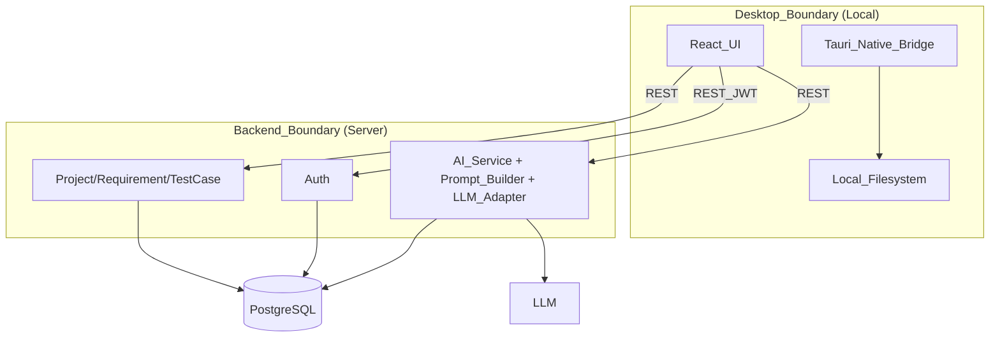
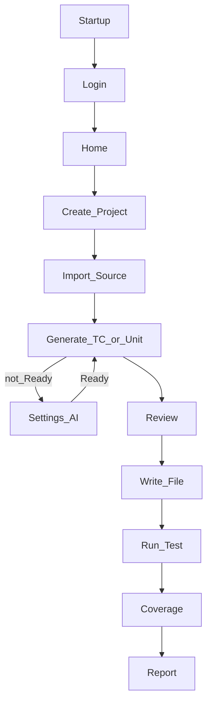
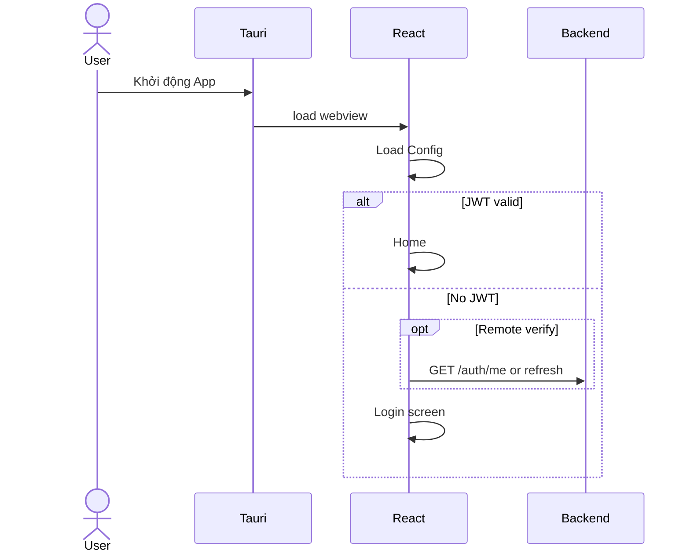
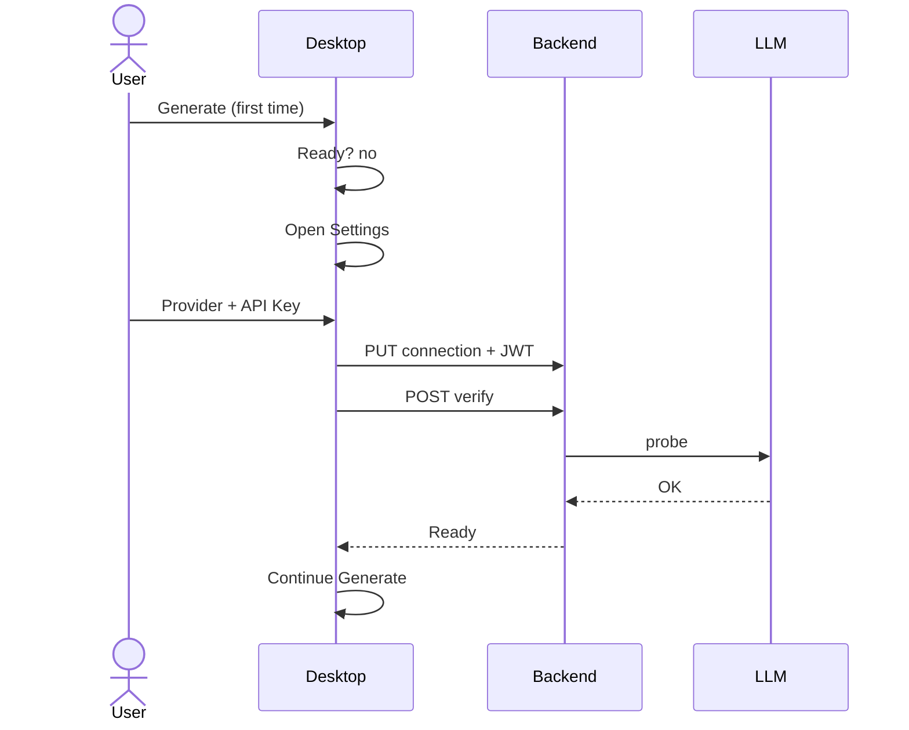
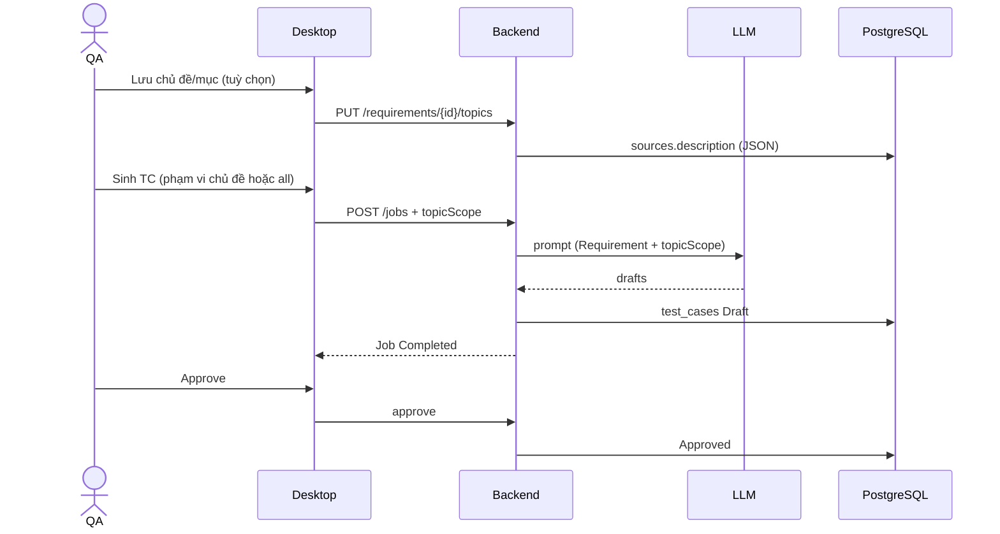
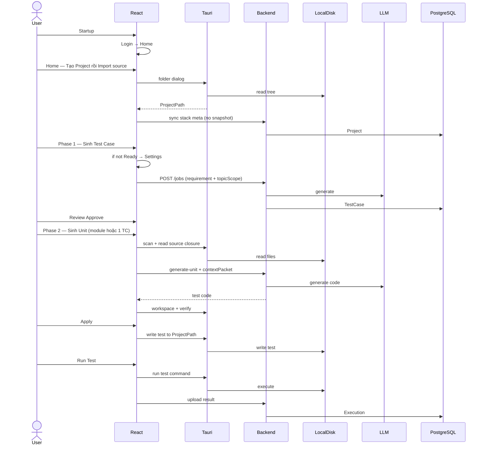
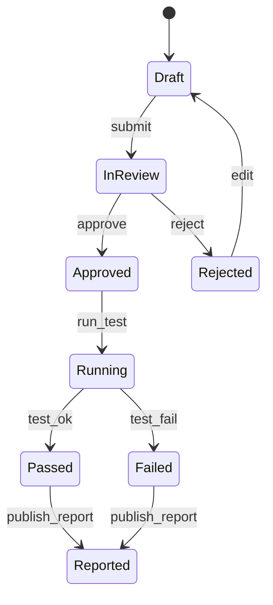

# AI Test Desktop Tool — Kiến trúc & Flow hệ thống

| | |
|--|--|
| **Sản phẩm** | AI Test Desktop Tool |
| **Version** | 11.0 |
| **Ngày** | 21/07/2026 |
| **Kiến trúc** | **Hybrid** — Desktop App (React + Tauri) + Python Backend (REST) + PostgreSQL |
| **Stack sản phẩm** | React + Tauri · Python FastAPI · PostgreSQL · LLM Adapter |
| **Stack dự án người dùng** | **Không ràng buộc** — C#, TypeScript, Python, Go, Java, … (đa ngôn ngữ) |
| **AI** | LLM Adapter (OpenAI / Anthropic / Gemini / …) — gọi từ **Backend** |
| **Client chính** | Desktop App trên PC |

> AITest **không hardcode** toolchain repo khách. **Phase 1:** sinh Test Case **chỉ từ Requirement** (có thể chia **chủ đề → mục**), không lưu mã nguồn trên PostgreSQL. **Phase 2:** sinh Unit/IT/API/E2E từ Requirement + TC **Approved** + mã nguồn **local** (context gửi kèm job, workspace `.ai-test/`). Import chỉ sync **stack meta** (`language`, `framework`, `syncedAt`); Run dùng lệnh test do user chọn hoặc gợi ý theo stack.

---

## 0. Quyết định kiến trúc

**Nguyên tắc:** Desktop là nơi người dùng làm việc hàng ngày; Backend tập trung dữ liệu, Auth và gọi AI; PostgreSQL là source of truth.

| Tầng | Trách nhiệm | Không làm |
|------|-------------|-----------|
| **Desktop (React + Tauri)** | Home (tạo Project + Import source), đọc/ghi source, chạy test, coverage, xem report | Lưu SoT dài hạn; không gọi LLM trực tiếp |
| **Python Backend (REST)** | Auth, User, Project meta, Requirement, TestCase, AI Service, Report metadata | **Không đọc filesystem máy user** |
| **PostgreSQL** | SoT: Project, Requirement (bảng `sources`), TC, Job, Execution, Coverage, Report — **không** snapshot/full repo | — |
| **LLM** | Sinh Test Case / mã test (qua Adapter) | Không persist dữ liệu Platform |

```text
                    AI Test Desktop App
        ┌─────────────────────────────────────┐
        │  React (Presentation)             │
        │  Login · Home · Import · Generate   │
        └──────────────────┬──────────────────┘
                           │ IPC
        ┌──────────────────▼──────────────────┐
        │  Tauri (Native Bridge — Rust)       │
        │  Folder Dialog · FS · Process       │
        └──────────────────┬──────────────────┘
                           │ REST API (HTTPS + JWT)
        ┌──────────────────▼──────────────────┐
        │  Python Backend                     │
        │  Auth · Project · Requirement · TC  │
        │  AI Service · Prompt · LLM Adapter  │
        └──────────────────┬──────────────────┘
              ┌────────────┴────────────┐
              ▼                         ▼
        PostgreSQL          OpenAI / Anthropic / Gemini
```

**Vì sao hybrid:**

| Nhu cầu | Xử lý tại |
|---------|-----------|
| Đọc `D:\Project\…`, ghi file test, chạy **lệnh test theo stack** | **Desktop (Tauri)** |
| User, TC, Requirement, lịch sử, báo cáo tập trung | **Backend + PostgreSQL** |
| Gọi AI (API Key, Prompt, audit) | **Backend** |
| QA / Dev / Lead máy khác nhau cùng thấy TC | **PostgreSQL** qua API |

---

## 1. Tổng quan hệ thống

```text
┌─────────────────────────────────────────────────────────────┐
│  Desktop App (máy QA / Dev / Lead)                          │
│  ┌─────────────┐    ┌──────────────────────────────────┐   │
│  │   React     │◄──►│  Tauri — Native Bridge (Rust)    │   │
│  │   (UI)      │    │  FS · Dialog · Process spawn     │   │
│  └─────────────┘    └──────────────────────────────────┘   │
└────────────┬────────────────────────────┬───────────────────┘
             │ REST + JWT                  │ Local Disk
             ▼                             ▼
┌────────────────────────┐      D:\Project\… (source + tests)
│  Python Backend        │
└───────────┬────────────┘
            ├──────────────► PostgreSQL
            └──────────────► LLM (API Key)
```

| Thành phần | Công nghệ | Vai trò |
|------------|-----------|---------|
| Desktop UI | React | Màn hình, điều hướng, gọi REST |
| Native Bridge | **Tauri (Rust)** | Folder dialog, filesystem, spawn lệnh test (gợi ý theo stack) / E2E (phase sau) |
| Backend | Python | REST API, domain, AI Service |
| DB | PostgreSQL | SoT tập trung |
| AI | OpenAI / Anthropic / Gemini | Qua LLM Adapter trên Backend |

Desktop App là **client chính** — không thay bằng Web Platform. Backend là API server; **không** thay việc chạy test trên máy Dev.

---

## 2. Phân tách trách nhiệm Desktop vs Backend

### 2.0 Tauri — Native Bridge (React ↔ OS)

Tauri là lớp **cầu nối native** giữa React (webview) và hệ điều hành. React xử lý UI; Tauri xử lý mọi thao tác cần quyền OS.

| Chức năng Tauri | Mô tả |
|-----------------|-------|
| **Folder Dialog** | Chọn `D:\Projects\OrderService` |
| **File System** | Đọc cây thư mục, đọc source theo extension (đa ngôn ngữ) |
| **Write Test File** | Ghi file Unit/IT vào workspace (path gợi ý theo `language` / framework) |
| **Run Test Command** | Spawn process (vd. `dotnet test`, `npm test`, `pytest`, `go test`, …), đọc console |
| **Run E2E** | (Phase sau) Playwright hoặc runner do user cấu hình |
| **Parse Coverage** | Đọc file coverage sau khi chạy test |
| **Export Report** | Ghi file HTML/PDF/Excel ra disk |

**Web Browser không thể** mở folder tùy ý, spawn lệnh test local, hay ghi file vào path tùy ý một cách an toàn — đó là lý do bắt buộc có Desktop App (Tauri), không chỉ SPA trên browser.

```text
React (UI)  ──invoke──►  Tauri Command (Rust)  ──►  OS / Filesystem / Process
```

### 2.1 Desktop App — trách nhiệm

| Module | Việc |
|--------|------|
| **Startup / Auth UI** | Khởi động App, Login, lưu JWT |
| **Project Manager** | Open / Recent project, scan repo & detect stack (qua Tauri) |
| **Source Reader** | Duyệt folder, chọn class/method, **đọc snippet local** |
| **File Writer** | Ghi file test vào workspace sau khi API trả code |
| **Test Runner** | Chạy lệnh test đã cấu hình / gợi ý (qua Tauri) |
| **Coverage Parser** | Parse coverage file trên máy local |
| **Report Viewer** | Xem / export báo cáo (meta từ Backend + file local) |
| **UI nghiệp vụ** | Import Requirement, Generate, Review — **gọi REST** |

**Quy tắc quan trọng:** Source code **luôn** nằm trên máy user (ProjectPath). Desktop đọc local, build **context packet** tối thiểu và gửi kèm job **Phase 2** (sinh test thực thi). Backend **không** truy cập disk và **không** lưu bản sao repo / snapshot source trên PostgreSQL. **Phase 1** (sinh TC) mặc định **không** gửi code — chỉ Requirement (+ phạm vi chủ đề nếu chọn).

### 2.2 Python Backend — trách nhiệm

| Service | Việc |
|---------|------|
| **Auth Service** | Login, JWT, User |
| **Project Service** | CRUD Project **metadata** (`name`, `language`, `framework`, `meta`: stack detect, `syncedAt`, `modules` — **không** `sourceSnapshot`) |
| **Requirement Service** | CRUD Requirement qua API `/requirements` — persist bảng **`sources`** (+ meta JSON trong `description`: version, **topics**, …) |
| **TestCase Service** | Draft → Review → Accept/Reject |
| **AI Service** | Điều phối Generate TC / Unit / IT |
| **Prompt Builder** | Ghép prompt từ Requirement + **context do Desktop gửi** |
| **LLM Adapter** | Factory Provider + API Key → vendor LLM |
| **Execution / Report meta** | Nhận kết quả run/coverage từ Desktop, lưu PG |

Backend **không** nhận absolute path `D:\Projects\…` làm điều kiện đọc source.

### 2.3 Ranh giới — sơ đồ



### 2.4 Boundary Matrix (tránh chồng chéo)

| Thành phần | Chỉ làm | Không làm |
|------------|---------|-----------|
| Desktop (React) | UI, điều hướng, gọi REST, hiển thị trạng thái | Gọi LLM vendor trực tiếp |
| Tauri | Dialog, đọc/ghi filesystem local, spawn lệnh test, parse coverage local | Lưu SoT nghiệp vụ |
| Backend | Auth, domain service, Prompt Builder, LLM Adapter, lưu metadata | Đọc filesystem máy user |
| **PostgreSQL** | Lưu SoT: Project, **`sources`**, TestCase, Job, Execution, Coverage, Report, Connection | Chạy test/parse source; **không** lưu snapshot repo |
| LLM | Sinh nội dung AI theo prompt | Persist dữ liệu hệ thống |

---

## 3. Module chức năng (toàn hệ thống)

| # | Module | Chạy ở | Chức năng chính |
|---|--------|--------|-----------------|
| 1 | Home (Project + Import) | **Desktop UI + Tauri** | Tạo Project → Import folder / Recent / Scan / **detect stack đa ngôn ngữ** |
| 2 | Read_Source | **Desktop** | Đọc source → tạo context gửi lên API |
| 3 | Write_Test | **Desktop** | Ghi file test vào workspace |
| 4 | Run_Test | **Desktop (Tauri)** | Lệnh test (user hoặc gợi ý), console log |
| 5 | Coverage | **Desktop** | Parse coverage local |
| 6 | Report | **Desktop** | Xem / export report |
| 7 | Auth / Login | Desktop UI + Backend | JWT |
| 8 | Requirement Manager | Backend + Desktop UI | CRUD **`sources`** qua API `/requirements`; chủ đề/mục trong meta |
| 9 | Test Review | Backend + Desktop UI | Accept / Reject TC |
| 10 | Settings (AI) | Desktop UI + Backend | **Lazy** — khi Generate lần đầu |
| 11 | AI Generator | **Backend** | Generate TC / Unit / IT |

**Hỗ trợ Backend:** Prompt Builder, LLM Adapter, PostgreSQL Repository.

### 3.1 Home — tạo Project rồi Import source

**Home** là màn hình chính sau Login (thay cho Open Project độc lập). Flow chuẩn:

```text
User → Home
  → 1) Tạo Project thủ công (name, framework, language, …)
       → REST: POST /projects → Backend lưu metadata → trả projectId
  → 2) Import source vào Project đã tạo
       → Tauri Folder Dialog → chọn D:\Projects\OrderService
       → Desktop: gắn ProjectPath local với projectId
       → Scan repo + cây thư mục + nhận diện language/framework
       → REST: PUT `meta` (framework detect, `syncedAt`, stacks/modules — **không** snapshot source)
```

| Bước | Ở đâu | Kết quả |
|------|--------|---------|
| Tạo Project | Backend (REST) | Bản ghi Project trên PostgreSQL (`projectId`) |
| Import source | Desktop (Tauri FS) + REST sync | `ProjectPath` local + **stack meta** gắn `projectId` trên PG |
| Generate / Run | Desktop + Backend | Dùng `projectId` đã tạo; Backend **không** đọc disk |

| Desktop (local) | Backend (metadata only) |
|-----------------|----------------------|
| `D:\Projects\OrderService` (sau Import) | `projectId`, `name`, `framework`, `language`, `meta.syncedAt` |
| Đọc source local (mọi extension phù hợp) | Không lưu absolute path làm SoT |
| Ghi Unit Test, chạy lệnh test local | Nhận ExecutionResult sau upload |

```json
{
  "projectId": 10,
  "name": "OrderService",
  "framework": "ASP.NET Core 8",
  "language": "C#"
}
```

Ví dụ khác: `"language": "TypeScript", "framework": "NestJS"` hoặc `"language": "Python", "framework": "FastAPI"` — metadata mang tính mô tả, không khóa sản phẩm vào một stack.

> **Không** mở folder rồi mới tạo Project ngầm. User **tạo Project trước**, rồi **Import** workspace local vào Project đó.

### 3.2 Triết lý sản phẩm — Hai phase độc lập

Hai phase **tách ranh giới** để QA làm việc không phụ thuộc repo Dev, và Dev sinh test có cấu trúc theo module — không “lắt nhắt” từng case một cách sơ sài.

| Phase | Mục tiêu | Đầu vào | Không dùng | Đầu ra |
|-------|----------|---------|------------|--------|
| **Phase 1** | Requirement → Test Case | User Story, SRS, Requirement text; **chủ đề → mục** (tuỳ chọn) | Mã nguồn, cấu trúc repo (mặc định) | TC Draft → Review → **Approved** (`module` = tên chủ đề) |
| **Phase 2** | Approved TC → test thực thi | Requirement + TC Approved + **source local** | — | Unit / IT / API / E2E (workspace → verify → apply) |

```text
Phase 1 (Backend + PG)
  Requirement (sources) ──► Job sinh TC ──► test_cases (Draft)
       ▲                        │
       └── topics/items ────────┘ (topicScope trên job)

Phase 2 (Desktop-first)
  Approved TC + scan/index local ──► contextPacket ──► Backend LLM
       ──► .ai-test/workspace/<run>/ ──► Verify ──► Repair? ──► Apply → ProjectPath
       └── hoặc: sinh theo cả module (batch TC cùng module/chủ đề)
```

**Chủ đề & mục (Phase 1):** không tách bảng SQL riêng — lưu trong `sources.description` (JSON meta, key `topics`). API: `GET/PUT /requirements/{id}/topics`. Sinh TC theo chủ đề: body job `topicScope` → prompt + gán `test_cases.module`.

**Sinh theo module (Phase 2):** Desktop nhóm TC Approved theo `module`, chạy lần lượt auto scope + workspace (progress UI) thay vì bắt user chọn từng TC.

Chi tiết Phase / Workspace pipeline: [`docs/PHASES_TRIEN_KHAI.md`](docs/PHASES_TRIEN_KHAI.md) (§3 · P5).

### 3.3 Requirement trên PostgreSQL — không có bảng `requirements`

| Khái niệm UI/API | Bảng PG | Ghi chú |
|------------------|---------|---------|
| Requirement | **`sources`** | `content`: tài liệu ghép section; `description`: JSON meta (hash, version, **topics**, …) |
| Test case | **`test_cases`** | `source_id` → `sources.id` |
| Job sinh TC | **`jobs`** | `source_id`, `generate_strategy`, `requirement_version` |

API REST vẫn dùng path `/requirements` — đây là **alias nghiệp vụ**, không phải tên bảng.


---

## 4. Flow tổng thể

### 4.0 Cấu trúc flow trong tài liệu

```text
4.0 Startup
  → 4.1 Login
  → 4.2 Home (Tạo Project + Import source)
  → 4.3 Generate Phase 1 (TC theo Requirement / chủ đề) — lazy Settings AI
  → 4.4 Review Test Case
  → 4.5 Generate Phase 2 (Unit — workspace hoặc theo module)
  → 4.6 Write File (Apply) + Run Test
  → 4.7 Coverage + Report
```

### 4.1 UX chuẩn — trải nghiệm giống IDE

Người dùng **không** bị ép nhập API Key ngay sau Login. Flow mong muốn:

```text
Open App
  → Login
  → Home
  → Tạo Project thủ công (metadata Backend)
  → Import source (Tauri) vào Project đã tạo
  → Phase 1: Chủ đề & mục (tuỳ chọn) → Sinh Test Case
       │
       └─ AI chưa Ready? → Settings AI (lazy) → Verify → Ready
  → Review → Approve
  → Phase 2: Sinh Unit (từng TC hoặc **cả module**)
       → Workspace Preview → Verify → Repair? → Apply
  → Run Test → Coverage → Report
```



### 4.2 Startup Flow

```text
Khởi động App
  → Tauri Runtime
  → React Application
  → Load Config (API URL, Theme, Version)
  → Check JWT (local secure storage)
       ├─ Token hợp lệ ──► Home
       └─ Không / hết hạn ──► Login
```

| Thành phần | Việc |
|------------|------|
| Tauri | Khởi động window, native bridge |
| React | Route theo auth state |
| Backend | Chỉ verify/refresh token nếu App gọi — **chưa gọi AI** |



### 4.3 Login Flow

```text
Login → Backend Auth → JWT → Lưu secure → Home
```

Mọi REST sau Login: `Authorization: Bearer <JWT>`.

### 4.4 Home — Tạo Project + Import source

Sau Login, user vào **Home**. Trên Home thực hiện lần lượt:

1. **Tạo Project thủ công** — form name / framework / language → `POST /projects` → có `projectId` trên Backend.
2. **Import source** — chọn Project vừa tạo → Tauri Folder Dialog → scan tree → gắn `ProjectPath` local với `projectId`.

```text
Home
  → Tạo Project (REST metadata)
  → Import source (Tauri Dialog → chọn path)
  → Scan repo → hiển thị cây thư mục + stack detect
  → Project sẵn sàng cho Generate / Run
```

Recent / mở lại: chọn Project đã có trên Backend → Import lại (hoặc dùng path đã map local) nếu cần.


### 4.5 Settings AI — lazy initialization

**Không ép** Settings ngay sau Login. Chỉ kích hoạt khi user bấm **Generate** lần đầu mà AI chưa Ready.

```text
User bấm Generate
  → App check Ready?
       ├─ Ready ──► tiếp tục
       └─ Chưa ──► Settings (Provider + API Key + Model)
                      → Verify (Backend → LLM)
                      → Ready → quay lại Generate
```



### 4.6 Generate Test Case (Phase 1)

**Mặc định:** chỉ Requirement (User Story, SRS, phần Requirement trong `sources.content`). **Không** gửi mã nguồn lên server.

```text
Desktop: nhập/sửa Requirement → (tuỳ chọn) định nghĩa chủ đề & mục → Lưu PG
  → Sinh TC: chọn toàn bộ requirement HOẶC một chủ đề
  → POST /jobs { projectId, sourceId, mode, topicScope?, useSourceContext? }
       useSourceContext=false (mặc định) → Backend không nhận contextPacket
       useSourceContext=true → Desktop có thể gửi contextPacket tối thiểu (tuỳ chọn, không lưu PG)
  → Backend: Job → Prompt Builder (+ topicScope) → LLM
  → Lưu Draft (module = tên chủ đề nếu sinh theo chủ đề)
  → Review → Approve
```



### 4.7 Generate Unit Test (Phase 2 — workspace & module batch)

**Điều kiện:** TC **Approved**, ProjectPath local (Tauri), AI Ready.

```text
Chế độ A — Theo module: chọn module (= test_cases.module / chủ đề Phase 1)
  → Desktop: với mỗi TC trong module — Context Builder → POST generate-unit + contextPacket
  → Workspace run (.ai-test/workspace/) → Preview → Verify → Repair? → Apply

Chế độ B — Từng TC: chọn một TC, scope file (auto hoặc thủ công) → cùng pipeline workspace
```

Backend nhận **context packet** (snippet + metadata), **không** đọc disk. Code sinh ra **không** ghi thẳng repo production trước khi user Verify/Apply.

Tham chiếu Phase: [`docs/PHASES_TRIEN_KHAI.md`](docs/PHASES_TRIEN_KHAI.md).

### 4.8 Run Test + Coverage + Report

```text
Desktop Test Runner (Tauri)
  → chạy lệnh test trong ProjectPath (cấu hình / gợi ý theo stack)
  → Parse log / coverage local (format phụ thuộc tool)
  → Upload Execution + Coverage → Backend → PG

Desktop Report Viewer
  → Đọc meta từ Backend + export file local
```

### 4.9 End-to-end — sequence



### 4.10 Bảng vai trò × bước

| Bước | QA | Dev | Lead | Desktop | Backend |
|------|----|-----|------|---------|---------|
| Startup | ✓ | ✓ | ✓ | Tauri + React | token verify (optional) |
| Login | ✓ | ✓ | ✓ | UI | Auth |
| Home — Tạo Project | ✓ | ✓ | | UI | POST metadata |
| Home — Import source | ✓ | ✓ | | **Tauri FS** | gắn path↔projectId |
| Settings AI | ✓ | ✓ | cấu hình | UI (lazy) | encrypt + verify |
| Generate TC (Phase 1) | ✓ | | | UI (chủ đề/mục) | AI + PG (`sources`, `jobs`) |
| Review | ✓ | | ✓ | UI | PG |
| Generate Unit (Phase 2) | | ✓ | | Tauri scope + workspace | AI |
| Run + Coverage | | ✓ | | **Tauri** | nhận result |
| Report | | ✓ | ✓ | Viewer | meta PG |

### 4.11 Business Flow chi tiết (Input/Output/Điều kiện/Fail/Hủy/Quay lại)

| Bước | Actor | Input | Output | Điều kiện sang bước sau | Fail flow | Hủy thao tác | Quay lại |
|------|-------|-------|--------|--------------------------|-----------|--------------|----------|
| Startup | QA/Dev/Lead | App config, token local | Home hoặc Login | JWT hợp lệ hoặc login thành công | Token lỗi/expired -> Login | Đóng app | — |
| Login | QA/Dev/Lead | Email + Password | JWT + profile | Login 200 | 401/403 hiển thị lỗi | Cancel -> ở Login | — |
| Home — Tạo Project | QA/Dev | name, framework, language | projectId (Backend) | Tạo Project 200 | Validate lỗi / trùng | Cancel form -> Home | Home |
| Home — Import source | QA/Dev | projectId + Folder path | ProjectPath + tree + sync meta | Import + scan OK | Marker stack không rõ → user chỉnh language/framework | Cancel dialog | Home |
| Generate TC (Phase 1) | QA | Requirement (+ chủ đề) | Draft test cases | AI Ready; có requirement trên PG | timeout → Settings/retry | Dừng job | Yêu cầu & TC |
| Review | QA/Lead | Draft TC | Approved/Rejected | Có TC Approved cho Phase 2 | transition sai | Bỏ review | Generate TC |
| Generate Unit (Phase 2) | Dev | Approved TC + context local | Workspace + code | Tauri + ProjectPath + AI Ready | scope/LLM lỗi | Cancel preview | Review |
| Apply / Write File | Dev | Workspace PASS | File test trong ProjectPath | Verify PASS (khuyến nghị) | path/permission | Cancel apply | Generate Unit |
| Run Test | Dev | ProjectPath + command | log / artifact test | Process chạy xong | Lệnh test fail (exit ≠ 0) | Cancel run | Write File |
| Coverage | Dev | Coverage file | Coverage metrics | Parse thành công | Parse fail -> cảnh báo + cho tiếp tục | Skip parse | Run Test |
| Report | Dev/Lead | Execution + coverage metadata | Report view/export | Có dữ liệu execution | Backend/API lỗi | Cancel export | Coverage |

### 4.12 Technical Flow (Backend điều phối PostgreSQL và LLM)

```text
Desktop (UI/Tauri)
  -> REST API (JWT)
  -> Backend Service
       ├─ PostgreSQL (persist/query metadata, execution, report)
       └─ Prompt Builder + LLM Adapter -> LLM Vendor
  -> Response về Desktop
```

Backend là trung tâm điều phối. PostgreSQL và LLM không giao tiếp trực tiếp với nhau; Backend quyết định gọi Database, LLM hoặc cả hai tùy nghiệp vụ.

**Flow Generate AI:**

```text
Desktop
  -> Backend
  -> Prompt Builder
  -> LLM Adapter
  -> LLM Vendor
  -> Backend
  -> PostgreSQL
  -> Desktop
```

**Flow không gọi AI (ví dụ Upload Run/Coverage):**

```text
Desktop
  -> Backend
  -> PostgreSQL
  -> Desktop
```

| Flow | Request | Backend xử lý | PostgreSQL lưu | Response |
|------|---------|---------------|----------------|----------|
| Verify AI | Provider + API Key | Encrypt key, verify với LLM | Connection.status, lastVerifiedAt | Ready/Error |
| Generate TC | Requirement + projectId + `topicScope?` + `useSourceContext?` | Build prompt Phase 1, gọi LLM, map draft + module | Job + TestCase Draft | Job status + TC |
| Approve/Reject | testcaseId + action | Validate state transition | reviewStatus, reviewedAt | TC cập nhật |
| Generate Unit | Approved TC + `contextPacket` (ephemeral) | Context-aware prompt, LLM | (audit metadata tương lai) | Generated test code |
| Upload Run Result | test result + coverage | Validate payload, tổng hợp report meta | Execution/Coverage/Report | OK + report meta |

### 4.13 Entity State (lifecycle)



### 4.14 Exception Flow

| Lỗi | Nguyên nhân | Desktop xử lý | Backend xử lý | User nhìn thấy |
|-----|-------------|---------------|---------------|----------------|
| Login fail | Sai mật khẩu/user bị khóa | Giữ form login | Trả 401/403 | Thông báo đăng nhập thất bại |
| Backend down | API unreachable | Retry + banner lỗi | — | Không kết nối server |
| LLM timeout | Vendor chậm/lỗi mạng | Cho retry generate | Đánh dấu job fail, log lỗi | Generate thất bại, thử lại |
| API Key invalid | Key sai/hết hạn | Mở Settings AI | Verify trả Error | API Key không hợp lệ |
| Không nhận diện được stack | Repo thiếu marker quen thuộc | Cho user nhập/sửa language, framework, lệnh test | — | Cảnh báo trước Run / Generate Unit |
| Lệnh test fail | Test đỏ / build fail / sai lệnh | Hiển thị log | Lưu trạng thái fail khi upload | Run test thất bại |
| Generate fail | Prompt/LLM lỗi | Giữ màn hình review hiện tại | Trả lỗi AI service | Không sinh được test |
| Coverage parse fail | File coverage không đúng format | Cho skip coverage | Lưu execution không coverage | Không đọc được coverage |

---

## 5. AI & Auth — tóm tắt

```text
Startup → Login → Home → Tạo Project → Import source
  → Generate?
       → chưa Ready → Settings AI (lazy) → Verify → Ready
       → Backend: Prompt Builder → LLM Adapter → Vendor LLM
```

| Quy tắc | Chi tiết |
|---------|----------|
| Login | Bắt buộc (Backend chung) |
| Settings AI | **Lazy** — không ngay sau Login |
| Source code | Phase 1: **không** gửi code (mặc định). Phase 2: Desktop gửi **context packet** kèm request — **không** persist full repo trên PG |
| Gọi LLM | **Chỉ Backend** — Desktop không gọi vendor trực tiếp |
| API Key | Lưu encrypted trên Backend; không trả plaintext |
| Requirement trên PG | Bảng **`sources`**, API path `/requirements` |

### 5.1 Business Rules

| Rule ID | Quy tắc |
|---------|---------|
| BR-01 | Chưa Login không gọi API nghiệp vụ |
| BR-02 | **Phase 2:** chưa gắn ProjectPath local (Tauri) không sinh Unit / không Verify-Apply |
| BR-03 | Chỉ Test Case **Approved** mới Generate Unit / IT / E2E (Phase 2) |
| BR-04 | AI chưa Ready thì không gọi LLM |
| BR-05 | Desktop **không** upload toàn bộ repo; context packet **giới hạn** file/size; PostgreSQL **không** lưu snapshot source |
| BR-06 | Backend không đọc filesystem local của user |
| BR-07 | API Key không trả về client sau khi lưu |
| BR-08 | Review: Draft → InReview → Approved/Rejected |
| BR-09 | **Phase 1:** sinh TC **chỉ** từ Requirement; `useSourceContext` mặc định **false** |
| BR-10 | Sinh TC theo **chủ đề** → `topicScope` trên job; TC gán `module` = tên chủ đề |
| BR-11 | **Phase 2:** cho phép sinh Unit **theo cả module** (nhóm TC cùng `module`) |
| BR-12 | Unit sinh ra đi qua **workspace**; Apply vào ProjectPath sau Verify (khuyến nghị PASS) |
| BR-13 | Run Test dùng lệnh user cấu hình hoặc gợi ý theo stack — không hardcode một runner |

---

## 6. PostgreSQL (SoT tập trung)

```text
User ──* Project ──* sources (Requirement)
              ──* test_cases ──* Job
              ──* Execution ──* Coverage
              ──* Report
Connection (provider, apiKeyCiphertext, status) — gắn Project
```

**Lưu ý:** không có bảng `requirements`. Requirement = hàng trong **`sources`**. Chủ đề/mục = JSON trong `sources.description` (key `topics`).

QA Approve trên máy A → Dev máy B thấy TC **Approved** qua cùng PostgreSQL (Dev vẫn cần ProjectPath local riêng để Phase 2).

### 6.1 PostgreSQL lưu gì

| Nhóm dữ liệu | Mục lưu trữ |
|--------------|-------------|
| Identity | User, auth liên quan |
| Project domain | Project (`meta`: language, framework, stacks, `syncedAt` — **không** source snapshot), **`sources`** (Requirement text + meta topics), **`test_cases`** |
| AI config | AiBackendConnection (provider, status, apiKeyCiphertext) |
| Runtime | Job, Execution, Coverage |
| Reporting | Report metadata |
| Workspace audit | Metadata runs/verify/apply — **không** nội dung source; xem [`docs/PHASES_TRIEN_KHAI.md`](docs/PHASES_TRIEN_KHAI.md) (P5d) |

---

## 7. Stack & tổ chức repo

### 7.1 Hai lớp “stack”

| Lớp | Nghĩa | Ví dụ |
|-----|--------|--------|
| **Stack sản phẩm** | Công nghệ xây dựng AITest | React, Tauri, FastAPI, PostgreSQL, LLM provider |
| **Stack dự án** | Repo người dùng Import / chạy test | .NET, Node, Python, Go, Java, … — **bất kỳ** |

```text
┌─────────────────────────────────────────────┐
│  AITest Desktop + Python API + PostgreSQL   │  ← stack sản phẩm (cố định)
└──────────────────┬──────────────────────────┘
                   │ meta stack (language, framework, syncedAt)
┌──────────────────▼──────────────────────────┐
│  Project người dùng (đa ngôn ngữ)           │  ← stack dự án (tuỳ repo)
└─────────────────────────────────────────────┘
```

Gợi ý path test, framework, lệnh chạy: Desktop (`desktop/src/lib/stackHints.ts`) và Backend (`suggest_unit_path`, prompt **language-aware**) — user luôn có thể chỉnh.

### 7.2 Thành phần code
| Layer | Công nghệ | Vị trí code |
|-------|-----------|-------------|
| Desktop UI | **React (Vite)** | `desktop/src/` |
| Native Bridge | **Tauri (Rust)** | `desktop/src-tauri/` — Webview load React |
| API | **Python FastAPI + JWT** | `api/app/` |
| DB | PostgreSQL | docker-compose |
| AI | LLM Adapter + API Key | `api/app/llm/` (gọi từ Backend) |

```text
AITest/
├── desktop/          # Sản phẩm chính — React + Tauri
│   ├── src/          # UI React (pages, api client, tauri bridge)
│   └── src-tauri/    # Rust commands
├── api/              # Python Backend (FastAPI)
│   └── app/          # config, models, routers, services, llm
├── legacy/           # Angular + Golang cũ (chỉ tham chiếu)
├── docker-compose.yml
└── KIEN_TRUC_DU_AN.md
```

**Hiện trạng code:** đã migrate sang **React + Python**. Bản Angular (`legacy/angular-frontend/`) và Golang (`legacy/golang-api/`) chỉ giữ để đối chiếu contract, không phải stack chính.  
Chi tiết Phase / backlog: [`docs/PHASES_TRIEN_KHAI.md`](docs/PHASES_TRIEN_KHAI.md).

---

## 8. Auth

| Quy tắc | Chi tiết |
|---------|----------|
| Startup | JWT hợp lệ → Home; không → Login |
| Sau Login | Home → Tạo Project → Import source (không bắt Settings AI) |
| Token | JWT mọi REST (trừ login/register/refresh) |

---

## 9. Đa ngôn ngữ & stack dự án (stack-agnostic)

1. **Scan / Import:** nhận diện bằng marker đa hệ (manifest, đuôi file, cấu trúc thư mục); **không bắt buộc** `.sln` hay một SDK cố định.  
2. **Sync:** Desktop lưu path local (workspace); Backend lưu `language`, `framework`, `stacks`, `modules`, `syncedAt` trong `projects.meta` — **không** `sourceSnapshot`, **không** absolute path máy user làm SoT.  
3. **Generate TC (Phase 1):** chỉ Requirement (+ `topicScope`); `useSourceContext=true` mới gửi context packet tạm thời — **không** lưu trên PG.  
4. **Generate Unit (Phase 2):** Context Builder + Language Adapters trên Desktop; prompt và path theo `language`/framework; workspace `.ai-test/` → Verify → Apply; **batch theo module**.  
5. **Run Test:** lệnh user nhập hoặc gợi ý; Tauri spawn process.  
6. **Coverage:** parser theo adapter từng tool.  
7. **Đa user:** TC/Requirement trên PostgreSQL dùng chung; **ProjectPath** và JWT **per máy**.

Context gửi lên Backend có **giới hạn** (số file, độ sâu, ký tự) — phục vụ LLM, không thay Git.

---

## 10. Kết luận

```text
Startup → Login → Home → Tạo Project → Import source (Tauri, sync meta)
  → Phase 1: Requirement + chủ đề/mục → Sinh TC → Review → Approve
  → Phase 2: Sinh Unit (module hoặc từng TC) → Workspace → Verify → Apply
  → [lazy Settings AI if needed]
  → Run → Coverage → Report
```

- **Desktop** = làm việc hàng ngày (Tauri + React); đọc/ghi source & chạy test **mọi stack** user cấu hình.  
- **Backend** = SoT domain + AI orchestration — **không** lưu/đọc repo user.  
- **Hai phase** tách QA (spec/TC) và Dev (test thực thi) rõ ràng.

Tài liệu liên quan: [`docs/PHASES_TRIEN_KHAI.md`](docs/PHASES_TRIEN_KHAI.md), [`docs/GUIDE_SU_DUNG.md`](docs/GUIDE_SU_DUNG.md).

---

## 11. Những thay đổi đã thực hiện (v9.2 → v9.3)

| # | Đã sửa | Vì sao | Lợi ích |
|---|--------|--------|---------|
| 1 | Bổ sung **mục 2.0 Tauri — Native Bridge** với bảng chức năng đầy đủ | Làm rõ Tauri không chỉ “mở dialog” mà là cầu nối OS cho FS, process, coverage, export | Tech Lead hiểu vì sao bắt buộc Desktop, không chỉ SPA |
| 2 | Tách rõ **Desktop vs Backend** (mục 2.1 / 2.2) — Backend không đọc disk; Desktop gửi context | Tránh nhầm lẫn Backend đọc `D:\Project\…` | Ranh giới kiến trúc đúng hybrid |
| 3 | **UX lazy Settings AI** — không ép sau Login; kích hoạt khi Generate lần đầu | Giống IDE: mở project trước, cấu hình AI khi cần | Trải nghiệm mượt, giảm friction onboarding |
| 4 | Thêm **flow IDE** (mục 4.1) và bổ sung bước **Review** trong E2E | Flow trước thiếu Review giữa Generate và Write | Khớp nghiệp vụ QA → Dev |
| 5 | Cập nhật **tất cả sơ đồ** (ASCII, Mermaid flow, sequence E2E) cho đồng nhất | Sơ đồ cũ lệch nhau (`can_Ready` vs `chua_Ready`, thiếu Tauri layer) | Tài liệu nhất quán, trình bày chuyên nghiệp |
| 6 | Sơ đồ kiến trúc thêm lớp **Tauri giữa React và REST** | Phản ánh đúng 3 tầng Desktop: UI → Native → API | Đúng kiến trúc Tauri thực tế |
| 7 | Đã migrate stack sang **React + Python**; Angular/Go dời sang `legacy/` chỉ để tham chiếu | Tránh hiểu nhầm Angular/Go là stack chính | Một đường chạy duy nhất |
| 8 | Rút gọn phần lặp; gộp mục Auth/AI; chuẩn hóa bảng | Giảm trùng ý giữa mục 2, 3, 5, 8 | Dễ đọc, chuẩn ADD |

### 11.1 Data Flow theo API (Input -> Processing -> Output)

| API/Flow | Input | Processing | Output |
|----------|-------|------------|--------|
| Verify AI Connection | provider, apiKey, projectId | Encrypt key -> call verify -> update status | connection status Ready/Error |
| Generate Test Case | requirement + topicScope + job mode | Prompt Phase 1 → LLM → map module | Draft Test Cases |
| Review Approve/Reject | testcaseId, action, comment(optional) | Validate transition -> update reviewStatus | TestCase updated |
| Generate Unit Test | Approved TC + contextPacket (Desktop) | Prompt Phase 2 + workspace lifecycle | Generated test code + verify meta local |
| Upload Execution/Coverage | test result, coverage summary | Validate + aggregate metadata | Report metadata |

---

## 12. Bảng tổng hợp mục bổ sung (lần refactor này)

| Mục bổ sung | Vì sao cần | Lợi ích |
|-------------|------------|---------|
| Boundary Matrix | Tránh chồng chéo trách nhiệm Desktop/Backend/LLM/DB | Giảm tranh luận khi triển khai |
| Business Flow chi tiết | Bản cũ chưa đủ Input/Output/Fail/Cancel/Back | Team mới đọc vào làm ngay |
| Technical Flow table | Thiếu data path rõ ràng theo bước | FE/BE/Tauri phối hợp nhất quán |
| Entity State Diagram | Chưa có lifecycle đầy đủ | Review trạng thái dễ, tránh bug transition |
| Exception Flow | Thiếu quy ước xử lý lỗi phổ biến | UX lỗi rõ ràng, giảm support issue |
| Business Rules | Rule rải rác, chưa chuẩn hóa | Làm rõ điều kiện nghiệp vụ bắt buộc |
| API Data Flow | Thiếu Input/Processing/Output theo API | Dễ review contract kỹ thuật |

### 12.1 v10.0 — Chuẩn hoá tài liệu đa ngôn ngữ

| # | Đã sửa | Vì sao | Lợi ích |
|---|--------|--------|---------|
| 1 | Phân biệt **stack sản phẩm** vs **stack dự án**; bỏ mặc định `.NET` / `dotnet test` / `.cs` / `.sln` | Sản phẩm hỗ trợ mọi repo user Import | Tránh hiểu nhầm AITest chỉ cho C# |
| 2 | Mô tả `syncedAt` + stack meta trong `projects.meta` *(v11: **bỏ** `sourceSnapshot` — xem §12.2)* | Import đồng bộ metadata tập trung | Khớp milestone; v11 desktop-first source |
| 3 | Tauri: spawn **lệnh test tuỳ stack**; coverage/parser theo adapter | Run/Coverage không khóa một toolchain | Mở rộng stack bằng gợi ý + cấu hình |
| 4 | BR-09, BR-10; mục **9. Đa ngôn ngữ** | Đồng bộ với [`docs/PHASES_TRIEN_KHAI.md`](docs/PHASES_TRIEN_KHAI.md) | Một ngôn ngữ kiến trúc xuyên doc |

### 12.2 v11.0 — Hai phase, chủ đề/module, desktop-first source

| # | Đã sửa | Vì sao | Lợi ích |
|---|--------|--------|---------|
| 1 | **Phase 1 / Phase 2** tách flow sinh TC vs sinh test thực thi | Tránh trộn requirement với code; QA không phụ thuộc repo | Ranh giới nghiệp vụ rõ |
| 2 | Bỏ **`sourceSnapshot`** trên PG; sync chỉ **stack meta** | Source chỉ trên Desktop | Bảo mật + đúng hybrid |
| 3 | **Chủ đề & mục** + sinh TC theo `topicScope`; **`sources`** thay vì bảng `requirements` | Cấu trúc TC theo module, không lẻ tẻ | UX chuyên nghiệp hơn |
| 4 | **Phase 2:** workspace (Generate → Verify → Repair → Apply) + **sinh theo cả module** | Dev batch theo chủ đề Phase 1 | Giảm thao tác lặp |
| 5 | Cập nhật flow, BR, PostgreSQL, API data flow, sequence diagrams | Doc v10 còn mô tả snapshot & generate TC từ PG | Một nguồn kiến trúc thống nhất |
