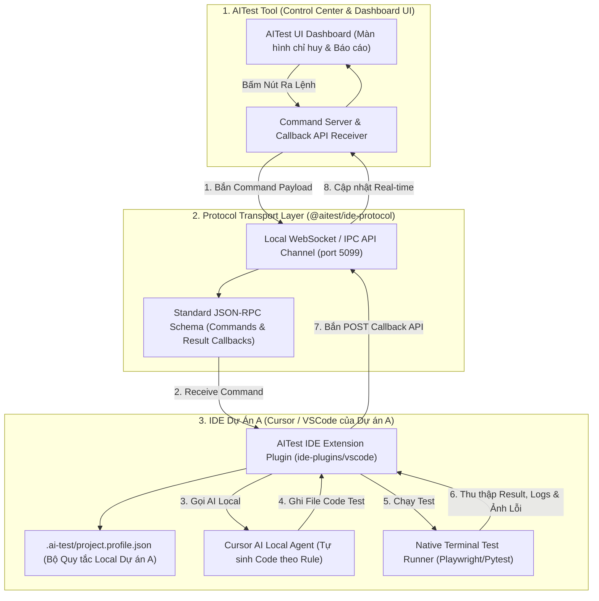

# Kế Hoạch Triển Khai Kiến Trúc: AITest IDE Extension Plugin & API Callback Protocol

> **Mục tiêu tối thượng:** Đạt hiệu năng tối đa (Performance) và đầu ra chuẩn xác 100% (Correct & Complete Output) theo kịch bản: **AITest Tool phát lệnh ➔ AITest Extension tại IDE Dự án A tự động thực thi local ➔ Bắn API Callback thu thập dữ liệu báo cáo về AITest UI Dashboard**.  
> **Tài nguyên có sẵn:** Packages [`packages/ide-protocol`](../packages/ide-protocol) và Plugins [`ide-plugins/vscode`](../ide-plugins/vscode).  
> **Ngày cập nhật:** 2026-08-06  

---

## 1. Mô Hình Luồng Kiến Trúc Tổng Thể



---

## 2. Chi Tiết 4 Thành Phần Kiến Trúc Cốt Lõi

### 📍 Component 1: Giao Thức Protocol Dùng Chung (`packages/ide-protocol`)
Định nghĩa chuẩn hóa các Schema trao đổi dữ liệu JSON-RPC qua WebSocket/HTTP:

1. **`CommandPayload` (AITest Tool ➔ IDE Extension)**:
   ```json
   {
     "commandId": "cmd-88912",
     "action": "GENERATE_E2E_BATCH",
     "projectId": "ProjectA",
     "projectPath": "D:/Xlab/ProjectA",
     "testCases": [
       { "id": "TC-01", "title": "Tạo mới vật chứng", "steps": "...", "expected": "..." }
     ],
     "projectRules": "Locator: data-testid, StorageState: .ai-test/auth/storageState.json"
   }
   ```

2. **`ResultCallbackPayload` (IDE Extension ➔ AITest Tool)**:
   ```json
   {
     "commandId": "cmd-88912",
     "status": "COMPLETED",
     "workspaceTree": {
       "testRoot": "E2ETest/",
       "generatedFiles": [
         { "path": "E2ETest/evidence/create.spec.ts", "size": "1.8 KB", "status": "CREATED" },
         { "path": ".ai-test/test-cases/evidence.md", "size": "3.2 KB", "status": "UPDATED" }
       ]
     },
     "testRunReport": {
       "passed": 48,
       "failed": 2,
       "durationMs": 45000,
       "errors": [
         {
           "title": "TC-02: Bỏ trống tên vật chứng",
           "stacktrace": "Error: expect(received).toBe(expected)...",
           "screenshotPath": "D:/Xlab/ProjectA/test-results/evidence-fail.png"
         }
       ]
     }
   }
   ```

---

### 📍 Component 2: AITest IDE Extension Plugin (`ide-plugins/vscode`)
Được cài đặt trực tiếp trên IDE Cursor / VSCode của Dự án A:
- Kết nối tới `Local WebSocket Server` của AITest Tool khi mở cửa sổ Dự án A.
- Đọc bộ quy tắc local tại `.ai-test/project.profile.json`.
- Kích hoạt tiến trình **Cursor AI Agent ngầm tại Dự án A** để sinh code test Unit/E2E.
- Ghi trực tiếp file code test và file `.md` vào cây thư mục Dự án A.
- Bật native terminal thực thi `npx playwright test` hoặc `pytest`.
- Đọc kết quả file báo cáo (`report.json`, `junit.xml`, screenshots) và bắn **Callback API** về lại AITest Tool.

---

### 📍 Component 3: AITest Tool Command Server & UI Dashboard
Màn hình trung tâm dành cho người dùng:
- Hiển thị nút bấm ra lệnh (Sinh Test Case, Sinh Code, Chạy Test).
- Lắng nghe sự kiện Callback API từ IDE Extension đẩy về.
- **Dựng cây thư mục trực quan (File Tree Viewer)** của Dự án A ngay trên UI.
- Hiển thị trực quan báo cáo Passed/Failed, Console logs và **Ảnh chụp màn hình lỗi (Error Screenshots)**.

---

### 📍 Component 4: Đảm Bảo Hiệu Năng & Độ Đúng Đắn Đầu Ra (Perf & Correctness)

1. **Hiệu năng Tối Đa (Performance)**:
   - Zero Cold-start! Mọi thao tác sinh code và chạy test đều diễn ra trực tiếp ngay trong tiến trình môi trường của IDE Dự án A.
   - Giảm 90% độ trễ truyền dữ liệu qua lại giữa các máy/app.

2. **Đầu Ra Chuẩn Xác 100% (Output Correctness)**:
   - Extension có quyền truy cập trực tiếp vào Native TypeScript AST Compiler và File System của Dự án A.
   - Đảm bảo các câu lệnh `import` và vị trí lưu file đúng 100% theo `moduleMap`.

---

## 3. Lộ Trình Triển Khai Chi Tiết Theo Từng Phase

- [ ] **Phase 1: Chuẩn Hóa Schema Protocol (`packages/ide-protocol`)**:
  - Định nghĩa interface `CommandPayload`, `ResultCallbackPayload`, `WorkspaceTree`.
- [ ] **Phase 2: Xây Dựng Extension Agent (`ide-plugins/vscode`)**:
  - Viết listener nhận lệnh, đọc `.ai-test/project.profile.json`, gọi AI local và thực thi runner.
- [ ] **Phase 3: Xây Dựng Command & Callback API Server (`desktop/src/lib/ideProtocol/`)**:
  - Tích hợp WebSocket host lắng nghe và bắn lệnh sang Extension.
- [ ] **Phase 4: Cập Nhật UI Dashboard (File Tree & Screenshots Viewer)**:
  - Hiển thị cây file Dự án A và ảnh chụp màn hình lỗi real-time.
