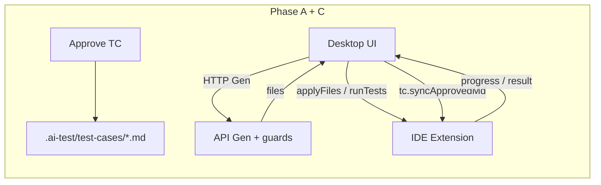

# Kế Hoạch Triển Khai: AITest IDE Extension Protocol (Unit/E2E Codegen)

> **Mục tiêu:** AITest Desktop ra lệnh → Extension trên IDE Dự án A thực thi local (Apply/Run; sau đó Gen) → Callback báo cáo về UI, **giữ nguyên** rule/guard/output SoT hiện tại.  
> **Tài nguyên:** [`packages/ide-protocol`](../packages/ide-protocol), [`ide-plugins/vscode`](../ide-plugins/vscode), [`desktop/src/lib/ideBridge`](../desktop/src/lib/ideBridge), [`desktop/src/lib/ideProtocol`](../desktop/src/lib/ideProtocol), [`desktop/src/lib/approvedTcSync`](../desktop/src/lib/approvedTcSync).  
> **Ngày cập nhật:** 2026-08-06  
> **Đọc kèm:** [`AUTO_RULES_PHASED_IMPLEMENTATION.md`](AUTO_RULES_PHASED_IMPLEMENTATION.md), [`E2E_STABILITY_BEFORE_PERF_PLAN.md`](E2E_STABILITY_BEFORE_PERF_PLAN.md), [`PERF_JOB_BUILDER_WORKER_POOL_PLAN.md`](PERF_JOB_BUILDER_WORKER_POOL_PLAN.md), [`AITEST_SOURCE_A_INTEGRATION_PLAN.md`](AITEST_SOURCE_A_INTEGRATION_PLAN.md).

---

## 0. Quyết định kiến trúc (Hybrid theo phase)

| Phase | Ai Gen code | Ai Apply / Run | Guards / Rules | Approved TC `.md` |
|-------|-------------|----------------|----------------|-------------------|
| **A** | Desktop → API CLI | Extension FS + runner | API guards + Desktop `projectRules` | — |
| **B** | Extension Agent (stub) | Extension | Post-guard bắt buộc | Đọc MD bổ sung (chưa Gen) |
| **C** | — | — | — | ✅ Sync Approved → `.ai-test/test-cases/` |

**Transport:** Extension = WS JSON-RPC server (port **ephemeral**); Desktop = client. Discovery: `~/.aitest/ide-bridge.json`. **Không** hardcode port 5099.

**SoT Gen Phase A:** DB Approved TC. File `.md` là **artifact đồng bộ** (Agent/audit) — không thay grounding/guards.

---

## 1. Invariants

1. Desktop authoritative `projectRules` (conventions); empty ≠ legacy meta fallback.
2. Approved-only Gen (BR-03); chỉ TC Approved mới ghi `.md`.
3. E2E grounding fail-closed; post-LLM R6/R9; E2E_* allowlist.
4. Output jail code: `AItest/UnitTest|E2ETest/...`.
5. TC markdown jail: chỉ `.ai-test/test-cases/**/*.md` (tách với AItest jail).
6. Auth storageState / auth-seed; Playwright project hoặc shared runner.
7. Fallback Apply/Verify: không bridge → Tauri ghi `.ai-test/` như trước.
8. **Unit Gen architecture (2026-08):**
   - Flow một chiều: **Approve** (ghi TC MD) → **Connect IDE** → Gen → staging → Verify → Apply.
   - **Không** silent fallback `POST /generate-unit`. Legacy API chỉ qua nút «Gen legacy (API)».
   - Rule SoT: `packages/ide-protocol` `UNIT_CONVENTIONS_CORE` → seed `.ai-test/unit-conventions.md`.
   - Gen Owner = Extension `UnitGenEngine` (default `CursorAgentCliEngine`); Desktop = `UnitJobRunner` + protocol only.
   - Job state: `draft|generating|generated|gen_failed|verifying|pass|fail|applied|discarded` + `via` + `timeline` + `transforms`.
   - Fail-closed: thiếu IDE / TC MD / SUT → `gen_failed` + CTA; transport retry tối đa 1 lần.

---

## 2. Protocol methods

| Method | Phase | Status |
|--------|-------|--------|
| `aitest/codegen.applyFiles` | A | ✅ |
| `aitest/codegen.runTests` | A | ✅ |
| `aitest/codegen.cancel` | A | ✅ |
| `aitest/codegen.generateUnitBatch` | B.1 | ✅ Extension `UnitGenEngine` (CLI); Desktop **fail-closed** (no API auto-fallback) |
| `aitest/codegen.generateE2eBatch` | B | ✅ Stub |
| `aitest/codegen.progress` / `result` | A | ✅ |
| `aitest/tc.syncApprovedMd` | C | ✅ |

Types: `codegenTypes.ts`, `tcTypes.ts`. Jails: `codegenPathJail.ts`, `tcPathJail.ts`.

---

## 3. Map file

| Layer | Files |
|-------|--------|
| Protocol | `methods.ts`, `tcTypes.ts`, `tcPathJail.ts`, `client.ts`, `codegen.test.ts` |
| Extension | `tcSyncCommands.ts`, `unitGenCommands.ts`, `unitGenParse.ts`, `bridgeServer.ts`, `codegenCommands.ts` |
| Desktop Phase B | `ideProtocol/phaseBGen.ts`, `unitWorkspace/unitJobRunner.ts`, `GenerateUnitPage` (IDE required) |
| Extension Gen | `unitGenEngine.ts`, `cursorAgentCliEngine.ts`, `unitGenCommands.ts` |
| Conventions SoT | `packages/ide-protocol/src/unitConventions.ts` |
| Desktop TC sync | `desktop/src/lib/approvedTcSync/*` |
| Wire Approve | `ReviewQueuePanel.tsx`, `RequirementsPage.tsx` |
| Apply/Run | `ideProtocol/*`, `stagingApply.ts`, `applyManager.ts`, `e2eJobRunner.ts` |
| UI | `CodegenResultPanel.tsx`, `IdeConnectPanel` trên Unit/E2E |
| API B | `POST /e2e-codegen-guard` |

---

## 4. Checklist

- [x] Phase 0–5 — Hybrid A/B Apply/Run/UI/guard-only (xem lịch sử)
- [x] **Phase 6 / C** — Approved TC → `.ai-test/test-cases/{module}/{testCaseId}.md`
- [x] **Phase B.1 Unit Gen** — Extension `UnitGenEngine` + Desktop `UnitJobRunner` fail-closed (Approve MD + IDE required)
- [x] **Unit conventions SoT** — shared `@aitest/ide-protocol` → `.ai-test/unit-conventions.md` (quantified limits)
- [x] **Unit job observability** — timeline / transforms / via / metrics on manifest

---

## 5. Phase C — chi tiết

**Đường dẫn:** `.ai-test/test-cases/{moduleSlug}/{testCaseId}.md`

**Nội dung:** YAML frontmatter (`id`, `testCaseId`, `title`, `module`, `type`, …) + Precondition / Steps / Expected / Test Data.

**Khi sync:** sau `POST /testcases/{id}/approve` thành công (single hoặc bulk). Bỏ qua nếu chưa bind project root (best-effort, không chặn Approve).

**Không làm:** thay DB SoT; ghi ngoài `.ai-test/test-cases/`; tự Gen từ MD trong Phase A.

---

## 6. Cách test Phase C

1. Bind project root (Tauri) và/hoặc Connect IDE Extension (folder = cùng root).
2. Duyệt 1–N TC Approved trên Coverage hoặc Requirements.
3. Kiểm đĩa: `{root}/.ai-test/test-cases/.../*.md`.
4. Disconnect IDE → Approve lại vẫn ghi nếu chạy Desktop Tauri.

---

## 7. Việc không làm

- Không thay `/api/jobs` bằng codegen protocol
- Không bỏ API guards
- Không hardcode port 5099
- Không ghi product source ngoài `AItest/`
- Không coi `.md` TC là SoT Gen Phase A
