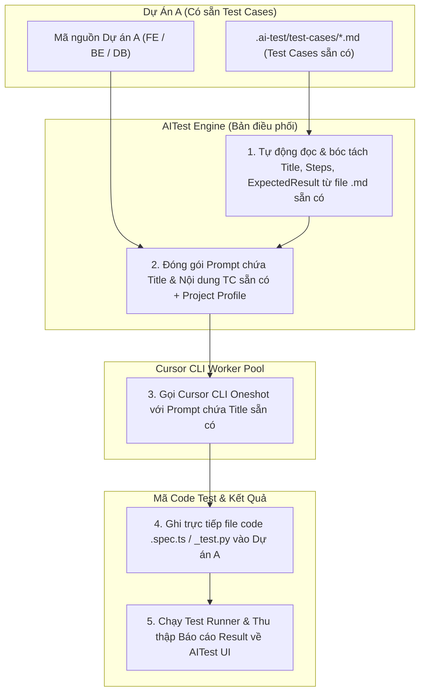

# Phương Án Triển Khai AITest: Tích Hợp Trực Tiếp & Theo Dõi Toàn Diện Dự Án A

> **Mục tiêu tối thượng:** Đảm bảo **AITest Tool kết nối trực tiếp 100%, điều phối và theo dõi hoàn toàn tính đúng đắn của toàn bộ cây file mã nguồn Dự án A** (Live Workspace Session & Real-time File Tracking).  
> **Hỗ trợ kịch bản sẵn có:** Nạp trực tiếp các Test Case đã có sẵn trong Dự án A (dạng `.md`) để đẩy thẳng Prompt sang Cursor CLI sinh code siêu tốc!  
> **Ngày cập nhật:** 2026-08-06  
> **Tài liệu liên quan:** [`PERF_JOB_BUILDER_WORKER_POOL_PLAN.md`](PERF_JOB_BUILDER_WORKER_POOL_PLAN.md), [`TARGET_RULES_PROJECT_PROFILE_PLAN.md`](TARGET_RULES_PROJECT_PROFILE_PLAN.md).

---

## 1. Mô Hình Xử Lý Khi Dự Án A ĐÃ CÓ SẴN Test Cases (Existing TC Execution)

Nếu trong Dự án A đã có sẵn danh sách Test Cases (dưới dạng các file Markdown `.ai-test/test-cases/*.md` hoặc tài liệu kiểm thử sẵn có):

---

## 2. Ưu Điểm Khi Sử Dụng Test Case Có Sẵn Trên Dự Án A

1. **Bỏ qua Bước Phân tích (Tiết kiệm 100% thời gian tạo Draft)**:
   - Không cần nạp lại tài liệu SRS hay tạo mới kịch bản. AITest nạp thẳng danh sách `Title`, `Steps`, `ExpectedResult` từ các file `.md` đã lưu sẵn trong Dự án A.

2. **Ghép thẳng Title & Steps vào Prompt gửi Cursor CLI**:
   - AITest đóng gói Prompt: *"Hãy viết bài test [Unit/E2E] cho Test Case sẵn có: '[Title]' với các bước: '[Steps]' và kết quả mong đợi: '[ExpectedResult]'"*.
   - Cursor CLI chỉ làm duy nhất một việc: **Chuyển đổi văn bản nghiệp vụ có sẵn thành mã code kiểm thử thực thi được**.

3. **Tính Chuẩn Xác Nghiệp Vụ 100%**:
   - Code test sinh ra tuân thủ chính xác từng câu từng chữ mà đội ngũ QA/BA của Dự án A đã duyệt và lưu trong kho Git.

---

## 3. Các Trụ Cột Đảm Bảo Theo Dõi & Điều Phối Dự Án A

### 📍 1. Real-time File System Watcher & Incremental Code Indexing
- Mỗi khi Dev hoặc AI chỉnh sửa/tạo mới bất kỳ file nào trong Dự án A, AITest **phát hiện thay đổi trong dưới 50ms**.
- Tự động cập nhật lại **Cây phụ thuộc (Dependency Graph)** và **Danh mục Symbol (Hàm, Class, Interface, Locators)** của Dự án A.

### 📍 2. Kiểm Soát Tính Đúng Đắn Phiên Bản (Content Hash & Version Drift Detection)
- Tất cả các file trong Dự án A (bao gồm cả các file `.md` Test Case) đều được tính mã băm `contentHash`.
- Nếu file Test Case `.md` hoặc mã nguồn Dự án A bị sửa đổi, AITest **tự động phát hiện sự sai lệch (Version Drift)** và nạp lại Snapshot mới nhất.

### 📍 3. Điều Phối Ghi File & Đảm Bảo Cú Pháp Import Hợp Lệ
- Ghi trực tiếp các file code test vào `Dự-Án-A/E2ETest/` hoặc `Dự-Án-A/tests/unit/` theo đúng `moduleMap`.
- Tự động kiểm tra và đảm bảo các đường dẫn `import` trong file test chính xác 100% với cấu trúc thư mục thực tế của Dự án A.
