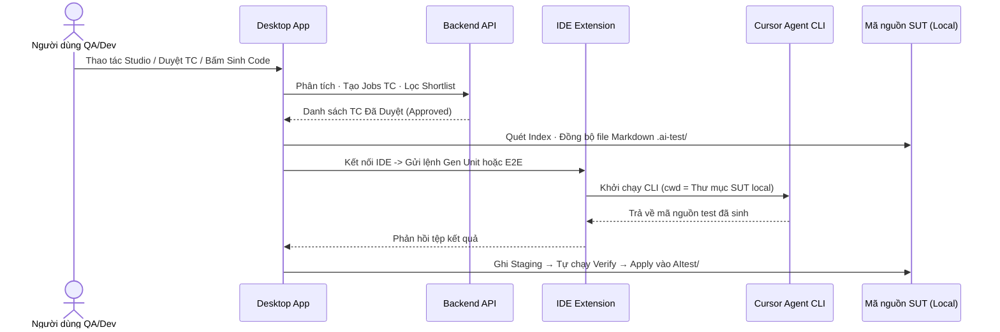
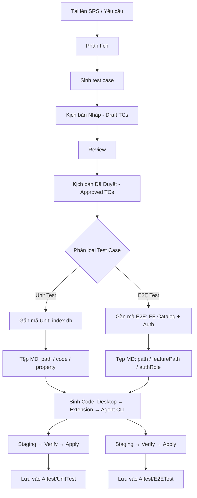
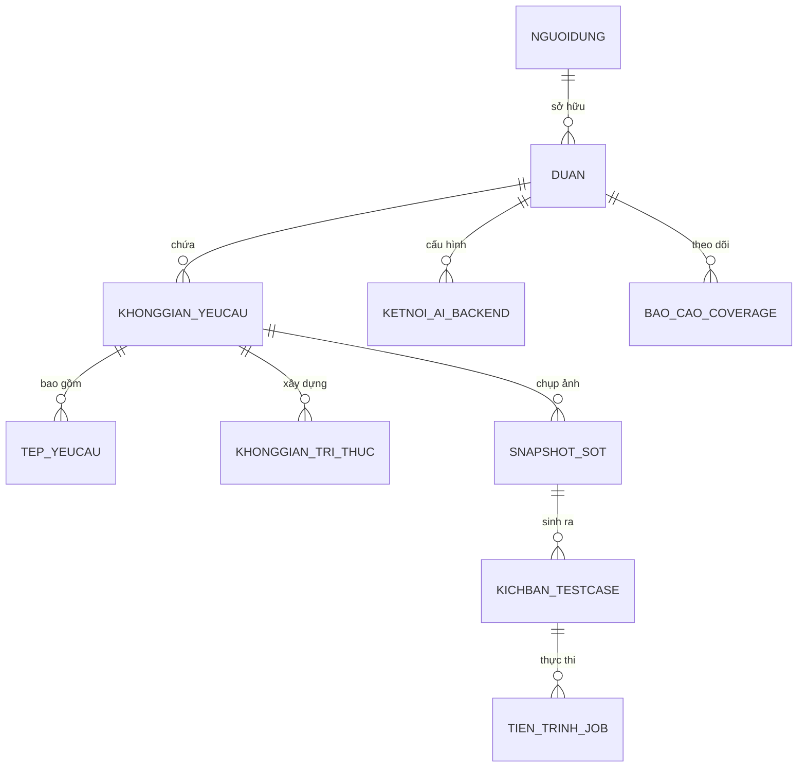

# TÀI LIỆU KIẾN TRÚC HỆ THỐNG AITEST PLATFORM (SYSTEM ARCHITECTURE)

> **Tài liệu Kỹ thuật Tổng quan về Kiến trúc, Pipeline và Dữ liệu**  
> **Dự án:** AITest Platform — Nền tảng AI Hỗ trợ Kiểm thử Tự động  
> **Phiên bản:** 2.0.0 (Thuần Việt & Chuẩn hóa Pipeline)  
> **Ngày cập nhật:** 13/08/2026  

---

## MỤC LỤC TỔNG QUAN

1. [Tóm Tắt Điều Hành](#1-tóm-tắt-điều-hành)
2. [Sơ Đồ Kiến Trúc Hệ Thống](#2-sơ-đồ-kiến-trúc-hệ-thống)
3. [Pipeline — Unit và E2E Test](#3-pipeline--unit-và-e2e-test)
4. [Pha Phê Duyệt & Gắn Mã (Approve / Ground)](#4-pha-phê-duyệt--gắn-mã-approve--ground)
5. [Pha Sinh Mã Tự Động (Automate Phase)](#5-pha-sinh-mã-tự-động-automate-phase)
6. [Kiến Trúc Dữ Liệu & Cấu Trúc File System](#6-kiến-trúc-dữ-liệu--cấu-trúc-file-system)
7. [Bảo Mật & Chiến Lược Triển Khai](#7-bảo-mật--chiến-lược-triển-khai)
8. [Các Quyết Định Kiến Trúc Chính (ADR)](#8-các-quyết-định-kiến-trúc-chính-adr)
9. [Giới Hạn Hệ Thống & Phạm Vi Ngoài Mục Tiêu](#9-giới-hạn-hệ-thống--phạm-vi-ngoài-mục-tiêu)

---

## 1. TÓM TẮT ĐIỀU HÀNH

Luồng vận hành cốt lõi của AITest Platform:  
**Tải Yêu cầu (SRS) → Phân tích → Sinh & Duyệt Test Case → Gắn mã nguồn SUT (Ground) → Sinh code & Xác minh (Unit / E2E).**

Mã nguồn SUT là **Stack-Agnostic** (không phụ thuộc ngôn ngữ, hỗ trợ C#, TypeScript/JavaScript, Python...). Hệ thống hỗ trợ tốt nhất và tối ưu sâu cho **C# (.NET)** và **TypeScript/JavaScript**.

| Tầng thành phần | Công nghệ sử dụng | Vai trò & Đặc điểm |
|---|---|---|
| **Desktop App** | React 19, Vite, TypeScript, Tauri v1 (Rust) | Giao diện Native siêu nhẹ (~15MB), thao tác File System local SUT, điều phối chạy test. |
| **Backend API** | Python 3.12, FastAPI, Pydantic v2, SQLAlchemy 2 | Quản lý Auth, Requirement Studio, Test Cases (SoT), Jobs Dispatcher & Coverage Metrics. |
| **Database** | PostgreSQL 16 (Port host mặc định **5433**) | Trung tâm lưu trữ duy nhất (Single Source of Truth - SoT) cho dữ liệu nghiệp vụ. |
| **IDE Extension** | Extension `aitest-ide` (Cursor / VS Code) | Plugin kết nối Desktop App với Cursor Agent CLI qua giao thức JSON-RPC WebSocket. |
| **Giao thức dùng chung** | `@aitest/ide-protocol` | Hợp đồng giao tiếp giữa Desktop App và IDE Extension. |
| **Động cơ AI CLI** | Cursor Agent CLI (chạy local trên SUT) | **Tầng AI Duy Nhất**: Sinh code Unit Test và E2E Test trực tiếp trong thư mục local SUT. |

---

## 2. SƠ ĐỒ KIẾN TRÚC HỆ THỐNG

Người dùng QA / Dev thao tác trực tiếp trên **AITest Desktop App**. 
Cả hai quy trình sinh **Unit Test** và **E2E Test** đều dùng **chung một luồng sinh mã (Gen Owner = IDE Extension → Agent CLI local)**; chỉ khác nhau ở các marker đầu vào và bộ thực thi xác minh (Runner Verify) đầu ra.



---

## 3. PIPELINE — UNIT VÀ E2E TEST

Một quy trình khép kín xuyên suốt 3 pha chính: **Thiết Kế (Design) → Gắn Mã (Ground) → Sinh Tự Động (Automate)**. 
Sau khi kịch bản Test Case được phê duyệt (Approved): **cả Unit và E2E dùng chung một Động cơ Sinh Mã (Extension + Agent CLI)**; chỉ khác nhau ở dữ liệu gắn mã (Ground SoT), định dạng marker, thư mục lưu kết quả (Apply) và bộ chạy xác minh (Runner Verify).



### Bảng Phân Tách Trách Nhiệm Giữa Các Pha:

| Pha | Đơn vị Đảm nhận | Đầu vào ──► Đầu ra |
|---|---|---|
| **1. Thiết Kế (Design)** | Backend + PostgreSQL | SRS → Phân tích → Sinh TC Approved (**chưa** gắn path SUT) |
| **2. Gắn Mã (Ground)** | Desktop App (+ Backend Shortlist) | Approved TC + Code Index/Catalog ──► Tệp Markdown chứa Markers (`path:`, `code:`) |
| **3. Sinh Code (Automate)** | **IDE Extension + Agent CLI** (Unit & E2E) | Tệp Markdown Markers ──► Staging ──► Verify (Runner) ──► Apply ghi tệp vào `AItest/` |

### So Sánh Chi Tiết Giữa Unit Test Và E2E Test:

| Tiêu chí | Unit Test | E2E Test (Playwright) |
|---|---|---|
| **Luồng Sinh Code** | Desktop ──► Extension ──► Agent CLI | **Cùng luồng** Desktop ──► Extension ──► Agent CLI |
| **Đối tượng Gắn (Ground)** | Class Handler / DTO / Hàm Backend | Đường dẫn Route FE + Vai trò Đăng nhập (Auth Role) |
| **Cú pháp Marker** | `path:`, `code:`, `target.property:` | `path:` / `featurePath:`, `authRole:` |
| **Bộ chạy Xác minh (Verify)** | `dotnet test` / `vitest` / `jest` / `pytest` | Playwright Runner (`workers: 1`) |
| **Thư mục Đầu ra (Apply)** | `AItest/UnitTest/{Module}/` | `AItest/E2ETest/_shared/` + `{Req}/{TC}/` |
| **Xác thực (Auth Mode)** | Không yêu cầu | `storage` \| `ui_helper` \| `none` \| `public` |

---

## 4. PHA PHÊ DUYỆT & GẮN MÃ (APPROVE / GROUND)

Khi tạo Jobs sinh Test Case ở pha Design, hệ thống **tuyệt đối không ghi cứng đường dẫn mã nguồn (SUT Path)** vào CSDL PostgreSQL. Chỉ khi người dùng bấm **Duyệt (Approve)** trên Desktop App, quá trình gắn mã (Grounding) mới được kích hoạt:

- **Dành cho Unit Test**: Hệ thống đối chiếu `Module → Function → Title` với tệp chỉ mục code local `index.db` ──► Xếp hạng và đề xuất shortlist ──► Gắn thẻ `code:` và thuộc tính `target.property` ──► Đồng bộ ra tệp Markdown `.ai-test/test-cases/` kèm file grounding. AI chỉ được chọn trong danh sách shortlist, nếu chỉ số tin cậy thấp hoặc index cũ (`STALE_INDEX`) sẽ không cho phép gắn nhầm.
- **Dành cho E2E Test**: Hệ thống đối chiếu Frontend Catalog + `project.profile.json` + `.ai-test/auth/` ──► Gắn thẻ `path:`, `featurePath:` và `authRole:` chuẩn xác (không tự bịa ra route hoặc vai trò đăng nhập không tồn tại).

---

## 5. PHA SINH MÃ TỰ ĐỘNG (AUTOMATE PHASE)

**Luồng thực thi:** `Tệp Approved MD ──► Cổng Kiểm Tra (Gates) ──► Sinh Code (Extension + Agent CLI) ──► Staging ──► Verify (Runner) ──► Apply vào thư mục AItest/`.

```mermaid
flowchart TB
  MD[Tệp Approved MD] --> Gates{Cổng Kiểm Tra Gates}
  Gates -->|Hợp lệ (OK)| Ext["Extension → Agent CLI"]
  Gates -->|Không hợp lệ| X[Từ chối Sinh Code]
  Ext --> Stg[Thư mục Tạm Staging]
  Stg --> Ver{Tự Chạy Verify}
  Ver -->|Unit Test| RU[Động cơ: dotnet / vitest / jest / pytest]
  Ver -->|E2E Test| RE[Động cơ: Playwright]
  RU --> App[Ghi Chính Thức Vào AItest/]
  RE --> App
```

| Bước Thực Thi | Unit Test | E2E Test |
|---|---|---|
| **Cổng Kiểm Tra (Gates)** | Kiểm tra kết nối IDE; field bind; Planner `ready`. | Kiểm tra kết nối IDE; route / `authRole` đã được ground. |
| **Sinh Code (Gen)** | Agent CLI chạy trên thư mục SUT local. | **Cùng** Agent CLI chạy trên thư mục SUT local. |
| **Lưu Tạm (Staging)** | `.ai-test/staging/{runId}/` | `.ai-test/staging/{runId}/` |
| **Xác minh & Ghi chính thức** | Chạy runner stack ──► Ghi vào `AItest/UnitTest/` | Chạy Playwright ──► Ghi vào `AItest/E2ETest/` |

---

## 6. KIẾN TRÚC DỮ LIỆU & CẤU TRÚC FILE SYSTEM

### 6.1 Mô Hình CSDL PostgreSQL (SoT Nghiệp Vụ)



> [!NOTE]
> PostgreSQL chỉ đóng vai trò lưu trữ duy nhất (SoT) cho dữ liệu nghiệp vụ (Yêu cầu, Test Case, Trạng thái Jobs). CSDL **không lưu trữ mã nguồn dự án SUT hay các tệp binary video/trace nặng**.

### 6.2 Cấu Trúc Thư Mục Artifacts Trên Máy Local (`AItest/` & `.ai-test/`)

```text
{Thư_Mục_Mã_Nguồn_SUT_Local}/
├── AItest/                             ← Thư mục lưu mã test chính thức
│   ├── UnitTest/{Tên_Module}/…         ← Mã nguồn Unit Test sinh ra (*.cs, *.test.ts, test_*.py)
│   ├── E2ETest/_shared/… + {Req}/{TC}/ ← Mã nguồn E2E Test Playwright (*.spec.ts)
│   ├── APITest/ · IntegrationTest/     ← Cấu trúc dành cho API / Integration Test
│   └── Reports/ · Coverage/ · Metadata/← Báo cáo kết quả kiểm thử & bao phủ
└── .ai-test/                           ← Thư mục tạm & chứa tri thức local
    ├── test-cases/{module}/{TC}.md     ← Kịch bản Test Case đã Approved kèm Markers
    ├── index.db                        ← Chỉ mục mã nguồn local (JSON format)
    ├── project.profile.json            ← Cấu hình profile dự án local
    └── staging/{runId}/                ← Thư mục tạm cô lập trước khi Verify
```

| Stack Mã Nguồn SUT | Định dạng Code Đầu ra (Unit) | Bộ Chạy Test Runner |
|---|---|---|
| **C# (.NET / `.csproj` / `.sln`)** | `*.cs` | `dotnet test` |
| **TypeScript / JS (`package.json`)** | `*.test.ts` / `*.spec.ts` | `vitest` / `jest` |
| **Python (`pytest`)** | `test_*.py` | `pytest` |

---

## 7. BẢO MẬT & CHIẾN LƯỢC TRIỂN KHAI

| Ranh giới Bảo mật | Cơ chế Bảo vệ |
|---|---|
| **Người dùng ↔ Backend API** | Xác thực qua **JWT Token**; Cấu hình CORS chặt chẽ. |
| **Kết nối AI CLI Engine** | Thực thi trực tiếp trên máy cá nhân qua Cursor CLI / Claude CLI; **không hardcode vendor API Key**. |
| **Ghi đĩa Local SUT** | Cơ chế cô lập đường dẫn (**Path Jail**): Chỉ được phép ghi vào `AItest/` và `.ai-test/`. |
| **Thông tin Đăng nhập E2E** | Sử dụng file seed/profile local trên máy cá nhân — không invent; không lưu trữ mật khẩu nhạy cảm lên CSDL Backend. |

```text
[MÁY CHỦ DOANH NGHIỆP] ──► PostgreSQL + FastAPI Backend (Quản lý Auth, Requirement, SoT Test Cases)
          ▲
          │ (JWT / HTTP)
          ▼
[MÁY QA / DEV LOCAL]  ──► AITest Desktop App + IDE Extension + Cursor Agent CLI (Xử lý mã local 100%)
```

---

## 8. CÁC QUYẾT ĐỊNH KIẾN TRÚC CHÍNH (ADR)

| Mã ADR | Quyết định Kiến trúc | Lý do & Ý nghĩa |
|---|---|---|
| **ADR-1** | **Hybrid Desktop + API + Extension** | Đảm bảo SoT nghiệp vụ tập trung trên Server nhưng sinh code an toàn 100% trên File System local. |
| **ADR-2** | **Gen Owner = IDE Extension + Agent CLI** | Sử dụng **cùng một luồng sinh code duy nhất** cho cả Unit Test và E2E Test. |
| **ADR-3** | **Phân biệt Unit vs E2E qua Runner** | Unit và E2E chỉ khác nhau ở cú pháp marker, thư mục đầu ra và runner xác minh; không đổi Động cơ sinh code. |
| **ADR-4** | **Tách rời 3 Pha (Design / Ground / Automate)** | Tránh hiện tượng AI tự bịa ra đường dẫn file mã nguồn không tồn tại khi viết kịch bản. |
| **ADR-5** | **AI Approve theo danh sách Shortlist** | Chống hiện tượng ảo giác (Hallucination) của AI khi chọn class/method kiểm thử. |
| **ADR-6** | **Fail-Closed Security** | Nếu thông tin ranh giới không hợp lệ, hệ thống từ chối sinh code ngay lập tức thay vì ghi nhầm file. |
| **ADR-7** | **Chỉ mục mã nguồn Local (`index.db`)** | Tệp chỉ mục gọn nhẹ lưu trực tiếp tại máy local giúp tra cứu symbol nhanh chóng. |
| **ADR-8** | **Giao thức `@aitest/ide-protocol` Độc Lập** | Giữ giao thức kết nối sạch sẽ, không nhét từ điển sản phẩm nghiệp vụ vào protocol. |
| **ADR-9** | **Xác minh 100% Pass trước khi Apply** | Chỉ khi bộ test runner chạy PASS 100% tại thư mục tạm Staging thì mới di chuyển chính thức vào `AItest/`. |
| **ADR-10**| **Tự động Sửa Lỗi Kịch bản (E2E Auto-Heal)** | Tự động phát hiện và điều chỉnh lại Selector UI khi cấu hình DOM giao diện thay đổi. |

---

## 9. GIỚI HẠN HỆ THỐNG & PHẠM VI NGOÀI MỤC TIÊU

### 1. Giới hạn Hệ thống Hiện tại (Current Limitations)
- **Chỉ mục C#**: Hiện tại đồ thị phụ thuộc (Import Graph) của C# sử dụng giải thuật tĩnh, chưa phân tích sâu bằng TypeScript.
- **API / Integration Test Engine**: Cấu trúc thư mục `AItest/APITest/` và `AItest/IntegrationTest/` đã được quy hoạch khung, nhưng động cơ sinh tự động đang ưu tiên 2 luồng chính là **Unit Test** và **E2E Test**.

### 2. Các Mục Tiêu Ngoài Phạm Vi (Non-Goals)
- Hệ thống **không thay thế hệ thống quản lý mã nguồn Git / CI/CD** của dự án SUT.
- Giao thức IDE Bridge **không lưu trữ hay tích lũy dữ liệu nhạy cảm** của doanh nghiệp.
- Ứng dụng Desktop **không chứa bất kỳ bộ chìa khóa bí mật (Hardcoded Private Keys/API Keys)** nào.

---

> **Tài liệu được lưu trữ trực tiếp tại:** [`docs/ARCHITECTURE.md`](file:///d:/Xlab/AITest/docs/ARCHITECTURE.md)  
> **Áp dụng cho:** Đội ngũ Phát triển Hệ thống, Kiến trúc sư Phần mềm (Architect) và Đội ngũ Vận hành AITest Platform.
