# AI Test Desktop Tool — Architecture Document Version 2.2 (Requirement Studio + Agentic IDE)

| | |
|--|--|
| **Sản phẩm** | AI Test Desktop Tool |
| **Version** | **2.2 (Requirement Studio + Agentic IDE)** |
| **Ngày** | 24/07/2026 |
| **Trạng thái** | Design SoT — Phase 1 mở rộng thành **AI Requirement Studio**; Phase 2 (Agentic IDE) giữ nguyên foundation P0–P5.7 + P9–P10 |
| **Thay thế** | Không vá [`KIEN_TRUC_DU_AN.md`](../KIEN_TRUC_DU_AN.md) (v11). File này là kiến trúc mục tiêu. |
| **Supersedes** | V2.1 Agentic IDE Context — bản gốc: [`archive/ARCHITECTURE_V2_IDE_FIRST_2.1_pre_requirement_studio.md`](./archive/ARCHITECTURE_V2_IDE_FIRST_2.1_pre_requirement_studio.md) |
| **Audience** | Architect, Tech Lead, Desktop/IDE/Backend engineers, UX |
| **Phase boundary** | [`REQUIREMENT_STUDIO_PHASE_BOUNDARY.md`](./REQUIREMENT_STUDIO_PHASE_BOUNDARY.md) |

> **North star (Phase 1 — Requirement Studio):** Upload nhiều tài liệu → Parse → **Knowledge Workspace** → Chat / Coverage → **Freeze** → **Requirement Snapshot** → Generate Test Cases → Review → Approve. AI phải **hiểu đủ Requirement** trước khi sinh TC — không Generate TC thẳng từ file upload.  
> **North star (Phase 2 — Agentic IDE):** Người dùng chọn **Test Case Approved** → phân tích intent → Planner → IDE Commands từng bước → confidence → sinh Unit Test → Workspace → Verify → Apply → Run.  
> Source **không** được coi là “đống text để scan”. Context Unit đến từ **IDE Command Layer** — **không bao giờ** gửi cả repo cho LLM. Caret là **tín hiệu phụ (boost)**.

---

## Mục lục

1. [Executive Summary](#1-executive-summary)
2. [Business Goals](#2-business-goals)
3. [System Context (C4 L1)](#3-system-context-c4-l1)
4. [Functional Architecture](#4-functional-architecture)
5. [Phase 1 — AI Requirement Studio](#5-phase-1--ai-requirement-studio)
6. [Knowledge & Chat](#6-knowledge--chat)
7. [Requirement Snapshot & Traceability](#7-requirement-snapshot--traceability)
8. [Technical / Logical Architecture](#8-technical--logical-architecture)
9. [Physical & Deployment](#9-physical--deployment)
10. [Component Diagram & Adapters](#10-component-diagram--adapters)
11. [IDE Protocol & Commands](#11-ide-protocol--commands)
12. [Agent Runtime — Business Analyzer, Planner, Confidence](#12-agent-runtime--business-analyzer-planner-confidence)
13. [Context Builder & Prompt Builder](#13-context-builder--prompt-builder)
14. [Workspace Pipeline](#14-workspace-pipeline)
15. [Generate Flows by Test Kind](#15-generate-flows-by-test-kind)
16. [Coverage & Report Flows](#16-coverage--report-flows)
17. [UI/UX Architecture](#17-uiux-architecture)
18. [Module & Layer Responsibility](#18-module--layer-responsibility)
19. [Business Rules (BR-V2)](#19-business-rules-br-v2)
20. [State Machines](#20-state-machines)
21. [Data Flow & Database](#21-data-flow--database)
22. [Security / Scalability / Extensibility](#22-security--scalability--extensibility)
23. [Error / Retry / Offline](#23-error--retry--offline)
24. [Folder Structure](#24-folder-structure)
25. [Migration v11 / V2.1 → V2.2](#25-migration-v11--v21--v22)
26. [Roadmap Phases (executable)](#26-roadmap-phases-executable)
27. [Future Roadmap](#27-future-roadmap)
28. [Glossary](#28-glossary)

Phụ lục: [A Unit E2E](#phụ-lục-a--sequence-unit-test-e2e-agentic) · [B Class sketch](#phụ-lục-b--class-sketch) · [C UX copy](#phụ-lục-c--ux-copy-vi) · [D Studio](#phụ-lục-d--sequence-requirement-studio-phase-1) · [E Snapshot→TC](#phụ-lục-e--sequence-snapshot--test-case--approve)

---

## 1. Executive Summary

AI Test **V2.2** là sản phẩm hybrid gồm hai pha gắn liền:

1. **Phase 1 — AI Requirement Studio** — hiểu và chuẩn hóa Requirement (multi-doc → Knowledge → Chat/Coverage → Freeze Snapshot) **trước** khi sinh Test Case.  
2. **Phase 2 — Agentic IDE Unit** — AI Coding Agent chuyên Unit/Test automation (cùng họ Cursor / Claude Code / Copilot / Cline), hẹp miền: TC Approved → context IDE incremental → Unit test.

Năng lực sản phẩm:

- **Requirement Studio** (upload đa loại tài liệu, Knowledge Workspace, Chat, Coverage, Freeze Snapshot)
- **Test Case Generation từ Requirement Snapshot** (không từ raw upload)
- **Unit generation từ TC + context IDE incremental**
- Integration / API / E2E (cùng pipeline Phase 2, khác plan profile)
- Execute, **Code** Coverage, Report
- Workspace staging (không ghi thẳng production)

### Vấn đề Phase 1 cũ → thiết kế đúng (V2.2)

| Sai (Phase 1 cũ) | Đúng (Requirement Studio) |
|------------------|---------------------------|
| Upload → Generate TC ngay | Upload → Knowledge → Chat/Coverage → **Freeze** → Generate TC |
| Requirement = 1 file / CRUD | **Requirement Workspace** + nhiều artifact |
| Chat/LLM đọc lại raw file | Chat chỉ trên **Knowledge Workspace** (BR-V2-17/21) |
| TC không gắn snapshot | TC bắt buộc **`requirementSnapshotId`** (BR-V2-16/20) |

### Vấn đề V2.0 / V2.1 Phase 2 đã sửa (giữ)

| Giả định sai (V2.0 / v11) | Thiết kế đúng (Phase 2) |
|---------------------------|-------------------------|
| TC đủ để AI “biết” file nào | TC = **business**; implementation cần **resolve** |
| Caret = luôn đúng chỗ sinh unit | Caret = **optional boost** |
| Một lần `getSemanticContext` là đủ | **Planner loop** lấy thêm file khi thiếu |
| Scan / dump tree khi không chắc | **Cấm** full-project scan |

### Bốn trụ (+ Studio)

1. **IDE Plugin** — Context Provider (LSP/PSI/Roslyn commands); không reasoning; **không** tham gia Phase 1  
2. **Desktop Orchestrator** — UI (Requirement Studio + Agent Run), relay IDE commands, Workspace, Run  
3. **Backend Agent Runtime** — Phase 1: Parser / Knowledge Builder / Chat / Freeze / Generate-TC; Phase 2: Business Analyzer, Planner, Confidence, Prompt Builder, LLM Adapter  
4. **PostgreSQL** — meta SoT (Project, Knowledge, Snapshot, TC, Jobs, Execution) — **không** persist source code Phase 2

---

## 2. Business Goals

| ID | Goal | KPI gợi ý | Phase |
|----|------|-----------|-------|
| BG-01 | Sinh unit từ TC Approved với context đúng implementation | ≥70% run có `primarySymbol` confidence ≥ 0.8 | 2 |
| BG-02 | Không bịa API / class | Related files chỉ từ IDE commands trong plan | 2 |
| BG-03 | Đa IDE / đa ngôn ngữ | Adapter matrix; thêm IDE = plugin mới | 2 |
| BG-04 | QA/Dev cộng tác qua TC Approved trên PG | Giữ hybrid SoT meta | 1+2 |
| BG-05 | An toàn source | Không persist source trên server; snippets ephemeral | 2 |
| BG-06 | UX agent rõ ràng | User thấy Analyze → Plan → Fetch → Confidence → Generate | 2 |
| BG-07 | Không full-repo LLM | 0 generate path gửi toàn bộ workspace tree | 2 |
| BG-08 | Requirement đủ trước Freeze | Coverage Dashboard: % Complete tăng; Missing được liệt kê trước Freeze | 1 |
| BG-09 | Trace TC ↔ Snapshot | 100% TC mới có `requirementSnapshotId` | 1 |
| BG-10 | Multi-document Requirement | ≥2 loại artifact (vd. SRS + OpenAPI) gộp một Knowledge Workspace | 1 |
| BG-11 | Chat cập nhật Knowledge | Mỗi phiên chat có knowledge-diff audit; không re-ingest raw file | 1 |

---

## 3. System Context (C4 L1)

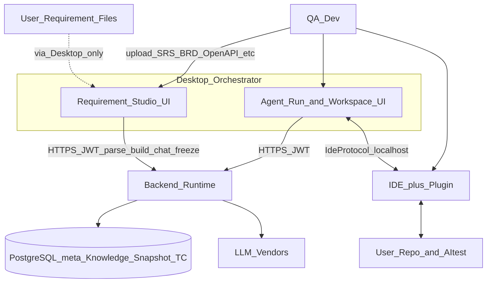

| Luồng | Mô tả |
|-------|--------|
| **Phase 1** | User upload file → **Desktop Requirement Studio** → API (Parser / Knowledge Builder / Chat / Freeze) → PG (Knowledge, Snapshot, TC) + LLM |
| **Phase 2** | User + IDE ↔ Desktop Agent UI ↔ API (Analyzer / Planner / Generate Unit); IDE đọc **User Repo** qua plugin |

**Ranh giới dữ liệu**

- Upload **không** đi thẳng Backend ↔ ổ đĩa user: mọi file Requirement qua Desktop (hoặc API multipart do Desktop/orchestrator gửi).
- Nội dung parse / Knowledge / Snapshot lưu **PostgreSQL** (và object store nếu có) theo policy meta — **không** dùng để persist **source code** Phase 2.
- Backend **không** có mũi tên đọc filesystem user (repo code). IDE Plugin **không** tham gia Phase 1.

**Người ngoài hệ thống:** User, LLM Vendor, (tuỳ chọn) CI runner sau này.

---

## 4. Functional Architecture

```text
┌─ Product Capabilities (V2.2) ─────────────────────────────────────┐
│  Identity │ Project Meta │ Requirement Studio │ Knowledge │ Snapshot │
│  TC Review │ Generate* │ Agent Run │ Workspace / Execute / Report   │
│  IDE Link │ Settings AI │ Activity / Audit                          │
└───────────────────────────────────────────────────────────────────┘
* Generate =
    TC  ← chỉ từ Requirement Snapshot (Phase 1)
    Unit / Integration / API / E2E ← Agent + IDE context (Phase 2)
```

### Capability → Owner

| Capability | IDE Plugin | Desktop | Backend | Phase |
|------------|:----------:|:-------:|:-------:|:-----:|
| Upload Requirement files | — | **X** | receive | 1 |
| Document Parser / Chunking | — | progress UI | **X** | 1 |
| Knowledge Builder | — | Workspace UI | **X** + LLM | 1 |
| Requirement Chat | — | **X** | **X** + LLM | 1 |
| Requirement Coverage | — | Dashboard | **X** | 1 |
| Freeze → Requirement Snapshot | — | confirm UI | **X** | 1 |
| Generate TC (from Snapshot) | — | **X** | **X** + LLM | 1 |
| TC Review / Approve | — | **X** | **X** SoT | 1 |
| Search / read / goto / refs | **X** | invoke | | 2 |
| Business Analyzer | — | UI show | **X** | 2 |
| Planner Agent | — | execute steps | **X** | 2 |
| Confidence Evaluator | — | UI bars | **X** | 2 |
| Context merge / budget | — | relay | **X** | 2 |
| Prompt + LLM generate unit | — | | **X** | 2 |
| Workspace staging / verify / apply | open file | **X** | meta audit | 2 |
| Auth / Project SoT | — | UI | **X** | 1+2 |

**IDE Plugin = không tham gia Phase 1** (ô `—` ở các hàng Studio).

---

## 5. Phase 1 — AI Requirement Studio

Ranh giới Phase: [`REQUIREMENT_STUDIO_PHASE_BOUNDARY.md`](./REQUIREMENT_STUDIO_PHASE_BOUNDARY.md).  
Sequence kỹ thuật: §8.3. Rules: BR-V2-16…21 (§19.2).

### 5.1 Mục tiêu

AI **hiểu đầy đủ Requirement** (Knowledge Workspace) **trước** khi Generate Test Case.  
IDE Plugin **không** tham gia Phase 1.

### 5.2 Business Flow

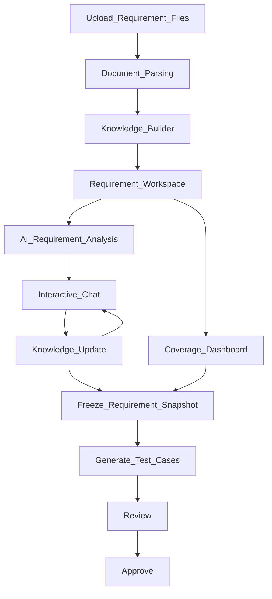

```text
Upload Requirement Files
  → Document Parsing
  → Knowledge Builder
  → Requirement Workspace
  → AI Requirement Analysis
  → Interactive Chat
  → Knowledge Update
  → Requirement Snapshot (Freeze)
  → Generate Test Cases
  → Review
  → Approve
```

### 5.3 Requirement Workspace (UI + state)

| Khu vực | Nội dung |
|---------|----------|
| Uploaded Files | Danh sách FileRef, loại, trạng thái parse |
| Parsed Documents | Metadata + chunk stats (không dùng làm chat context) |
| AI Summary | Tóm tắt thống nhất sau Knowledge Builder |
| Business Rules | Rules có cấu trúc |
| Actors | Vai trò / persona |
| Use Cases / Flows | Luồng nghiệp vụ |
| API Summary | Endpoint / contract từ Spec + OpenAPI |
| Database Summary | Entity / quan hệ từ DB design |
| Requirement Coverage | Ma trận Complete / Partial / Missing |
| Missing Information | Open questions / gaps |
| AI Chat Session | Hội thoại gắn Knowledge version |
| Requirement Snapshot | Bản Freeze (immutable) + lịch sử version |

### 5.4 Module diagram (trách nhiệm)

| Module | In | Out | Không làm |
|--------|----|-----|-----------|
| Upload Manager | files đa loại | FileRef[] | LLM |
| Document Parser | FileRef | Chunks + metadata | Chat |
| Knowledge Builder | Chunks | Knowledge Workspace | Generate TC |
| Requirement Workspace UI | Knowledge | edits / chat triggers | IDE commands |
| Coverage Analyzer | Knowledge | Complete / Partial / Missing | Freeze tự ý |
| Chat Orchestrator | Knowledge + user msg | Knowledge delta | Raw file re-ingest (BR-V2-17) |
| Freeze Service | Knowledge + version | Snapshot immutable | Mutate snapshot |
| Generate TC | **Snapshot only** | Draft TCs + `requirementSnapshotId` | Uploaded files / chat log |

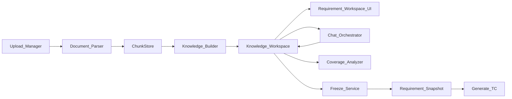

### 5.5 Supported file types

AI **tổng hợp** nhiều artifact thành **một** Knowledge Workspace thống nhất:

| Nhóm | Ví dụ |
|------|--------|
| Nghiệp vụ | SRS, BRD, User Story, Markdown |
| API | API Specification, Swagger / OpenAPI |
| Dữ liệu | Database Design |
| Luồng | Sequence Diagram, Flowchart |
| Bảng / văn bản | Excel, PDF, Word |

Upload thêm **trước Freeze** được phép (BR-V2-18) → rebuild / merge Knowledge → version mới.

### 5.6 Một flow duy nhất

- **Không** còn “Requirement CRUD một file → Generate TC ngay”.
- Mọi Generate TC phải qua **Freeze → Snapshot** (BR-V2-16).

---

## 6. Knowledge & Chat

### 6.1 Document Parser → Chunking

```text
Upload Files → Document Parser → Chunking → ChunkStore → Knowledge Builder
```

- Không gửi trực tiếp cả file lên LLM mỗi lần chat.
- Parser xuất text/structure + metadata (mime, page/sheet, hash); ChunkStore lưu ordinal + giới hạn kích thước.

### 6.2 Knowledge Builder → Knowledge schema (logical)

Sau parse, AI sinh / cập nhật Knowledge Workspace:

| Thành phần | Mô tả |
|------------|--------|
| Business Rules | Ràng buộc nghiệp vụ có id/mô tả |
| Actors | Ai tham gia hệ thống |
| Use Cases / Flows | Kịch bản / bước |
| Glossary | Thuật ngữ chuẩn hóa |
| API Summary | Endpoint, method, contract tóm tắt |
| Database Summary | Bảng / quan hệ / ràng buộc dữ liệu |
| Constraints | Giới hạn phi chức năng / policy |
| Open Questions | Câu hỏi còn mở |
| Missing Information | Thiếu sót đã phát hiện |
| Coverage matrix | Xem §6.4 |

**BR-V2-21:** Knowledge Workspace là **nguồn duy nhất** của AI Phase 1 (Analysis / Chat / Coverage).

### 6.3 Interactive Chat

Người dùng có thể:

- Hỏi / giải thích Requirement  
- Tổng hợp / tìm thiếu  
- Bổ sung Business Rule  
- Sửa / chuẩn hóa thuật ngữ  

Sau mỗi turn: **Knowledge Update** (diff có audit).  
**BR-V2-17:** Chat chỉ trên Knowledge — **cấm** re-ingest raw upload mỗi turn.  
Ngoại lệ: **Rebuild Knowledge** có chủ đích (re-parse) — audit riêng (§8.1).

### 6.4 Requirement Coverage

AI tự đánh giá mức đủ của Requirement theo chiều:

| Dimension | Status |
|-----------|--------|
| Authentication | Complete / Partial / Missing |
| Authorization | Complete / Partial / Missing |
| Validation | Complete / Partial / Missing |
| Exception | Complete / Partial / Missing |
| Permission | Complete / Partial / Missing |
| Notification | Complete / Partial / Missing |
| Logging | Complete / Partial / Missing |
| Audit | Complete / Partial / Missing |
| Performance | Complete / Partial / Missing |
| Security | Complete / Partial / Missing |

**Coverage Dashboard** trên Requirement Workspace.  
**Policy Freeze (chốt):** được Freeze khi còn **Missing**, nhưng UI **warn bắt buộc** (liệt kê Missing); không block cứng — QA chịu trách nhiệm. (Có thể siết thành block ở roadmap R6 nếu cần.)

### 6.5 States (Knowledge)

```text
Empty → Parsing → Building → Ready ⇄ Updating → Ready
                              ↓
                            Stale  (upload thêm / rebuild cần thiết)
                              ↓
                         Building → Ready
Ready → (Freeze) → Snapshot created; Knowledge có thể tiếp tục version mới
```

---

## 7. Requirement Snapshot & Traceability

### 7.1 Versioning

```text
Draft → (build) → Version N → Chat / Update → Version N+1 → Freeze → Snapshot vN (immutable)
```

| Khái niệm | Mutable? | Dùng cho |
|-----------|:--------:|----------|
| Knowledge Version N | Có (qua chat/rebuild) | Làm việc Studio |
| Requirement Snapshot vN | **Không** (BR-V2-19) | **Generate TC only** (BR-V2-16) |

Generate TC **luôn** gắn Snapshot — **không** gắn draft Knowledge hay chat history.

### 7.2 Freeze

1. User xác nhận trên Desktop (sau khi xem Coverage warn nếu Missing).  
2. Freeze Service copy Knowledge version hiện tại → **Requirement Snapshot** immutable.  
3. Trả `snapshotId`.  
4. Upload / chat sau đó → version Knowledge mới; Generate TC cũ vẫn trace Snapshot cũ.

### 7.3 Traceability

```text
RequirementSnapshot (id)
        ↓
Generate TC
        ↓
TestCase.requirementSnapshotId   ← BR-V2-20 (bắt buộc với TC sinh từ Studio)
        ↓
Review → Approve
        ↓
Phase 2: Generate Unit (Approved TC)
```

| Rule | Nội dung |
|------|----------|
| BR-V2-16 | Generate TC chỉ từ Snapshot |
| BR-V2-19 | Snapshot immutable |
| BR-V2-20 | Mỗi TC có `requirementSnapshotId` |

Generate TC **không** đọc Uploaded Files hay raw Chat History.

### 7.4 ER logical (tóm tắt — chi tiết §21)

```text
Project
  └── RequirementWorkspace
        ├── RequirementFile
        ├── DocumentChunk
        ├── KnowledgeWorkspace (+ Coverage, ChatSession)
        ├── RequirementVersion
        └── RequirementSnapshot ──► TestCase.requirementSnapshotId
```

---

## 8. Technical / Logical Architecture

### 8.1 Logical layers

```text
┌─────────────────────────────────────────────────────────────┐
│ Presentation                                                │
│  Desktop: Requirement Studio UI · Agent Run / Workspace UI  │
│  IDE Plugin: status / commands (Phase 2 only)               │
├─────────────────────────────────────────────────────────────┤
│ Application / Orchestration (Desktop)                       │
│  Phase 1: Upload · Studio session · Chat UI · Freeze UX     │
│  Phase 2: AgentRunController · Command Bus · Workspace FSM  │
│           · Runner                                          │
├─────────────────────────────────────────────────────────────┤
│ Domain Context (local / ephemeral)                          │
│  Phase 2: Context Builder → AITestContextPacket             │
│  Phase 1: không giữ raw file làm context chat               │
├─────────────────────────────────────────────────────────────┤
│ Adapters                                                    │
│  IIDEAdapter · ILanguageAdapter · IRunner · ICoverage       │
│  IReportExporter · ILLMAdapter (server-side)                │
├─────────────────────────────────────────────────────────────┤
│ Backend Runtime                                             │
│  Phase 1: DocumentParser · ChunkStore · KnowledgeBuilder    │
│           ChatOrchestrator · CoverageAnalyzer · FreezeSvc   │
│           GenerateTC(from Snapshot) · Auth/TC domain        │
│  Phase 2: BusinessAnalyzer · Planner · ConfidenceEvaluator  │
│           PromptBuilder · LLMAdapter                        │
├─────────────────────────────────────────────────────────────┤
│ Persistence                                                 │
│  PostgreSQL: Knowledge · Snapshot · TC · Jobs · meta        │
│  Local: .ai-test/ workspace (Phase 2 staging only)          │
└─────────────────────────────────────────────────────────────┘
```

**Pipeline Phase 1 (logical):**

```text
Upload → DocumentParser → ChunkStore
       → KnowledgeBuilder → KnowledgeWorkspace
       → Chat / Coverage → Freeze → RequirementSnapshot
       → GenerateTC → Review → Approve
       → (Phase 2) Agent Unit …
```

**Cấm (sau Knowledge Builder Ready):** path “re-read upload blobs for chat / analysis”. Chat và Coverage chỉ đọc **Knowledge Workspace** (BR-V2-17, BR-V2-21). Ngoại lệ duy nhất: **Rebuild Knowledge** có chủ đích (re-parse) — có audit, không dùng trong chat turn thường.

### 8.2 Technical stack (product)

| Layer | Tech | Module Phase 1 (mới) |
|-------|------|----------------------|
| Desktop | React + Tauri | `desktop` features: Requirement Studio UI, chat, coverage, freeze |
| IDE Plugin #1 | VS Code / Cursor Extension (TypeScript) | *không dùng Phase 1* |
| IDE Plugin #2+ | JetBrains / VS | *không dùng Phase 1* |
| Protocol IDE | JSON-RPC 2.0 WebSocket `ws://127.0.0.1:<port>` | Phase 2 only |
| Backend | Python FastAPI | `api` features: parse, knowledge, chat, freeze, generate-tc |
| DB | PostgreSQL | FileRef, Chunk, Knowledge, Snapshot, TC.`requirementSnapshotId` |
| LLM | Adapter OpenAI / Anthropic / Gemini / Ollama | Knowledge build, chat, generate-tc, (Phase 2) unit |

Hybrid stack **không đổi**; chỉ bổ sung feature modules trong `desktop/` + `api/`.

### 8.3 Communication — Phase 1 Requirement Studio

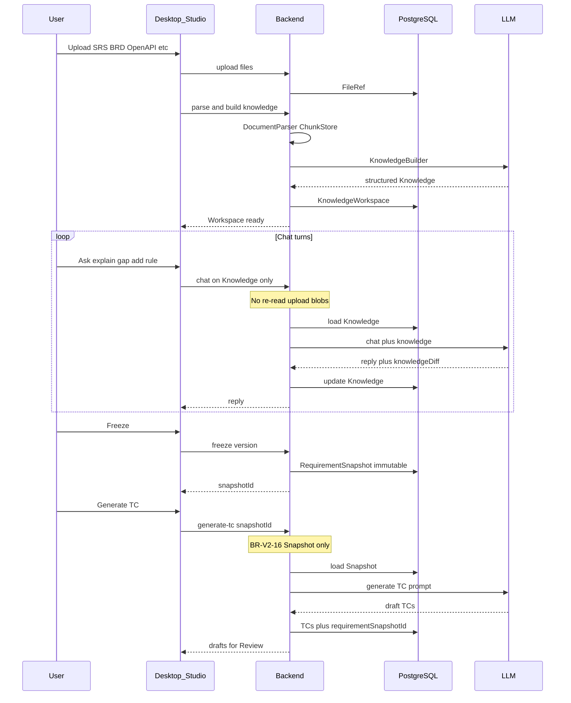

### 8.4 Communication — Phase 2 Unit generate (agentic)

*Giữ nguyên flow V2.1 — không đổi bởi Requirement Studio.*

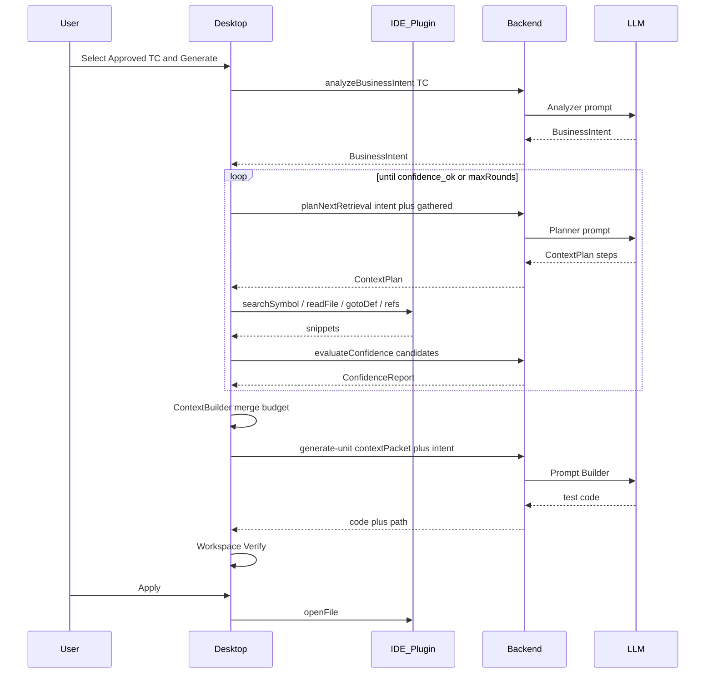

**Cầu nối hai pha:** TC Approved trong Phase 2 phải xuất phát từ Generate TC gắn **Requirement Snapshot** (Phase 1). Backend generate-unit vẫn chỉ nhận Context Packet — không đọc Snapshot raw thay IDE.

---

## 9. Physical & Deployment

```text
[Dev machine]
  IDE + Plugin ──localhost── Desktop App
                              │ HTTPS
[Company / Cloud]
  Backend API ── PostgreSQL
  Backend ────── LLM Vendor APIs
```

| Artifact | Deploy |
|----------|--------|
| `desktop/` | Cài trên PC user (Tauri) |
| `ide-plugins/vscode/` & `ide-plugins/antigravity/` | Marketplace / VSIX sideload (VS Code, Cursor, Antigravity IDE) |
| `api/` | Docker / VM nội bộ |
| PG | Managed / on-prem |

**Không** deploy source user lên server.

---

## 10. Component Diagram & Adapters

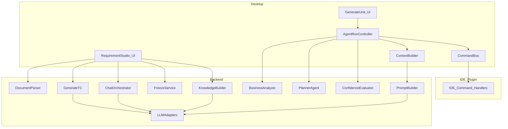

Phase 1 components (Parser / Knowledge / Chat / Freeze / GenerateTC) **không** nối `IIDEAdapter`.

### 10.1 `IIDEAdapter` (contract)

```text
connect() / disconnect() / health()
getWorkspace()
getCurrentFile() / getCurrentSelection() / getCurrentMethod() / getCurrentClass()
searchSymbol(query, kinds?)
searchText(query, glob?)
searchClass(name) / searchMethod(name, container?)
goToDefinition(symbolId | position)
findReferences(symbolId)
findImplementations(symbolId)
getCallHierarchy(symbolId)
readFile(path, range?)
getConstructor() / getImports() / getNamespace()
createTestFile(path, content)
openGeneratedTest(path)
runCurrentTest(filter?)
```

Mỗi IDE implement adapter; Desktop chỉ gọi interface. **IDE không gọi LLM.**

### 10.2 Other adapters

| Interface | Ví dụ |
|-----------|--------|
| `ILanguageAdapter` | C#, TS, Python, Go, Java — conventions, path hints |
| `ITestFrameworkAdapter` | xUnit, Jest, Vitest, pytest, JUnit |
| `IRunnerAdapter` | `dotnet test`, `npm test`, `pytest` |
| `ICoverageParser` | cobertura, lcov, istanbul, TRX |
| `IReportExporter` | HTML, JUnit XML, JSON |
| `ILLMAdapter` | vendor chat completions |

---

## 11. IDE Protocol & Commands

### 11.1 Transport

- WebSocket JSON-RPC 2.0  
- Discovery: `%USERPROFILE%\.aitest\ide-bridge.json` `{ port, token, ide, version }`  
- Auth: session token Desktop ↔ Plugin  

### 11.2 Packet: `IdeSemanticPacket` (focus snapshot)

Vẫn dùng cho **caret boost** và round retrieval đầu nếu user đang focus. Không thay thế BusinessIntent/Plan.

### 11.3 IDE Command Layer (Desktop → Plugin)

| Command | Mục đích |
|---------|----------|
| `aitest/searchSymbol` | Tìm symbol theo tên / fuzzy |
| `aitest/searchText` | Text search có giới hạn kết quả |
| `aitest/goToDefinition` | Nhảy định nghĩa |
| `aitest/findReferences` | Usages |
| `aitest/getSemanticContext` | Packet quanh caret / symbol |
| `aitest/readFile` | Đọc range / file (có max bytes) |
| `workspace.createTestFile` | Apply qua IDE |
| `workspace.openFile` | Mở test vừa gen |
| `test.run` | Run filter |

**Giới hạn cứng:** mỗi command trả về tối đa N hits / M KB snippet — không dump workspace.

### 11.4 Shared agent types (protocol / API)

```text
BusinessIntent {
  action, entity, expectedResults[], businessRules[],
  validationRules[], externalDeps[], domainTerms[],
  searchHints[]   // tokens gợi ý Planner (EN/VN aliases)
}

ContextPlan {
  round, rationale, steps: [{ op, query, reason }],
  stopWhen: { minConfidence, maxFiles }
}

RetrievalResult {
  files: [{ path, role, snippet, symbolIds[] }],
  evidence: string[]
}

ConfidenceReport {
  candidates: [{ symbol, path, score, rationale }],
  overall: number,
  enough: boolean,
  missingHints: string[]
}
```

---

## 12. Agent Runtime — Business Analyzer, Planner, Confidence

**Vị trí:** Backend (LLM). Desktop chỉ orchestrate và hiển thị.  
**Phase 2 only.** TC **Approved** đầu vào phải đến từ Generate TC gắn **Requirement Snapshot** (Phase 1, BR-V2-16/20).

### 12.1 Business Analyzer

**Input:** Approved Test Case (title, steps, expected, module, preconditions, testData).  
**Output:** `BusinessIntent`.

Ví dụ TC «Tạo vật chứng thành công» → Action=`Create`, Entity=`Evidence`, Expected=`save`, `evidenceCode`, `uploadImage`, `auditLog`.

**Không** đọc source. **Không** đoán path file.

### 12.2 Planner Agent

**Input:** `BusinessIntent` + `RetrievalResult[]` đã có + optional caret packet + `codeAliases` meta.  
**Output:** `ContextPlan` (1..k steps).

Nguyên tắc:

- Chỉ request những gì còn thiếu  
- Ưu tiên: Service/Handler entity → Command/DTO → Validator → Repository (theo stack)  
- Dùng synonym / `projects.meta.codeAliases` cho tiếng Việt → token code  
- `maxRounds` (mặc định 3–5), `maxFiles` (mặc định 8–12)

### 12.3 Confidence Evaluator

Chấm từng candidate (vd. EvidenceService 0.95, EvidenceCommand 0.87, CaseRecordService 0.62).

- `overall >= threshold` (vd. 0.8) và có primary rõ → `enough=true` → Generate  
- Thấp → trả `missingHints` → Planner round tiếp  
- Hết rounds mà chưa đủ → **không** generate im lặng; UI hỏi user bổ sung caret / chọn candidate

### 12.4 Incremental retrieval (Desktop)

```text
Need Service? → searchSymbol → readFile
Need dep type? → goToDefinition → readFile
Need callers? → findReferences (budget)
Enough? → Context Builder → Generate
```

---

## 13. Context Builder & Prompt Builder

### Context Builder (Desktop)

1. Merge `RetrievalResult` + optional caret packet  
2. Dedupe path, rank (primary > ctor deps > validators > misc)  
3. Token budget / truncate  
4. Gắn testing stack (Ensure runner / language adapter)  
5. Xuất `AITestContextPacket` ephemeral  

**Không:** full disk scan làm nguồn chính; gọi LLM; persist source.

### Prompt Builder (Backend)

Input: `BusinessIntent` + Approved TC + `AITestContextPacket` + ConfidenceReport summary.  
Output: messages → LLM → test code + `suggestedPath` dưới `AItest/UnitTest/{Module}/`.

---

## 14. Workspace Pipeline

```text
Generate → Workspace (.ai-test/workspace/<run>/)
        → Verify → Repair? → Preview
        → Apply → {ProjectRoot}/AItest/{Kind}/{Module}/file
        → Open in IDE
```

Layout: `AItest/UnitTest|IntegrationTest|APITest|E2ETest/{Module}/` — không mirror `ClientApp/...`.

---

## 15. Generate Flows by Test Kind

### 15.1 Unit Test (primary — V2.1)

```text
Approved TC
  → Business Analyzer → BusinessIntent
  → Planner loop ↔ IDE Command Layer
  → Confidence gate
  → Context Builder → generate-unit
  → Workspace → Verify → Apply → Run
```

Optional: user caret → inject vào round 0 làm prior.

### 15.2 Integration / API / E2E

Cùng agent loop; khác `planProfile` (boundary modules / OpenAPI / UI selectors) và output folder.

### 15.3 Test Case (Requirement Studio — Phase 1)

```text
Requirement Snapshot (Freeze)
  → generate-tc(snapshotId)     ← BR-V2-16
  → Draft TCs + requirementSnapshotId  ← BR-V2-20
  → Review → Approve
```

- **Không** Generate TC từ Uploaded Files / raw Chat (BR-V2-16, BR-V2-17).
- **Không** bắt buộc IDE. `useSourceContext` (nếu còn) chỉ overview tối thiểu — **không** thay Snapshot.
- Chi tiết Studio: §5–§7; sequence: §8.3.

---

## 16. Coverage & Report Flows

Hai loại **không đồng nghĩa**:

### 16.1 Requirement Coverage (Phase 1)

Ma trận Complete / Partial / Missing trên Knowledge (Auth, Validation, …) — xem §6.4.  
Dashboard trong Requirement Studio; ảnh hưởng warn khi Freeze.

### 16.2 Code Coverage (Phase 2)

```text
Desktop RunnerAdapter.run(command)
  → parse coverage (lcov/cobertura/…)
  → POST Execution meta → PG
  → Report Viewer
```

---

## 17. UI/UX Architecture

### 17.1 North-star UX

> **Phase 1:** “Tôi upload SRS/API → Chat làm rõ Knowledge → Freeze Snapshot → Sinh TC → Duyệt.”  
> **Phase 2:** “Tôi chọn TC đã duyệt → agent lấy đúng Service → Sinh unit → Staging → Apply.”

Không: Generate TC từ upload · “Đoán file combobox” · “Scan cả repo” · bắt buộc caret trước TC.

### 17.2 Information Architecture

| Khu vực | Mục đích |
|---------|----------|
| Home | Checklist: AI · Studio (Knowledge/Snapshot) · Duyệt TC · IDE Connected |
| **Requirement Studio** | Files · Knowledge · Chat · Coverage · Freeze · TC Review |
| **Unit test** | Agent Run + Staging (Phase 2) |
| Chạy test / Báo cáo / Activity / AI settings | Giữ |

**Root Apply** = disk cho Apply/Run/ensure runner — **không** phải semantic source Phase 2.

### 17.3 Journey J1 — Requirement Studio

```text
1. Upload đa file (SRS, OpenAPI, …)
2. Parse → Knowledge Builder → Workspace Ready
3. Chat / Coverage (bổ sung Missing)
4. Freeze → Snapshot
5. Generate TC từ Snapshot → Review → Approve
```

### 17.4 Journey J2 — Daily Unit (agentic)

```text
1. IDE bridge Connected (extension AITest :port)
2. Desktop · chọn TC Approved
3. [Sinh unit] → Agent panel:
   - Intent chips
   - Plan steps + files retrieved
   - Confidence bars
4. enough → Generate → Staging → Verify → Apply → openFile
```

### 17.5 Wireframe — Generate Unit

```text
┌─ Unit test ───────────────────────────────────────────────┐
│ IDE ● Connected   (optional Focus: Class.method boost)    │
│ Root Apply ▸ collapsed   Framework ensure ▸               │
├───────────────────────────────────────────────────────────┤
│ TC Approved: [Select ▾]     [Sinh unit]                   │
├─ Agent Run ───────────────────────────────────────────────┤
│ ○ Phân tích TC → ● Lấy context → ○ Confidence → ○ Sinh   │
│ Intent: Create · Evidence · save · auditLog               │
│ Files: EvidenceService.ts (0.95) · EvidenceCommand (0.87) │
│ [Tiếp tục lấy context]  [Sinh khi đủ]                     │
├─ Staging │ Verify │ Apply ────────────────────────────────┤
└───────────────────────────────────────────────────────────┘
```

### 17.6 Anti-patterns

| Cấm | Thay bằng |
|-----|-----------|
| Full repo → LLM | Plan + IDE commands + budget |
| Generate khi confidence thấp im lặng | Gate + hỏi user |
| BE đọc disk user | Packet / snippets only |
| File picker làm happy path | Agent retrieval |
| Ghi cạnh production | Workspace → `AItest/` |
| Generate TC từ upload / chat raw | Freeze Snapshot → generate-tc (BR-V2-16) |
| Chat re-read PDF mỗi turn | Knowledge Workspace only (BR-V2-17) |

### 17.7 Legacy cleanup (đã làm P5.5)

Workspace Host / old Dashboard / ProductFlowStrip removed; redirects giữ bookmark.

---

## 18. Module & Layer Responsibility

| Module | Responsibility | Non-responsibility |
|--------|----------------|--------------------|
| `desktop` Requirement Studio | Upload UI, chat, coverage, freeze UX | IDE commands, parse internals |
| `api` parse / knowledge / chat / freeze | Phase 1 AI + PG Knowledge/Snapshot | IDE / repo disk |
| `api` generate-tc | TC từ **snapshotId** only | Raw upload / chat history |
| `ide-plugins/*` | IDE commands, snippets (Phase 2) | LLM, PG, Phase 1 Studio |
| `packages/ide-protocol` | RPC + agent DTOs | Business UI |
| `desktop` AgentRunController | Loop plan↔IDE↔confidence | Prompt strings dài |
| `desktop` Context Builder | Merge/rank/budget | LLM |
| `api` Analyzer/Planner/Confidence | Reasoning Phase 2 | Filesystem user |
| `api` Prompt/LLM | Generate unit / TC prompts | Discover source blindly |

**Boundary:** Desktop upload; Backend parse/LLM/PG; LLM **không** nhận raw PDF mỗi turn chat (BR-V2-17).

---

## 19. Business Rules (BR-V2)

### 19.1 Phase 2 / nền tảng (giữ)

| ID | Rule | Phase |
|----|------|:-----:|
| BR-V2-01 | Chưa login → không API nghiệp vụ | 1+2 |
| BR-V2-02 | Generate Unit cần TC **Approved** | 2 |
| BR-V2-03 | AI chưa Ready → không gọi LLM | 1+2 |
| BR-V2-04 | Semantic retrieval **qua IDE Plugin**; FS chỉ fallback offline advanced | 2 |
| BR-V2-05 | Backend **không** đọc filesystem user (repo code); không persist full source | 2 |
| BR-V2-06 | `contextPacket` thắng `workspaceId` khi có nội dung | 2 |
| BR-V2-07 | Apply chỉ qua Workspace pipeline | 2 |
| BR-V2-08 | Output `AItest/{Kind}/{Module}/` | 2 |
| BR-V2-09 | Packet/snippets ephemeral | 2 |
| BR-V2-10 | Mọi IDE qua `IIDEAdapter` | 2 |
| BR-V2-11 | **Cấm** full-project scan / dump tree vào LLM | 2 |
| BR-V2-12 | Generate Unit **blocked** nếu `ConfidenceReport.enough=false` (trừ user override có audit) | 2 |
| BR-V2-13 | Planner `maxRounds` / `maxFiles` bắt buộc | 2 |
| BR-V2-14 | Business Analyzer **không** đọc source | 2 |
| BR-V2-15 | IDE Plugin **không** gọi LLM | 2 |

### 19.2 Phase 1 — Requirement Studio (V2.2)

| ID | Rule | Phase |
|----|------|:-----:|
| **BR-V2-16** | Generate Test Case **chỉ** từ **Requirement Snapshot** (Freeze). Không từ Uploaded Files, raw parse, hay Chat History. | 1 |
| **BR-V2-17** | Chat **chỉ** làm việc trên **Knowledge Workspace** (không raw upload / không dump lại file mỗi turn). | 1 |
| **BR-V2-18** | Được upload thêm tài liệu **trước Freeze**; sau Freeze phải tạo version mới rồi Freeze lại (Snapshot mới). | 1 |
| **BR-V2-19** | Freeze tạo **Requirement Snapshot immutable** (không UPDATE nội dung snapshot). | 1 |
| **BR-V2-20** | Mỗi Test Case phải có **`requirementSnapshotId`** (traceability về Snapshot đã Freeze). | 1 |
| **BR-V2-21** | **Knowledge Workspace** là nguồn dữ liệu duy nhất của AI trong Phase 1 (Analysis / Chat / Coverage). | 1 |

### 19.3 Ghi chú supersede / không mâu thuẫn

| Cũ / dễ nhầm | Cách đọc V2.2 |
|--------------|----------------|
| “Generate TC từ Requirement text / upload” | **Superseded** bởi BR-V2-16 + BR-V2-21 |
| BR-V2-05 “không đọc filesystem user” | Áp dụng **repo source Phase 2**; Phase 1 upload đi qua Desktop→API (FileRef), không phải Backend tự mount ổ user |
| Generate Unit (BR-V2-02) | Vẫn từ TC **Approved**; TC đó phải đã gắn Snapshot (BR-V2-20) khi sinh từ Studio |

**Cross-ref:** §5–§8 (Studio / Knowledge / Snapshot / sequences), §15.3 Generate TC, §21 Data model (khi điền ER).

---

## 20. State Machines

### 20.1 Knowledge Workspace (Phase 1)

```text
Empty → Parsing → Building → Ready ⇄ Updating
                              ↓
                            Stale → Building → Ready
```

### 20.2 Requirement Version / Snapshot (Phase 1)

```text
DraftKnowledge → Version(N) → (Freeze) → Snapshot(N) [immutable]
Version(N) → Chat/Update → Version(N+1) → Freeze → Snapshot(N+1)
```

### 20.3 Test Case review

```text
Draft → InReview → Approved | Rejected
```

(TC Draft từ generate-tc **phải** có `requirementSnapshotId`.)

### 20.4 Agent Run (Phase 2)

```text
Idle → Analyzing → Planning → Retrieving → Evaluating
                 ↖─────────────────────────┘ (if not enough)
Evaluating → Generating → WorkspaceCreated → …
Evaluating → NeedsUserInput → Planning | Cancelled
```

### 20.5 Workspace run (Phase 2)

```text
Created → Generated → Verifying → Pass|Fail → Repairing? → Applied
```

### 20.6 IDE Bridge (Phase 2)

```text
Disconnected → Connecting → Connected → Degraded → Disconnected
```

---

## 21. Data Flow & Database

### 21.1 Data placement

| Data | IDE | Desktop | Backend/PG |
|------|-----|---------|------------|
| Requirement files / chunks | no | upload UX | **SoT** FileRef + Chunk |
| Knowledge Workspace | no | Studio UI | **SoT** |
| Requirement Snapshot | no | freeze UX | **SoT immutable** |
| Chat messages / knowledge-diff | no | chat UI | **SoT** + audit |
| TC (+ `requirementSnapshotId`) | no | review UI | **SoT** |
| Source snippets (Phase 2) | yes | ephemeral | **no** (prompt transit only) |
| BusinessIntent / Plan / Confidence | no | session UI | ephemeral + optional audit |
| Generated test staging | open | `.ai-test/` | audit meta |
| Execution / **code** coverage | optional | parse | **SoT meta** |

`projects.meta`: language, stacks, `codeAliases`, testFrameworks — **không** `sourceSnapshot` code.

### 21.2 ER logical (Phase 1)

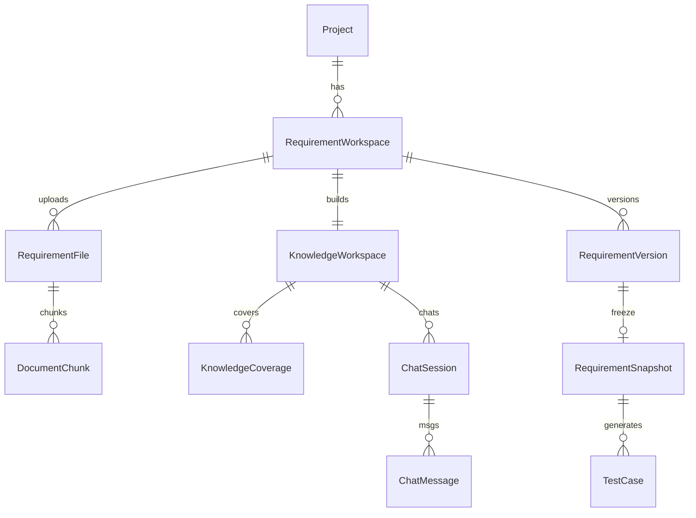

| Entity | Ghi chú |
|--------|---------|
| RequirementFile | mime, hash, status parse |
| DocumentChunk | ordinal, text, optional embedding |
| KnowledgeWorkspace | JSON/bảng con: Rules, Actors, UseCases, Glossary, APIs, DB, OpenQuestions |
| KnowledgeCoverage | dimension + Complete/Partial/Missing |
| RequirementVersion | n, draft\|active\|superseded |
| RequirementSnapshot | **copy-on-freeze**; **không UPDATE** nội dung (BR-V2-19) |
| TestCase | **FK `requirementSnapshotId`** bắt buộc TC Studio (BR-V2-20) |

**Generate-tc job input:** `snapshotId` only (BR-V2-16).  
**Audit:** freeze actor, chat knowledge-delta, generate-from-snapshot.

### 21.3 API flow (logical) — Phase 1

| API | Input | Output | BR |
|-----|-------|--------|-----|
| upload files | multipart | FileRef[] | BR-V2-18 |
| parse / rebuild knowledge | workspaceId | Knowledge | BR-V2-21 |
| chat | message + workspaceId | reply + knowledgeDiff | BR-V2-17 |
| coverage | workspaceId | matrix | |
| freeze | workspaceId + version | snapshotId | BR-V2-19 |
| generate-tc | **snapshotId** | TC drafts + snapshotId | BR-V2-16 |
| review / approve TC | tcId | status | (giữ) |

---

## 22. Security / Scalability / Extensibility

- JWT; API keys encrypted; IDE localhost + token  
- Snippets code không ghi PG; logs redacted  
- Path jail Apply (Phase 2)  
- Upload: giới hạn size/mime; scan virus nếu policy org; không execute file  
- Agent / Studio rounds giới hạn chi phí LLM  
- New IDE = adapter; new kind = plan profile + folder  
- Snapshot immutable + audit trail freeze/chat/generate-tc  

---

## 23. Error / Retry / Offline

| Situation | Behavior |
|-----------|----------|
| Parse fail / unsupported mime | File status=error; cho phép bỏ qua hoặc re-upload |
| Knowledge stale sau upload thêm | UI Stale → Rebuild trước Chat/Freeze (BR-V2-18) |
| Chat khi Knowledge chưa Ready | Block chat; yêu cầu build xong |
| Freeze khi Coverage Missing | **Warn bắt buộc** (liệt kê Missing); không block cứng (§6.4) |
| generate-tc thiếu snapshotId | 400 — BR-V2-16 |
| IDE disconnected | Block agent retrieval; advanced FS only với cảnh báo |
| Confidence low sau maxRounds | NeedsUserInput — chọn candidate / đặt caret / bổ sung hint |
| LLM fail | Retry backoff; giữ Agent Run / Studio state |
| Verify fail | Repair loop |
| Offline Backend | Generate/Analyze/Studio AI blocked |

---

## 24. Folder Structure

```text
AITest/
  desktop/
    src/features/requirementStudio/   # Upload, Knowledge, Chat, Coverage, Freeze
    src/… AgentRun / Workspace UI
  api/
    app/features/knowledge/           # Parser, Builder, Coverage
    app/features/snapshots/           # Freeze, immutable store
    app/features/requirement_chat/
    app/… agent runtime (Phase 2)
  packages/
    ide-protocol/          # RPC + BusinessIntent/Plan/Confidence types
  ide-plugins/
    vscode/                # Bridge + P10 commands (Phase 2)
    jetbrains/             # P6
    visualstudio/          # P7
  docs/
    ARCHITECTURE_V2_IDE_FIRST.md
    REQUIREMENT_STUDIO_*.md
    archive/
```

---

## 25. Migration v11 / V2.1 → V2.2

| Artifact | Fate |
|----------|------|
| Phase 1 Requirement CRUD / generate-tc từ text file | **Thay** bằng Requirement Studio → Snapshot (cutover R8) |
| TC cũ không có `requirementSnapshotId` | Backfill **nullable** → bắt buộc sau cutover Studio |
| Caret-first happy path | **Optional boost**; không còn primary DoD |
| `getSemanticContext` one-shot generate | Round 0 / boost only |
| FS `buildGenerateContext` | Offline advanced fallback |
| P0–P5.6 + P9–P10 code | **Foundation Phase 2 — giữ** |
| Local FS combobox hero | Removed from happy path (P5.5) |

---

## 26. Roadmap Phases (executable)

> Làm **tuần tự** trong từng track. Mỗi phase có DoD — không nhảy.  
> Foundation P0–P5.7 giữ. Agentic = **P9→P14**.  
> Requirement Studio = **R0→R8** (doc rồi code).  
> **Cấm:** full-project scan / dump repo vào LLM; **cấm** xen R-series giữa P10→P11.  
> R-series **trước hoặc song song** P11+ (khác team); Generate Unit vẫn cần Approved TC từ Snapshot khi Studio live.

### R-series — Requirement Studio (Phase 1)

| ID | Deliverable | Phụ thuộc |
|----|-------------|-----------|
| **R0** | Doc SoT 2.2 merged (checklist §13) | — |
| **R1** | Upload multi-file + FileRef PG | R0 |
| **R2** | Document Parser + Chunking | R1 |
| **R3** | Knowledge Builder + Workspace UI read-only | R2 |
| **R4** | Coverage Dashboard | R3 |
| **R5** | Chat + Knowledge Update | R3 |
| **R6** | Versioning + Freeze Snapshot | R5 |
| **R7** | Generate TC **from Snapshot only** + `requirementSnapshotId` | R6 |
| **R8** | Cutover: deprecate old Requirement CRUD paths | R7 |

**Cấm R1–R5:** implement Generate TC từ upload.

### Ownership (chốt)

| Thành phần | Owner | Không làm |
|------------|-------|-----------|
| Connect IDE, workflow UI, relay IDE cmds, Review/Apply/Run/Report | **Desktop** | Phân tích AST / đoán file từ TC |
| Business Analyzer, Planner, Confidence, Context Builder, Prompt, LLM | **Backend** | Đọc disk user / scan repo |
| Search / Read / Goto / Refs / Write / Run tests | **IDE Plugin** | Reasoning / generate unit |
| Generate Unit Test code | **LLM** (qua Backend) | Search workspace |

**Relay:** Backend không nối IDE. Desktop nhận `ContextPlan` → gọi IDE → gửi snippets → BE Context Builder / Confidence / Generate.

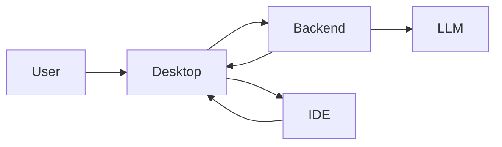

### Foundation — đã xong

| Phase | Nội dung | Status |
|-------|----------|--------|
| P0 | ide-protocol + mock | ✅ |
| P1 | VS Code/Cursor bridge + focus | ✅ |
| P2 | Desktop Connect IDE | ✅ |
| P3 | Context budget (local; migrate sang BE ở P12) | ✅ partial |
| P4 | BE packet-only generate | ✅ |
| P5 | Workspace Verify/Apply + AItest/ | ✅ |
| P5.5 | UI IDE-first cleanup | ✅ |
| P5.6 | Ensure test runner | ✅ |
| P5.7 | Agent Run UI shell + heuristic intent | ✅ shell |
| **P9** | Business Analyzer API (`/agent/analyze-intent`) | ✅ Done |
| **P10** | IDE Command Layer (search/read/goto/refs) | ✅ Done |

### Agentic — làm tiếp (bắt buộc theo thứ tự)

#### P9 — Business Analyzer (Backend) — ✅

| | |
|--|--|
| **Mục tiêu** | TC → `BusinessIntent` (LLM). Không đọc source. |
| **Đã ship** | `POST /api/agent/analyze-intent`; heuristic fallback; Desktop Agent panel gọi API |
| **DoD** | Intent từ BE (hoặc heuristic nếu AI chưa Ready); không đọc source |

#### P10 — IDE Command Layer (Plugin) — ✅

| | |
|--|--|
| **Mục tiêu** | IDE = Context Provider: Search / Read / Goto / Refs (giới hạn hits + bytes) |
| **Đã ship** | RPC `searchSymbol`, `searchText`, `goToDefinition`, `findReferences`, `readFile`; mock + tests; VS Code handlers; Desktop `retrieveViaIdeCommands` |
| **DoD** | Desktop gọi từng lệnh; 0 dump workspace |
| **Limits** | `IdeCommandLimits` (≤20 hits, ≤32KB read) |

#### P11 — Planner + retrieval loop

| | |
|--|--|
| **Mục tiêu** | BE Planner → Desktop relay IDE → lặp đến đủ / maxRounds |
| **Làm** | `POST /agent/plan-next`; AgentRunController; maxFiles/maxRounds |
| **DoD** | 1 TC → ≤ N snippets; không full-tree |
| **Owner** | Backend + Desktop |
| **Phụ thuộc** | P9, P10 |
| **Không** | Generate khi chưa qua confidence |

#### P12 — Context Builder + Confidence (Backend)

| | |
|--|--|
| **Mục tiêu** | BE merge/dedupe/graph nhẹ + chấm confidence; Desktop không “hiểu” source |
| **Làm** | evaluate-confidence + build packet ephemeral; threshold gate |
| **DoD** | Score candidates; `enough=false` → block generate (override có audit) |
| **Owner** | Backend; Desktop chỉ UI bars |
| **Phụ thuộc** | P11 |
| **Migrate** | Rank/budget từ Desktop P3 → BE |

#### P13 — Prompt + Generate Unit E2E

| | |
|--|--|
| **Mục tiêu** | Prompt = TC + Intent + context + framework → LLM → test |
| **Làm** | Harden generate-unit; path AItest/UnitTest/{Module}/ |
| **DoD** | Analyze→Plan→Fetch→Confidence→Generate→Staging trên 1 repo thật |
| **Owner** | Backend; Desktop staging P5 |
| **Phụ thuộc** | P12, P5 |

#### P14 — Review → Write → Run → Coverage

| | |
|--|--|
| **Mục tiêu** | Desktop Review → Write IDE → Run → Coverage |
| **Làm** | Timeline production; NeedsUserInput; openFile; coverage meta |
| **DoD** | Không cần file combobox; low confidence có CTA rõ |
| **Owner** | Desktop + IDE write/run |
| **Phụ thuộc** | P13, P5, P5.6 |

### Sau agent ổn

| Phase | Mục tiêu | Khi |
|-------|----------|-----|
| P6 | JetBrains (cùng commands) | Sau P10 |
| P7 | Visual Studio / Roslyn | Sau P10 |
| P8 | Integration/API/E2E profiles | Sau P14 |

```text
P0…P5.7
  → P9 Analyzer
  → P10 IDE Commands
  → P11 Planner loop
  → P12 Context + Confidence (BE)
  → P13 Generate E2E
  → P14 Review/Write/Run
       → P6/P7 · P8
```

### Bạn đang ở đâu?

| Hiện trạng | Phase tiếp |
|------------|------------|
| P5 + Agent UI stub | ~~P9~~ ✅ |
| Intent API OK | ~~P10~~ ✅ |
| **IDE search/read OK (hiện tại)** | **P11** |
| Loop lấy đúng vài file | **P12** |
| Confidence tin cậy | **P13** |
| Generate ổn 1 project | **P14** |

> **Thứ tự bắt buộc (agentic):** P9 → P10 → P11 → P12 → P13 → P14.  
> **P6 / P7** = adapter IDE khác (cùng command layer P10) — làm **song song hoặc sau** khi agent ổn trên VS Code/Cursor, không chèn giữa P10→P11.  
> **P8** = nhiều loại test — **sau P14**.

### Anti-goals

- Không scan all / index full repo → LLM  
- Không Backend đọc disk user  
- Không IDE gọi LLM  
- Không generate khi confidence thấp mà không hỏi user  

---

## 27. Future Roadmap

- Multi-snapshot compare / diff Freeze  
- CI agent generate-on-PR  
- Shared prompt policies  
- Mutation / contract / perf packs  
- Multi-repo workspaces  

---

## 28. Glossary

| Term | Nghĩa |
|------|--------|
| Requirement Workspace | UI + state Studio trên Knowledge |
| Knowledge Workspace | Knowledge structured — nguồn AI Phase 1 |
| Requirement Snapshot | Freeze immutable; input Generate TC |
| Document Parser / Knowledge Builder | Parse→chunk→Knowledge |
| Requirement Coverage | Complete/Partial/Missing (Phase 1) |
| Code Coverage | Coverage sau chạy test (Phase 2) |
| BusinessIntent | Intent nghiệp vụ có cấu trúc từ TC |
| ContextPlan | Kế hoạch retrieval của Planner |
| ConfidenceReport | Điểm tin cậy candidate symbols |
| IDE Command Layer | RPC search/read/goto — không AI |
| AgentRunController | Desktop loop orchestrating agents + IDE |
| IdeSemanticPacket | Snapshot caret / symbol (boost) |
| AITestContextPacket | Packet gửi Prompt sau merge |
| Workspace (staging) | `.ai-test/` trước Apply unit |

---

## Phụ lục A — Sequence: Unit Test E2E (Agentic)

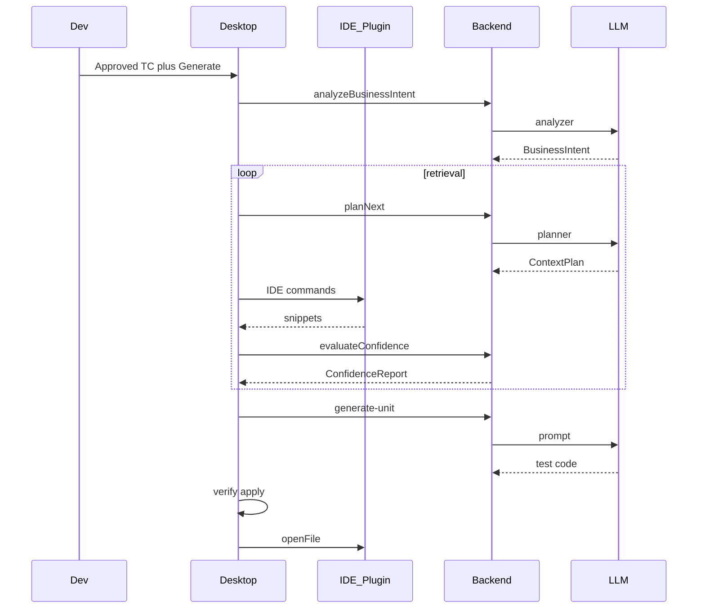

## Phụ lục B — Class sketch

```text
«interface» IIDEAdapter
  +searchSymbol(q): SymbolHit[]
  +goToDefinition(id): Location
  +readFile(path, range?): string
  +findReferences(id): SymbolRef[]

BusinessAnalyzer
  +analyze(tc): BusinessIntent

PlannerAgent
  +nextPlan(intent, gathered): ContextPlan

ConfidenceEvaluator
  +evaluate(intent, gathered): ConfidenceReport

AgentRunController
  +run(tc, opts): AgentRunResult

ContextBuilder
  +fromRetrieval(results, policy): AITestContextPacket
```

## Phụ lục C — UX copy (VI)

| Tình huống | Copy |
|------------|------|
| Chưa nối IDE | “Bật AITest bridge trong Cursor/VS Code — agent cần IDE để tìm code, không quét cả ổ đĩa.” |
| Đang phân tích | “Đang hiểu Test Case (action / entity / kết quả mong đợi)…” |
| Confidence thấp | “Chưa chắc đúng class — đặt caret vào Service hoặc chọn candidate.” |
| Đủ context | “Độ tin cậy đủ — có thể Sinh unit.” |
| Apply xong | “Đã Apply vào AItest/… — đã mở trong IDE.” |
| Knowledge chưa Ready | “Đang dựng Knowledge từ tài liệu — Chat sẽ mở khi xong.” |
| Coverage Missing trước Freeze | “Còn mục Missing — có thể Freeze nhưng nên bổ sung trước.” |
| Generate TC | “Chỉ sinh từ Snapshot đã Freeze — không từ file upload.” |

## Phụ lục D — Sequence: Requirement Studio (Phase 1)

Xem thêm §8.3. Tóm tắt:

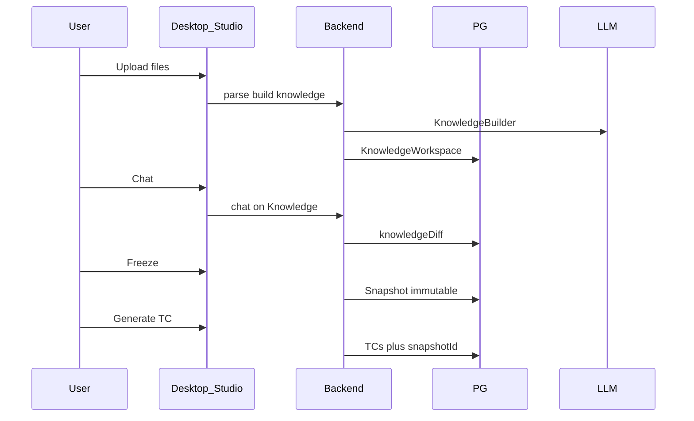

## Phụ lục E — Sequence: Snapshot → Test Case → Approve

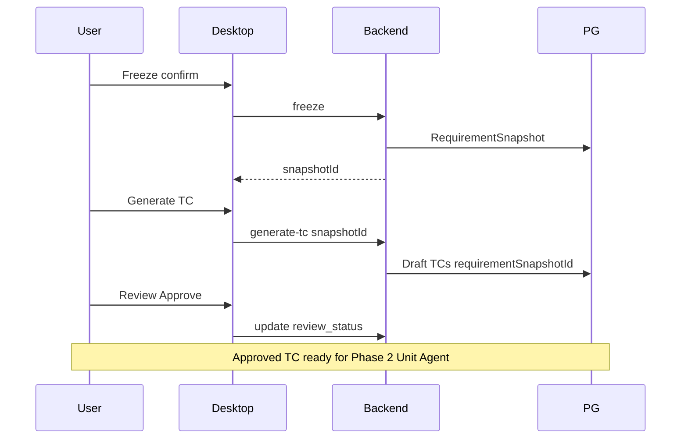

---

**Document owner:** Architecture  
**SoT version:** 2.2 — Requirement Studio + Agentic IDE  
**Foundation Phase 2:** P0–P5.7 + P9–P10  
**Phase 1 Studio:** **R0–R8 done** (Upload → Knowledge → Chat → Freeze → Gen TC from Snapshot → cutover Spec cũ + UI polish)  
**Next action (code Phase 1):** Harden UX theo feedback / monitor Snapshot→TC path  
**Next action (code Phase 2):** P11 Planner + retrieval loop (song song, không chèn giữa P10→P11 bằng R-series).
