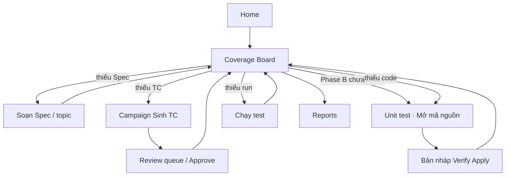

# Refactor flow — Spec → Test Case → Code (Coverage Board)

> **Mục tiêu:** hết loạn menu / wizard rời; người dùng làm việc trên **một bản đồ phủ dự án** (module).  
> **Không đập** hybrid Desktop + API + Agent Staging (ADR-002).  
> **Liên quan:** TDR R0–R8 · Journey Phase A/B · `KIEN_TRUC_DU_AN.md`

| | |
|--|--|
| **Trạng thái** | **IA Design/Automate** (2026-07-22) — Requirement + Unit test; tiếp **F7** |
| **Ưu tiên** | UX flow trước · API aggregate sau · Sidebar gọn cuối |
| **Không làm sớm** | Microservices · CQRS · đổi stack UI |

---

## F0 — Quyết định đã chốt (LOCKED)

> Doc-only. Không code ở F0. Mọi bước F1+ phải tuân thủ bảng này trừ khi mở ADR mới.

### F0.1 Information Architecture

| Quyết định | Chi tiết |
|------------|----------|
| **Coverage = SoT tinh thần** | Người dùng hỏi «còn thiếu gì?» → mở **Coverage Board** trước |
| **Generate* = action** | `/generate/tc`, `/generate/code` là wizard được CTA mở; không phải «nhà» của flow |
| **Spec = soạn + duyệt chi tiết** | Deep-link secondary sau F5; Coverage = SoT; Spec không xóa |
| **Reports ≠ Coverage Board** | Board = tiến độ Spec→TC→Code→Run; Reports = coverage % / file meta |
| **ADR-002 giữ nguyên** | Workspace Host ≠ Agent Staging; ô Code trên board: `staged` / `verified` / `applied` |

### F0.2 Sidebar — mock chốt (F1 thêm Coverage; F5 mới ẩn menu cũ)

**F1–F4 (song song — chưa xóa menu):**

```text
Tổng quan
  Home
  Projects
  Coverage          ← F1 thêm (primary mới)

A — Design
  Spec              ← giữ đến F5
  Sinh test case    ← giữ deep-link

B — Automate
  Workspace
  Unit test
  Chạy test

C — Insight
  Báo cáo
  Activity
  Cấu hình AI
```

**IA hiện tại (Design / Automate):**

```text
Design
  Home · Projects · Requirement
    (hub: theo dõi · chờ duyệt TC · soạn yêu cầu)
Automate
  Workspace · Unit test · Chạy test
Insight
  Báo cáo · Activity · Settings

Chu trình: Requirement (yêu cầu→chức năng→TC) → Workspace → Unit test → Run
```

### F0.3 Policy v1 — trạng thái & CTA (đóng băng)

**Module key**

- Nguồn: `TC.module` ∪ `requirement_topics.name` ∪ tên suy từ Spec  
- Normalize: `trim` + gộp case-insensitive; hiển thị tên đầu tiên gặp  
- Bucket thiếu tên: `(không module)`  

**Spec (ô)**

| Giá trị | Điều kiện |
|---------|-----------|
| `missing` | Không có requirement gắn module/topic này |
| `ready` | ≥1 requirement (có nội dung) gắn module |

*(v1 không dùng `draft` riêng — có req = ready)*

**TC (ô)**

| Giá trị | Điều kiện |
|---------|-----------|
| `none` | `tcTotal = 0` |
| `draft_heavy` | `tcTotal > 0` và `tcApproved = 0` |
| `partial` | `0 < tcApproved < tcTotal` |
| `ready` | `tcApproved ≥ 1` **và** không còn Draft/InReview *bắt buộc duyệt* — v1: `ready` khi `tcApproved ≥ 1` (Draft vẫn hiện số; CTA ưu tiên Duyệt nếu `tcDraft > 0`) |

**Code (ô) — v1 best-effort**

| Giá trị | Điều kiện |
|---------|-----------|
| `none` | Không có workspace-run/apply cho module |
| `staged` / `verified` | Có run status generated/pass (chưa applied) |
| `applied_partial` | `0 < codeApplied < tcApproved` |
| `applied` | `codeApplied ≥ tcApproved` (tcApproved ≥ 1) |

Nếu chưa map được module từ audit: coi **project-level** hint trên banner, ô module = `none` (F7 sửa).

**Run (ô) — v1**

| Giá trị | Điều kiện |
|---------|-----------|
| `none` | Chưa có execution Passed sau khi có applied (project-level OK) |
| `failing` | Execution gần nhất Failed/Error (project) |
| `passing` | ≥1 Passed gần đây (project) |

**Thứ tự ưu tiên CTA (một primary / hàng) — LOCKED**

```text
1. spec missing          → Soạn Spec     → /spec (hoặc create)
2. tc none               → Sinh TC       → /generate/tc?...
3. tcDraft > 0           → Duyệt TC      → /spec (filter)  [trước Sinh mã]
4. tcApproved≥1 & code gap → Sinh mã     → /generate/code?mode=module&module=
5. code applied & run none/fail → Chạy test → /run
6. else                  → — hoặc Xem báo cáo → /reports
```

Phase B: nếu CTA = Sinh mã mà **chưa** local folder → soft-gate `/unit-test` (Mở mã nguồn inline; không `/workspace`).

**Gap fill project-level (F3)**

- «Sinh TC còn thiếu»: module có Spec ready và `tcTotal = 0` (hoặc policy mở rộng sau)  
- «Sinh mã còn thiếu»: module `tcApproved ≥ 1` và code chưa `applied`  
- Luôn confirm modal + Activity campaign  

### F0.4 Out of scope F0–F2

- Không RBAC · không Alembic mới · không đổi LLM prompt  
- Không xóa route Spec/Generate  
- Không API `coverage-board` (F6)  

### F0.5 DoD F0 — đạt

- [x] Coverage = SoT; Generate* = action  
- [x] Policy v1 chốt (mục F0.3)  
- [x] Sidebar mock F1 vs F5 ghi rõ  

**Ký xác nhận:** product/dev — 2026-07-22 (agent + user kickoff F0)

---

## 1. Vấn đề hiện tại

```text
Sidebar: Spec | Sinh TC | Workspace | Sinh mã | Run | …
              ↓          ↓              ↓
         nhiều cửa vào cùng một câu chuyện
```

| Hiện tượng | Hệ quả |
|------------|--------|
| Spec / Sinh TC / Sinh mã là **3 thế giới** | User không biết đang “phủ dự án” tới đâu |
| Sinh **1 TC** hoặc **1 module** | Khó bao quát cả project |
| Journey tuyến tính | Thiếu góc nhìn **gap theo module** |
| Workspace Host vs Agent Staging | Dễ loạn tên (đã ADR — cần board phản ánh trạng thái code) |

**Nhu cầu thật:** *“Module nào còn thiếu Spec / TC / code / run?”* → một CTA cho chỗ trống đó.

---

## 2. Target product flow

### 2.1 Màn trung tâm: Coverage Board

```text
Dự án «Forensic»
┌──────────────┬──────┬─────────────┬──────────────┬─────────┬────────────┐
│ Module       │ Spec │ TC          │ Code         │ Run     │ CTA        │
├──────────────┼──────┼─────────────┼──────────────┼─────────┼────────────┤
│ Auth         │ ✅   │ 12 (8 Apr)  │ 3/8 applied  │ 2 pass  │ Sinh mã…   │
│ Payment      │ ✅   │ 0           │ —            │ —       │ Sinh TC    │
│ Reports      │ ❌   │ —           │ —            │ —       │ Soạn Spec  │
└──────────────┴──────┴─────────────┴──────────────┴─────────┴────────────┘

[ Sinh TC còn thiếu — cả dự án ]   [ Sinh mã còn thiếu — cả dự án ]
```

**Quy tắc CTA (đúng một primary / hàng):**

| Điều kiện | CTA |
|-----------|-----|
| Chưa Spec (hoặc topic trống) | Soạn Spec |
| Có Spec, TC = 0 hoặc thiếu Draft | Sinh TC |
| Có Draft/InReview, chưa đủ Approved | Duyệt TC |
| Có Approved, code applied < approved | Sinh mã (→ Agent Staging) |
| Đã Apply, chưa có execution gần | Chạy test |
| Đủ Spec+TC+Code+Run xanh | — (hoặc Xem report) |

### 2.2 Happy path (sau refactor)



### 2.3 Sidebar target (gọn)

```text
Home
Projects
Coverage          ← NEW (Spec + TC + Code + Run status)
Workspace         ← Phase B — gắn folder / tree / sync
Run
Reports
Activity          ← jobs + campaigns
Settings
```

**Deep-link giữ (không hiện hoặc secondary):**

- `/generate/tc` — mở từ CTA «Sinh TC»
- `/generate/code` — mở từ CTA «Sinh mã»
- `/spec` — redirect hoặc tab trong Coverage («Chi tiết Spec»)

---

## 3. Khái niệm domain (ổn định)

| Thuật ngữ UI | Nghĩa |
|--------------|--------|
| **Coverage Board** | Bảng phủ theo module/topic |
| **Module / Topic** | Đơn vị hàng trên board (từ `requirement_topics` + TC.module) |
| **Gap fill** | Campaign sinh phần còn thiếu (TC hoặc code) trên cả dự án / filter |
| **Mở mã nguồn** | Gắn folder local trên trang Unit test (`bindSourceRoot`) |
| **Bản nháp test** | `.ai-test/workspace/<run-id>/` — Verify → Apply (Agent Staging) |
| **Campaign** | Hàng đợi batch (đã có audit) — gắn progress lên board |

---

## 4. Trạng thái từng ô (định nghĩa)

### Spec
- `missing` | `draft` | `ready` (có nội dung + topic)

### TC
- `none` | `draft_heavy` (có TC nhưng Approved = 0) | `partial` | `ready` (Approved ≥ ngưỡng, vd. ≥1 hoặc ≥ N theo policy)

### Code (aggregate từ WorkspaceRun / Apply audit — meta PG)
- `none` | `staged` | `verified` | `applied_partial` | `applied`

### Run
- `none` | `failing` | `passing` (execution gần nhất theo module nếu có; interim: theo project)

**Policy v1:** xem **§ F0.3** (LOCKED). Không đổi tại đây mà không cập nhật F0.

---

## 5. API đề xuất (không breaking ngay)

### 5.1 Aggregate (mới)

```http
GET /api/projects/{id}/coverage-board
```

Response (sketch):

```json
{
  "projectId": "...",
  "modules": [
    {
      "key": "Auth",
      "specStatus": "ready",
      "requirementIds": ["..."],
      "tcTotal": 12,
      "tcApproved": 8,
      "tcDraft": 4,
      "codeApplied": 3,
      "codeStaged": 1,
      "runPass": 2,
      "runFail": 0,
      "nextAction": "generate_code",
      "nextLabel": "Sinh mã còn thiếu",
      "nextPath": "/generate/code?mode=module&module=Auth"
    }
  ],
  "totals": { "modules": 3, "readyModules": 0, "gaps": 3 },
  "nextProjectAction": {
    "action": "generate_tc_gaps",
    "label": "Sinh TC còn thiếu — cả dự án",
    "path": "/generate/tc?mode=gaps"
  }
}
```

### 5.2 Campaign gap-fill (mở rộng jobs hiện có)

```http
POST /api/projects/{id}/actions/generate-tc-gaps
POST /api/projects/{id}/actions/generate-code-gaps
```

Body: `{ "moduleKeys": ["Auth"] | null, "onlyApproved": true }`  
→ tạo campaign; FE poll Activity + refresh board.

**V1 có thể:** FE tính gap từ list TC + list runs hiện có, **chưa** bắt buộc endpoint mới — endpoint làm ở bước C.

---

## 6. FE structure (target)

```text
desktop/src/features/coverage/
  CoverageBoardPage.tsx      # màn chính
  model/
    coverageTypes.ts
    useCoverageBoard.ts      # React Query
  ui/
    ModuleRow.tsx
    GapFillBar.tsx           # 2 nút project-level
    ModuleStatusTags.tsx
```

Wizard giữ:

- `features/generate-tc` — mở với query `module` / `mode=gaps`
- `features/generate-code` — soft gate Workspace; Agent Staging như hiện tại
- Spec editor — drawer/tab từ board hoặc route `/coverage/spec/:id`

---

## 7. Roadmap từng bước (làm tuần tự)

### F0 — Chốt policy + IA (doc only)

**Làm**

- [x] Team agree: Coverage = SoT; Generate* = action  
- [x] Chốt policy v1 (mục 4 → **§ F0.3**)  
- [x] Sidebar mock F1/F5 (§ F0.2)  

**DoD:** Không tranh cãi «Spec vs Sinh TC» trước khi code. ✅

---

### F1 — Coverage Board read-only (FE)

**Làm**

- [x] Route `/coverage`  
- [x] Aggregate **client-side** từ APIs hiện có: requirements, topics, testcases, (optional) workspace-runs  
- [x] Bảng module + tags + **một** `Link` CTA / hàng  
- [x] Empty state: «Tạo Spec đầu tiên»  
- [x] Sidebar thêm **Coverage** (chưa ẩn Spec/Generate)  

**Không:** xóa Spec/Generate menu ngay.

**DoD:** User mở Coverage thấy module Forensic (hoặc «(không module)») + CTA đúng gap. ✅

---

### F2 — Gắn CTA → wizard có context

**Làm**

- [x] CTA «Sinh TC» → `/generate/tc?requirementId=&module=&scope=module`  
- [x] CTA «Duyệt» → `/spec?review=1&module=` (lọc Draft; Approve → Coverage)  
- [x] CTA «Sinh mã» → `/generate/code?mode=module&module=` + soft gate Workspace  
- [x] Sau Generate TC / batch code OK / Apply → `navigate('/coverage')` + toast  

**DoD:** Làm 1 module end-to-end từ Coverage **không cần nhớ sidebar**. ✅

---

### F3 — Gap fill cả dự án (campaign UX)

**Làm**

- [x] Nút «Sinh TC còn thiếu — cả dự án» (confirm + campaign `kind=tc`)  
- [x] Nút «Sinh mã còn thiếu — cả dự án» (Workspace gate → `/generate/code?mode=gaps`)  
- [x] Progress banner trên Board + link Activity; poll campaign Running  
- [x] Disable double-submit khi đang chạy gap-fill  

**DoD:** Một click phủ nhiều module; Activity hiện campaign; Board refresh sau completed. ✅

---

### F4 — Review queue trên Board

**Làm**

- [x] Tab «Chờ duyệt» — TC Draft/InReview, bulk Approve/Reject  
- [x] Drawer xem nhanh TC; link «Sửa trên Spec» cho nội dung dài  
- [x] CTA «Duyệt TC» → `/coverage?tab=review&module=`  

**DoD:** Approve không bắt buộc nhảy Spec full-page. ✅

---

### F5 — Sidebar & route cleanup

**Làm**

- [x] Sidebar: **Coverage** primary; «Sinh test case» / «Sinh mã» / «Soạn Spec» → secondary deep-link  
- [x] Legacy `/requirements` `/testcases` → `/coverage`; `/spec` giữ deep-link Soạn Spec (không hard-redirect)  
- [x] `/generate` → `/generate/tc` giữ deep-link  
- [x] Home / Journey CTA → `/coverage` khi đã có project (+ AI Ready)  

**DoD:** User mới chỉ cần Home → Coverage để hiểu dự án.

---

### F6 — API `coverage-board` + indexes

**Làm**

- [x] `GET .../coverage-board` (mục 5.1) — SQL aggregate TC/runs + Spec topics  
- [x] FE chuyển từ client aggregate → React Query (`useCoverageBoard`)  
- [x] Index DB: `(project_id, module, review_status)` + workspace_runs / requirement_topics (Alembic `0002` + startup `_ensure_indexes`)  

**DoD:** Board load < 1s với ~5k TC (page/filter server).

---

### F7 — Code/Run status chính xác hơn

**Làm**

- [ ] Map Apply audit / workspace-run → `module`  
- [ ] Run history filter theo module (best-effort parser)  
- [ ] Ô Code/Run trên board không còn «project-level guess»  

**DoD:** Sau Apply + Run, hàng module chuyển xanh đúng.

---

### F8 — GUIDE + checklist smoke

**Làm**

- [ ] Cập nhật hướng dẫn: Coverage là lối vào chính  
- [ ] Smoke: Board → gap TC → Approve → Workspace → gap code → Verify → Apply → Run → Board xanh  

**DoD:** Người mới 15 phút hiểu «phủ dự án».

---

## 8. Thứ tự bắt buộc

```text
F0 → F1 → F2 → F3 → F4 → F5 → F6 → F7 → F8
```

- **F1–F2** = giá trị UX lớn nhất, rủi ro thấp.  
- **F5** chỉ sau khi Board đã thay được Spec làm SoT tinh thần.  
- **F6–F7** = scale & đúng số liệu.

---

## 9. Rủi ro & chống scope creep

| Rủi ro | Cách tránh |
|--------|------------|
| Viết lại Spec/Generate từ đầu | Board bọc ngoài; wizard giữ |
| «Coverage» trùng Reports | Board = tiến độ Spec→Code; Reports = coverage % / file upload |
| Gap fill đốt token LLM | Confirm + limit module/batch; concurrency cap sẵn có |
| Module key lệch tên | Normalize: trim, case-fold; bucket `(không module)` |
| Đập ADR-002 | Board label Code: staged/verified/applied — không gọi staging là Workspace |

---

## 10. Nhật ký tiến độ

| Bước | Ngày | PR / commit | Ghi chú |
|------|------|-------------|---------|
| F0 | 2026-07-22 | docs only | LOCKED § F0 — Coverage SoT, policy CTA, sidebar mock |
| F1 | 2026-07-22 | FE | `/coverage` + buildCoverageBoard + nav Coverage |
| F2 | 2026-07-22 | FE | CTA deep-link + quay Coverage sau Generate/Approve/Apply |
| F3 | 2026-07-22 | FE | GapFillBar TC campaign + code mode=gaps |
| F4 | 2026-07-22 | FE | Tab Chờ duyệt + bulk Approve + drawer |
| F5 | 2026-07-22 | FE | Sidebar secondary tools; journey/Home → Coverage; legacy list → Coverage |
| F6 | 2026-07-22 | API+FE | `GET .../coverage-board` + indexes + `useCoverageBoard` |
| — | 2026-07-22 | API+FE | Multi-file SRS → Feature/chức năng đầy đủ; fan-out job khi sinh TC |
| F7 | | | tiếp theo |
| F8 | | | |

---

## 11. Bắt đầu ngay

1. ~~Tick **F0**~~ … ~~**F6**~~ ✅  
2. **Tiếp theo: F7** — Code/Run status theo module (Apply audit / execution).  
3. **F8** — GUIDE + smoke Coverage.

**Không** song song F5 (đổi sidebar gọn) trước khi F1 dùng được hàng ngày. *(đã xong F5)*
