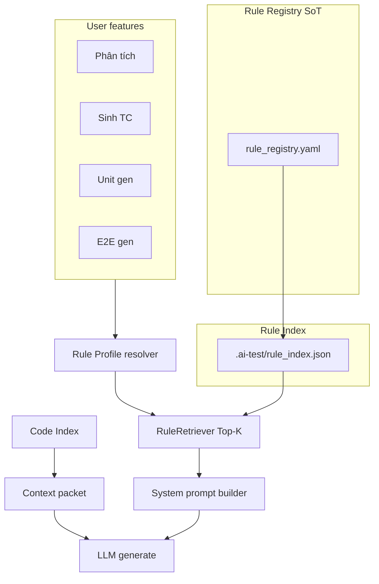

# Rule Index — Phase 0 Audit & Plan

> **Phase 0 (this doc):** inventory + flow mapping + taxonomy — **no runtime change**.  
> **Phase 1+:** registry + selective retrieve behind feature flag.

Related artifacts:

- **[`.cursor/rules/rule-index.mdc`](../../.cursor/rules/rule-index.mdc)** — Cursor/agent governance (đọc khi sửa rule)
- [`rule_inventory.csv`](rule_inventory.csv) — 50 rule artifacts (runtime + guard + dev)
- [`rule_flow_matrix.csv`](rule_flow_matrix.csv) — 10 user-facing features → tag profile

---

## 1. Executive summary

| Hiện tại | Sau Rule Index (target) |
|----------|------------------------|
| Rule rải 15+ file Python + `.mdc` | **1 registry** (`api/app/rules/`) |
| Mỗi gen inject **full block** (UUTGS ~5.5k, E2ECG ~12k chars) | **Top-K rule chunks** theo profile |
| Code Index chỉ cho **source** | **Rule Index** song song Code Index |
| Phân tích enrich: fidelity A–K full | Retrieve: `features` + `flows` + `validation` + `fidelity` subset |
| Không log rule IDs đã dùng | Mỗi job log `rule_ids[]` + token budget |

**Đánh giá:** Thay đổi **hiệu quả cao** nếu rollout incremental + A/B (`AITEST_RULE_RETRIEVE_MODE=full|selective`). Rủi ro chính: thiếu rule bắt buộc → cần `priority=required` luôn inject.

---

## 2. Chức năng hệ thống → rule hôm nay

| # | Chức năng | LLM? | Rule inject hôm nay | ~chars system |
|---|-----------|------|----------------------|---------------|
| 1 | Phân tích heuristic | Không | Python sanitize only | 0 |
| 2 | Phân tích enrich | Có | `ANALYSIS_FIDELITY_RULES` + JSON schema | ~4.5k |
| 3 | Chat Knowledge | Có | `ANALYSIS_CHAT_DIFF_RULES` | ~0.7k |
| 4 | Sinh TC Unit | Có | `UNIT_TC_FROM_ANALYSIS` + COMPACT + overlay + project/user | ~3–6k |
| 5 | Sinh TC E2E | Có | `E2E_TC_FROM_ANALYSIS` + E2E COMPACT + overlay + project/user | ~5–9k |
| 6 | Sinh TC mixed | Có | `DEFAULT_TC_GENERATION_RULES` (70 dòng) | ~5.5k |
| 7 | Sinh Unit code | Có | **Full UUTGS** + emit + TS/C# overlays + project/user | ~7–9k |
| 8 | Sinh E2E code | Có | **Full E2ECG 1–33** + journey pointer + auth overlays + project/user | ~12–15k |
| 9 | Sinh API test | Có | Inline `api_system_prompt` | ~0.5k |
| 10 | E2E heal / guard | Không | `e2e_codegen_guard`, `failure_taxonomy` | 0 (runtime) |
| 11 | Desktop DoR | Không | `assertTcReadyForE2eGen` | 0 |

**Index hôm nay:** chỉ **source code** (`.ai-test/index.db`). **Rule không được index.**

---

## 3. Taxonomy tags (chuẩn Phase 1+)

### 3.1 Domains

| Domain | Mô tả |
|--------|--------|
| `analysis` | Phân tích SRS → Knowledge 12 bucket |
| `tc_gen` | Sinh Test Case từ Freeze/Knowledge |
| `unit_codegen` | Sinh file unit test |
| `e2e_codegen` | Sinh Playwright POM/spec |
| `api_codegen` | Sinh API test |
| `runtime_guard` | Post-gen deterministic (không LLM) |
| `desktop_gate` | Desktop fail-closed trước gen |
| `dev_cursor` | `.cursor/rules` — dev only |
| `docs_pointer` | Tài liệu con trỏ |

### 3.2 Tags (retrieve filter)

| Tag | Dùng cho |
|-----|----------|
| `unit` | Unit test codegen |
| `mock` | Mock/stub/spy policy |
| `assertion` | Assert style, meaningful asserts |
| `isolation` | Deterministic, no flaky |
| `naming` | File/class/test naming, AAA |
| `sut-safety` | No bootstrap/main entry |
| `portable` | Cross-project hard rules |
| `playwright` | Playwright TS emit |
| `auth` | Login, storageState, roles |
| `locator` | Locator priority, contract |
| `journey` | Feature entry, workflow steps |
| `dor` | Definition of Ready (E2ECG 20–28) |
| `grounding` | FE/DOM/path fail-closed |
| `traceability` | TC trace: TYPE/id |
| `features` | FEATURES bucket / FR capability |
| `flows` | useCases / MSS |
| `validation` | field+rule |
| `br` | business rules |
| `fidelity` | Phân tích A–K |
| `knowledge-diff` | Chat ops |
| `format` | TC title/module/priority VN |
| `coverage` | TC coverage gate |
| `path` | featurePath / route |
| `auth-who` | execution context WHO |
| `api` | HTTP/OpenAPI |
| `errors` | Failure taxonomy / repair |
| `heuristic` | Non-LLM sanitize |

---

## 4. Selective profiles (Phase 2 target)

### PROFILE-UNIT-CODEGEN

```
required: unit, mock, assertion, isolation, sut-safety, portable, naming
optional: typescript | csharp (from stack)
exclude: playwright, locator, journey
budget: ~3500 chars (vs ~9000 full today)
```

### PROFILE-E2E-CODEGEN

```
required: playwright, auth, locator, journey, dor, portable, grounding
optional: heal, per-tc-hints
exclude: mock, unit-bootstrap
budget: ~6000 chars (vs ~14000 full today)
```

### PROFILE-ANALYSIS-ENRICH

```
required: fidelity, features, flows, validation, schema
optional: actors, br, api, ac, exec-context, nfr, gaps
exclude: uutgs, e2ecg, tc-gen
budget: ~4000 chars (similar today but chunked + retrievable)
```

### PROFILE-TC-UNIT

```
required: traceability, features, validation, br, format
optional: aaa, bootstrap, speed
exclude: playwright, path, flows-ui
```

### PROFILE-TC-E2E

```
required: traceability, flows, path, auth-who, coverage, format
optional: auth-hint, target-url, speed
exclude: mock, sut-safety
```

---

## 5. Proposed chunking (monolithic → indexable)

### UUTGS (`uutgs_rules.py`) → 10 chunks

| Chunk ID | Section | Tags |
|----------|---------|------|
| `UUTGS-01` | Objective | unit |
| `UUTGS-02` | Principles / SoT | unit;portable |
| `UUTGS-03` | Context | unit |
| `UUTGS-04` | Dependencies / Mock | unit;mock |
| `UUTGS-05` | Scenario scope | unit |
| `UUTGS-06` | Assertions & isolation | unit;assertion;isolation |
| `UUTGS-07` | Conventions & stack | unit;naming |
| `UUTGS-08` | Output & validation | unit |
| `UUTGS-09` | Forbidden | unit;sut-safety |
| `UUTGS-10` | Portable hard | unit;portable |

### E2ECG (`e2e_codegen_rules.py`) → 5 chunks

| Chunk ID | Rules | Tags |
|----------|-------|------|
| `E2ECG-I` | 1–6 Auth & role | e2e;auth;playwright |
| `E2ECG-II` | 7–19 Implementation | e2e;locator;journey;playwright |
| `E2ECG-III` | 20–28 DoR | e2e;dor;errors |
| `E2ECG-IV` | 29–33 Portable | e2e;portable;grounding |
| `E2ECG-FORBIDDEN` | Forbidden block | e2e;portable |

### Analysis (`knowledge_builder.py`) → 13 chunks

- `ANALYSIS-FIDELITY-A-K` (1 chunk, có thể split A–F / G–K)
- 12× `ANALYSIS-GUIDE-*` (đã có trong inventory)

---

## 6. Kiến trúc đích (Phase 1–4)



### Module layout (Phase 1)

```
api/app/rules/
  rule_registry.yaml      # SoT content + tags
  registry_loader.py      # load + validate
  profiles.py             # PROFILE-* definitions
  retriever.py            # retrieve_for_profile()
desktop/src/lib/ruleIndex/   # optional mirror for desktop-only gates
```

### Feature flag

```bash
AITEST_RULE_RETRIEVE_MODE=full      # default Phase 1 (no behavior change)
AITEST_RULE_RETRIEVE_MODE=selective # Phase 2+ per profile
```

---

## 7. Phase roadmap

| Phase | Deliverable | Risk |
|-------|-------------|------|
| **0** ✅ | `rule_inventory.csv`, `rule_flow_matrix.csv`, this doc | None |
| **1** | `rule_registry.yaml` + loader; adapters keep `full` inject | Low |
| **2** | Selective retrieve **Unit codegen** only + metrics log | Medium — A/B |
| **3** | E2E codegen + Phân tích enrich profiles | Medium |
| **4** | TC gen profiles; remove duplicate `.mdc` text; deprecate full inject | Low after KPI green |

---

## 8. KPI (đo trước/sau Phase 2)

| Metric | Baseline (ước lượng) | Target selective |
|--------|----------------------|------------------|
| Unit system prompt chars | ~7–9k | −35% to −50% |
| E2E system prompt chars | ~12–15k | −40% to −55% |
| First-pass compile rate (unit) | measure | +5% |
| E2E ContextMissing rate | measure | −20% |
| Phân tích feature-as-widget noise | measure post-sanitize | −80% |
| Wrong-domain rule in prompt | manual audit | 0 (no E2ECG in unit) |

---

## 9. Governance

1. **Single SoT:** runtime text lives in `rule_registry.yaml`; Python files become thin `def block(): return registry.get(...)` during migration.
2. **Sync:** `.cursor/rules/*.mdc` = pointers only (like `e2e-feature-journey.mdc` today).
3. **PR checklist:** new rule → add row in `rule_inventory.csv` + tag + profile.
4. **Tests:** `test_rule_registry.py` — every `required` tag in profile resolves ≥1 chunk.

---

## 10. Gaps found in Phase 0 audit

| Gap | Impact | Phase fix |
|-----|--------|-----------|
| No rule index | Full inject every job | 1–2 |
| `ANALYSIS_TC_READINESS_CHECKLIST` not wired to enrich | Checklist only in tests | 3 |
| `ANALYSIS_CRITERIA_GUIDE` not in enrich prompt | LLM relies on fidelity + sanitize | 3 retrieve by bucket |
| `E2E_GROUNDING_RULES` full text not in system prompt | Only pointer | 2 optional chunk |
| `DEFAULT_TC_GENERATION_RULES` still used for mixed TC | Bloated when engine unset | 4 |
| Duplicate narrative in `.mdc` vs Python | Drift risk | 4 pointer-only mdc |
| Project/User rules uncapped path | Can blow prompt | 1 cap in registry layer |

---

## 11. Next action (Phase 1 kickoff)

1. Create `api/app/rules/rule_registry.yaml` from inventory rows with `inject_mode=full_block`.
2. Implement `registry_loader.py` + validation schema.
3. Change `uutgs_system_block()` to read registry (content identical — **zero behavior change**).
4. Add CI test: registry char count matches current `UUTGS_SPEC` hash.

---

*Generated: Phase 0 audit. Update inventory CSV when adding/moving rules.*
