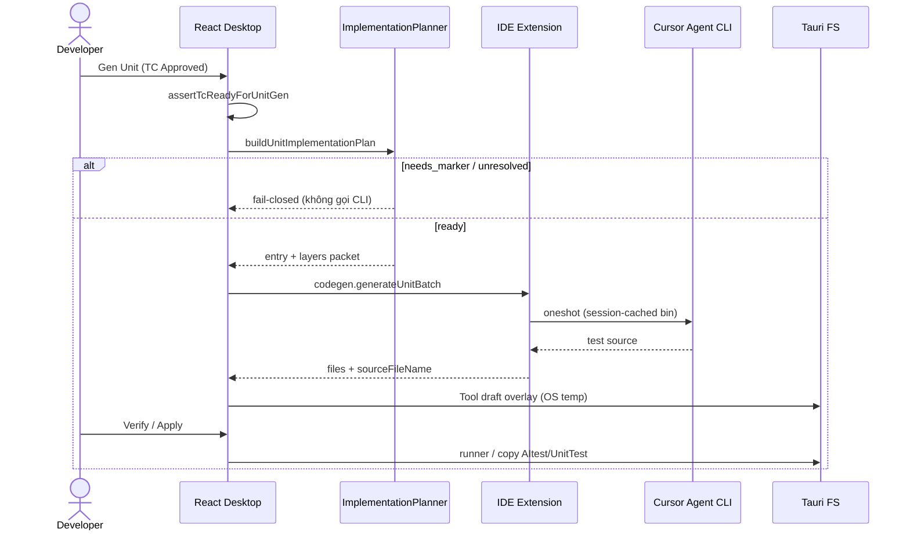

# SYSTEM MASTER DOCUMENTATION — AITEST PLATFORM
## Sách Trắng & Tài Liệu Tổng hợp Toàn Bộ Kiến Trúc, Quy Trình & Spec Hệ Thống

| Thông tin | Chi tiết |
|---|---|
| **Sản phẩm** | **AITest Platform** (AITest Desktop App & Backend Service & IDE Extension) |
| **Mô hình Kiến trúc** | **Hybrid Architecture** (Desktop App + Tauri FS + **IDE Extension Bridge** + Python REST Backend + PostgreSQL + AI CLI) |
| **Stack Sản phẩm** | **Frontend:** React 19 (Vite, TypeScript) + **Tauri v1** (Rust Native Bridge)<br>**Backend:** Python 3.12 (FastAPI, Uvicorn, Pydantic v2, SQLAlchemy 2.0, Alembic)<br>**IDE Bridge:** VS Code / Cursor extension (`aitest-ide`, JSON-RPC WebSocket)<br>**Shared protocol:** `@aitest/ide-protocol`<br>**Database:** PostgreSQL 16 (Port host **5433**)<br>**AI Engine:** AI CLI trên **SUT workspace** (Cursor Agent) cho Unit IDE Gen; Backend CLI adapters cho legacy / E2E / Studio |
| **Stack Dự án Người dùng** | **Không ràng buộc (Stack-Agnostic)** — C# (.NET), TypeScript/JavaScript (React/Vue/Angular), Python, Go, Java, v.v. |
| **Trạng thái Document** | **Single Source of Truth (SoT)** — đồng bộ code (Unit IDE Gen, Implementation Planner P1, Capability/Session P2, E2E layout `_shared`, Approve field LLM shortlist) — cập nhật **2026-08** |

> **Kiến trúc tổng thể (báo cáo / Architect overview):** [`docs/ARCHITECTURE.md`](./ARCHITECTURE.md).

---

> [!IMPORTANT]
> **Triết lý Thiết kế Cốt lõi (Hybrid Architecture):**
> 1. **Desktop App (React + Tauri)** là nơi người dùng làm việc hàng ngày: Studio, Coverage, Gen/Verify/Update và đọc/ghi local FS. Draft Unit nằm trong OS temp của Tool, không nằm trong source. Desktop **không** gọi LLM vendor trực tiếp và **không** lưu SoT dài hạn.
> 2. **IDE Extension** (Cursor/VS Code trên **repo SUT**) là **Gen Owner** cho Unit (IDE path): chạy Cursor Agent CLI trong workspace đích, apply/jail path, sync Approved TC markdown. Desktop chỉ **orchestrate** (`UnitJobRunner` + JSON-RPC).
> 3. **Python Backend (FastAPI)** là trung tâm Auth, Requirement Studio, Test Case SoT, Jobs, Reports; legacy `POST /generate-unit` vẫn có (UI «Gen legacy (API)»). E2E Generate/Verify/Heal vẫn điều phối qua API + Desktop co-located FS.
> 4. **PostgreSQL** là **Source of Truth (SoT)** nghiệp vụ: Dự án, Requirement, Knowledge, TC, Jobs, Execution metadata. **Không** lưu full mã nguồn SUT hay binary video/trace.
> 5. **Conventions / guards project-agnostic** sống trong `@aitest/ide-protocol` và seed `.ai-test/unit-conventions.md` trên SUT — không hardcode tên sản phẩm Forensic.

---

## MỤC LỤC TỔNG QUAN

- [Kiến trúc tổng thể](./ARCHITECTURE.md) — báo cáo Architect (boundaries, pha, SoT)
- [Chương 1: Tổng Quan & Triết Lý Kiến Trúc System](#chương-1-tổng-quan--triết-lý-kiến-trúc-system)
- [Chương 2: Design vs Automate](#chương-2-kiến-trúc-phân-tách-hai-phase-độc-lập-design-vs-automate)
- [Chương 3: Requirement Studio & Coverage](#chương-3-requirement-studio--ma-trận-bao-phủ-coverage-matrix)
- [Chương 4: Unit Test Engine](#chương-4-động-cơ-sinh--điều-phối-unit-test-unit-test-engine)
- [Chương 5: E2E Test Engine](#chương-5-động-cơ-sinh--điều-phối-e2e-test-e2e-test-engine--ai-cli)
- [Chương 6: Output Layout `AItest/`](#chương-6-quy-chuẩn-cấu-trúc-thư-mục-đầu-ra-aitest-output-layout)
- [Chương 7: Deployment & Troubleshooting](#chương-7-hướng-dẫn-cấu-hình-đóng-gói--vận-hành-deployment--troubleshooting)

---

## CHƯƠNG 1: TỔNG QUAN & TRIẾT LÝ KIẾN TRÚC SYSTEM

### 1.1 Sơ đồ Kiến trúc Hệ thống

> Topology: React gọi Backend **trực tiếp** (`fetch` + JWT). Tauri = FS / dialog / spawn test.  
> **Unit IDE Gen:** Desktop ↔ Extension (WebSocket JSON-RPC, discovery `~/.aitest/ide-bridge.json`).  
> Local `projectRoot` (SUT) được Desktop, Extension, và Backend (co-located E2E) cùng dùng.

```text
 ┌──────────────────────────────────────────────────────────────────────────────────┐
 │                    CLIENT LAYER (Desktop = React + Tauri)                        │
 │  Studio · Coverage · Unit/E2E Gen·Verify·Apply · Projects · Reports              │
 │         │ HTTP/JWT                                      │ Tauri IPC              │
 │         │                                               ▼                        │
 │         │                                    ┌────────────────────┐              │
 │         │                                    │ Tauri (Rust)       │              │
 │         │                                    │ dialog · FS · spawn│              │
 │         │                                    └─────────┬──────────┘              │
 └─────────┼──────────────────────────────────────────────┼─────────────────────────┘
           │                                              │
           │                         JSON-RPC WS          │ FS
           │                    (ide-bridge.json)         │
           ▼                              │               ▼
 ┌─────────────────────────────┐          ▼     ┌─────────────────────────────┐
 │ BACKEND (Python FastAPI)    │   ┌────────────────────┐  Local SUT project  │
 │ Auth·Projects·Studio·TC     │   │ IDE Extension      │  projectRoot        │
 │ generate-e2e · workspace    │   │ (Cursor/VS Code)   │  .ai-test/          │
 │ generate-unit (legacy)      │   │ UnitGenEngine      │    test-cases/*.md  │
 │ Jobs·Reports·agent          │   │ Agent CLI session  │    unit-conventions │
 └──────────────┬──────────────┘   │ Capability health  │    index.db         │
                │                  └─────────┬──────────┘  AItest/UnitTest|   │
                ▼                            │             E2ETest|APITest    │
 ┌──────────────────────┐                    ▼             staging/           │
 │ PostgreSQL 16 (SoT)  │           Cursor Agent CLI                          │
 │ User·Project·TC·Jobs │           (SUT workspace cwd)                       │
 └──────────────────────┘                                                     │
 └────────────────────────────────────────────────────────────────────────────┘
```

### 1.2 Bảng Phân Tách Trách Nhiệm (Boundary Matrix)

| Thành phần | Công nghệ | Chỉ làm | KHÔNG làm |
|---|---|---|---|
| **Desktop Client** | React 19 (Vite) | UI; REST+JWT; `UnitJobRunner` / E2E job; Implementation Planner + Context Packet; Verify/Apply orchestration | Không gọi LLM vendor trực tiếp; không Gen Unit IDE khi chưa Connect IDE (fail-closed) |
| **Native Bridge** | Tauri v1 | Dialog/scan, đọc/ghi FS, spawn test | Không quyết định AI / SoT nghiệp vụ |
| **IDE Extension** | `ide-plugins/vscode` (`aitest-ide`) | Bridge WS; **Unit Gen Owner** (Agent CLI); apply jail; sync Approved TC MD; capability negotiation; CLI session reuse | Không thay Postgres SoT; không Gen khi thiếu Approved MD |
| **Protocol** | `@aitest/ide-protocol` | RPC types, path jail, unit conventions SoT, SUT alignment guards, capabilities | — |
| **Python Backend** | FastAPI | Auth, Studio, TC SoT, E2E gen/verify/heal, legacy Unit API, Jobs, Reports | Không remote FS cho máy khác; không phải Gen Owner Unit IDE path |
| **Local SUT** | FS trên host | Source + `.ai-test/*` + `AItest/{UnitTest\|E2ETest\|APITest}` | Không phải SoT nghiệp vụ (metadata ở Postgres) |
| **PostgreSQL** | PostgreSQL 16 (:5433) | SoT User/Project/Workspace/TC/Jobs | Không full source / binary artifact |
| **AI LLM** | Agent CLI (SUT) / Backend adapters | Sinh code / TC / Knowledge theo prompt | Không giữ state dài hạn Platform |

### 1.3 Packages / Repo layout (liên quan vận hành)

```text
AITest/
├── api/                      # FastAPI Backend
├── desktop/                  # React + Tauri Desktop
├── ide-plugins/vscode/       # AITest IDE Bridge extension
├── packages/ide-protocol/    # Shared protocol + Unit conventions/guards
└── docs/                     # System spec (SoT)
```

Chi tiết protocol Unit: `packages/ide-protocol/` + `ide-plugins/vscode/` (bridge JSON-RPC, capabilities, path jail).

---

## CHƯƠNG 2: KIẾN TRÚC PHÂN TÁCH HAI PHASE ĐỘC LẬP (REQUIREMENT VS AUTOMATE)

```text
 PHASE 1: REQUIREMENT                        PHASE 2: AUTOMATE
┌─────────────────────────────┐        ┌─────────────────────────────────────────┐
│ Requirement Workspace       │        │ Approved TC (Postgres SoT)              │
│   ├── Upload Tài liệu       │        │        +                                │
│   ├── Phân tích (Knowledge) │ ─────► │ Approve → sync `AItest/test-cases/` MD│
│   └── Sinh & Duyệt Test Case│        │        +                                │
│       (Draft ──► APPROVED)  │        │ Bind SUT + Connect IDE                  │
│                             │        │        ▼                                │
│                             │        │ Unit: Planner → Ext Gen → Tool draft    │
│                             │        │        → Verify → Apply → AItest/       │
│                             │        │ E2E: Generate → Verify → Heal → Apply   │
└─────────────────────────────┘        └─────────────────────────────────────────┘
```

### 2.1 Phase 1: Design (Requirement Studio)
1. **Upload Tài liệu:** `.md`, `.docx`, `.pdf`, `.txt` → parse `extracted_text` (SRS).
2. **Phân tích (Knowledge - Freeze 1 bản duy nhất):** Thực hiện **duy nhất 1 lần Phân tích Knowledge tập trung** (LLM/Heuristic → FEATURES, ACTORS, FLOWS, BR, FR...) và **Freeze thành 1 phiên bản Knowledge Snapshot duy nhất** trên PostgreSQL. Mọi kịch bản Test Case (Unit & E2E) đều dùng chung bản Knowledge Snapshot đã Freeze này.
3. **Sinh & Duyệt Test Case:** `Draft` → Review → `Approved` (Coverage Board / Review Queue).

### 2.2 Phase 2: Automate (Unit & E2E Engines)
1. **Đầu vào:** TC **`Approved`** + `projectRoot` local (SUT).
2. **Approve artifact:** ghi `AItest/test-cases/{type}/{module}/{testCaseId}.md` (bắt buộc trước Unit IDE Gen).
3. **Unit (IDE path — mặc định):** Implementation Planner → Context Package → Extension Gen → Tool draft → Verify tạm + restore → Update `AItest/UnitTest/…`.
4. **Unit (legacy):** `POST /api/generate-unit` qua UI «Gen legacy (API)» (không silent fallback từ IDE path).
5. **E2E:** Generate (API) → Verify Playwright tuần tự → Heal tùy chọn → Apply `AItest/E2ETest/…`.

---

## CHƯƠNG 3: REQUIREMENT STUDIO & MA TRẬN BAO PHỦ (COVERAGE MATRIX)

### 3.1 Cấu trúc Dữ liệu SoT trên PostgreSQL

```text
Project (projects)
  └── Requirement Workspace (requirement_workspaces)
        ├── Requirement Files → Document Chunks
        ├── Knowledge Base (knowledge_workspaces)
        ├── Chat Sessions & Messages
        └── Requirement Snapshots
              └── Test Cases [requirement_snapshot_id]
                    └── Jobs
```

### 3.2 Luồng Phân Tích & Knowledge

1. **Ingestion:** parse + chunk (mặc định ~1500 ký tự, overlap ~120, ưu tiên heading).
2. **Extraction:** nhiều loại bản ghi phân tích (không chỉ BR/FR/API).
3. **Coverage:** Coverage Board project + Review Queue.

### 3.3 Graceful Degradation & Heuristic Fallback

Khi LLM lỗi/quota: Heuristic/Regex nội bộ vẫn bóc khung TC cơ bản.

### 3.4 Grounding markers trên TC (Unit)

Approve qua **IDE Repository Intelligence** (`unitApproveResolve`), rồi Desktop persist decision + sync MD / `.grounding.json`:

```text
path: src/.../EvidenceCreateCommandHandler.cs
code: EvidenceCreateCommandHandler.Handle
related: …
```

Thiếu quyết định authoritative / hash stale → fail-closed (Re-Approve), không bịa SUT và không re-resolve lúc Gen.

**As-built** (immutable decision, field shortlist, FEATURE_GAP giữ primary):  
→ [`docs/UNIT_APPROVE_SOURCE_GROUNDING.md`](UNIT_APPROVE_SOURCE_GROUNDING.md) · Architect overview → [`docs/ARCHITECTURE.md`](ARCHITECTURE.md).

---

## CHƯƠNG 4: ĐỘNG CƠ SINH & ĐIỀU PHỐI UNIT TEST (UNIT TEST ENGINE)

### 4.1 Hai đường Gen

| Đường | Owner Gen | Khi nào |
|---|---|---|
| **IDE Extension (mặc định)** | Extension `UnitGenEngine` (Cursor Agent CLI trong SUT) | Connect IDE + Approved TC MD + gates OK |
| **Legacy API** | Backend `POST /generate-unit` | Nút «Gen legacy (API)» — tường minh |

### 4.2 Quy trình Unit IDE Gen (SoT hiện tại)

**Ownership (Orchestrator):**

| Bước | Owner |
|------|--------|
| Phân tích Knowledge + sinh TC Unit | AITest Desktop → API ↔ AI CLI (**giữ trên AITest**) |
| Approve sync MD + seed `unit-conventions.md` | Desktop → SUT FS |
| Sinh **code** Unit | Desktop điều phối → IDE Extension → Cursor CLI (**không** Gen legacy API trên UI) |
| Repair Verify fail | Desktop → API ↔ AI CLI (residual) |
| Verify / Apply | Desktop Tauri runner / prefer IDE apply |

```text
Approved TC
    → Approve sync MD (AItest/test-cases/…)
    → Desktop gates (Tauri · projectRoot · IDE · MD)
    → Implementation Planner (Desktop)
         entry + multi-layer deps (handler→service→ports)
         status: ready | needs_marker | unresolved
    → Context Package (chỉ khi ready)
    → Extension generateUnitBatch
         (+ optional CLI sessionId / sessionReuse)
    → Quality guards (stack, alignment, no-invent)
    → Tool draft trong OS temp (không tạo staging trong source)
    → Verify → Apply → AItest/UnitTest/{RequirementOrModule}/…
```



### 4.3 Implementation Planner + Context (Phase 1 architecture)

- **Module:** `desktop/src/lib/testPlanner/buildUnitImplementationPlan.ts` + `contextCache.ts`.
- **Output:** `entry`, `layers[]` (BFS dependency ≤2, cap `UNIT_GEN_LIMITS.maxRelatedFiles`), `mocks`, `existingTests`, `status`.
- **Fail-closed:** không gửi primary yếu kiểu `ClientApp/admin/*.service.ts` khi TC không align / không marker.
- **Multi-layer BE:** Gen grounded trên entry + related ports/services trong excerpt — mock ports, không invent BR/MaxLength ngoài SUT.

### 4.4 Capability Negotiation + Session Reuse (Phase 2)

- **Health** trả `capabilities[]` (`unit`, `e2e`, `stream`, `sessionReuse`, `tcSync`) + `extensionVersion`.
- Desktop Connect IDE lưu caps; Gen Unit yêu cầu `unit` (extension cũ không gửi caps → vẫn cho qua).
- **Session:** `codegen.openSession` / `closeSession` — cache Agent binary + workspace giữa các TC; mỗi TC vẫn oneshot spawn (hợp đồng CLI).

### 4.5 Rule Engine SoT + Metrics (Phase 3)

- **SoT policy:** `.ai-test/unit-conventions.md` on the target repo (seed from `UNIT_CONVENTIONS_CORE` in `@aitest/ide-protocol`).
- Desktop/Extension **orchestrate only** — Gen prompt injects that file as authoritative `projectRules`; `UNIT_PROMPT_RULES_CORE` is transport lines (fence / refuse token), not a second policy copy.
- Shared guards/rank: `unitGenGuards` + `UNIT_RANK_POLICY` (code enforce, not prompt paraphrase).
- **Metrics** (localStorage `aitest.unitJobMetrics.v1` + timeline): `contextSize`, `retrievedFiles`, `promptTokens`/`promptChars`, `cliTimeMs`, `verifyTimeMs`, `applyTimeMs`. Extension gắn `CodegenPerTcResult.metrics`; Desktop ghi khi Gen/Verify/Apply.

### 4.6 Gates & Path jail

| Gate | Hành vi |
|---|---|
| Connect IDE | Bắt buộc trước IDE Gen |
| Approved TC MD | Bắt buộc dưới `AItest/test-cases/` |
| Planner `ready` | Bắt buộc trước gọi Extension (khi đi index/TS path) |
| SUT alignment | Extension từ chối packet lệch domain |
| Path jail | Chỉ `AItest/UnitTest/…` (+ scaffold AItest root cho csproj) |
| Stack match | Không ghi Jest vào `.cs` / không C# vào `.ts` |

Conventions SoT: `packages/ide-protocol/src/unitConventions.ts` → seed `.ai-test/unit-conventions.md`.

### 4.7 Tool Draft / Verify / Update

- Unit draft: vùng OS temp riêng của Desktop Tool + manifest/timeline; source không có `.ai-test/staging`.
- Verify: stage tạm vào `AItest/UnitTest`, chạy runner, rồi restore source.
- Update: ranh giới duy nhất ghi/xóa Unit code trên source.
- Verify/Apply UI: `VerifyApplyConsole.tsx`, `BatchRunConsole.tsx`.
- Apply: `applyManager.ts` → `AItest/UnitTest/{RequirementOrModule}/…` (layout rule `UNIT_LAYOUT_RULE`).

### 4.8 Đa Ngôn Ngữ (Markers)

| Stack | Marker | Output | Runner gợi ý |
|---|---|---|---|
| C# | `*.csproj` / `*.sln` | `AItest/UnitTest/…/*.cs` | `dotnet test` |
| TS/JS | `package.json` | `…/*.test.ts` / `*.spec.ts` | `vitest` / `jest` |
| Python | `pyproject.toml` / `requirements.txt` | `…/test_*.py` | `pytest` |

> Code Index hiện mạnh nhất với TS/JS; C# entry ổn định qua `path:`/`code:` + Extension disk resolve.

---

## CHƯƠNG 5: ĐỘNG CƠ SINH & ĐIỀU PHỐI E2E TEST (E2E TEST ENGINE & AI CLI)

### 5.1 Vai trò E2E Engine

Playwright **TypeScript** + POM. Desktop gọi từng bước độc lập (không ép pipeline 1–5):

1. **Inspect** — DOM / routes (cache theo route+FE).
2. **Generate** — song song có giới hạn (**×3** mặc định, **×2** Cursor CLI) qua Backend.
3. **Verify** — **tuần tự** (`workers: 1`); materialize `playwright.config.ts` + `_shared/pages` nếu thiếu.
4. **Heal** (tuỳ chọn) — AI sửa khi `healFailures=true`.
5. **Apply** — copy staging → `AItest/E2ETest/…`.

**Extension E2E Gen** (`generateE2eBatch`) vẫn **stub** — E2E Gen Owner hiện tại = Backend API + Desktop job runner.

**Guards sau LLM:** Auth → Feature entry → Act; fail-closed stubs; không invent route/role/credential.

> Rule runtime E2E: **single SoT** tại `api/app/llm/e2e_codegen_rules.py` (E2ECG).  
> Taxonomy lỗi E2E: `api/app/services/failure_taxonomy.py`.

### 5.2 Layout E2E (SoT)

```text
AItest/E2ETest/
├── _shared/
│   ├── pages/          # POM dùng chung (*.page.ts)
│   ├── fixtures/       # auth.helper, storageState, global.setup
│   └── types/          # playwright-shim.d.ts
└── {Requirement}/{TC}/
    ├── specs/          # *.spec.ts
    └── playwright.config.ts
```

Post-login TC cần `path:` / `featurePath:` (không invent `/admin/...`).

### 5.3 Auth modes (`e2e_auth_mode`)

| Mode | Khi nào | Cơ chế |
|---|---|---|
| **`storage`** | Có `storageState.json` hợp lệ | globalSetup + load state |
| **`ui_helper`** | App có login, chưa có state hợp lệ | `ensureAuthenticated` + `E2E_*` |
| **`none`** | Login/Logout TC | UI-driven |
| **`public`** | Không cần login | Không storage / helper |

### 5.4 API E2E chính

- `POST /api/generate-e2e` — POM + Spec (+ config scaffold).
- `POST /api/e2e-sandbox-module` — Verify module (tuần tự).
- `POST /api/e2e-sandbox-repair` — Verify/Heal 1 spec.
- `POST /api/e2e-inspect` — DOM interactive.
- `POST /api/e2e-auth-discover` / `e2e-auth-ensure` — auth.
- `POST /api/e2e-playwright-check` / `e2e-playwright-ensure` — runner.
- `POST /api/e2e-artifacts-sync` — metadata video/trace/screenshot.

---

## CHƯƠNG 6: QUY CHUẨN CẤU TRÚC THƯ MỤC ĐẦU RA (`AITEST/` OUTPUT LAYOUT)

### 6.1 Cây `AItest/` + `.ai-test/`

```text
{ProjectRoot}/                          ← SUT (không phải repo AITest tool)
├── AItest/
│   ├── UnitTest/{RequirementOrModule}/{TestFile}
│   ├── IntegrationTest/                ← reserved
│   ├── APITest/                        ← reserved
│   ├── E2ETest/
│   │   ├── _shared/{pages|fixtures|types}/
│   │   └── {Requirement}/{TC}/{specs|playwright.config.ts}
│   ├── Reports/
│   ├── Coverage/
│   └── Metadata/
├── .ai-test/
│   ├── test-cases/{module}/{testCaseId}.md   ← Approve sync (Unit Gen required)
│   ├── unit-conventions.md                   ← seed từ protocol SoT
│   ├── project.profile.json                  ← project profile (bind source)
│   ├── index.db                              ← code index (TS/JS)
│   ├── workspace/{runId}/…                   ← E2E legacy workspace (Unit không dùng)
│   └── auth/                                 ← E2E storageState (nếu có)
└── src/ | app/ | …                           ← mã nguồn SUT (giữ nguyên)
```

### 6.2 Path mapping

1. **Unit:** `[{packagePrefix}/]AItest/UnitTest/{RequirementOrModule}/{TestFile}` — không nhái `ClientApp/src/app/...` vào dưới UnitTest.
2. **E2E POM/auth** nằm `_shared/`, không nhân bản theo từng TC (trừ legacy).
3. Path jail: Extension + Desktop từ chối code ngoài `AItest/UnitTest` và TC artifact ngoài `AItest/test-cases/`.

---

## CHƯƠNG 7: HƯỚNG DẪN CẤU HÌNH, ĐÓNG GÓI & VẬN HÀNH

### 7.1 Build Desktop (Tauri MSI)

- Node.js v20+, Rust/Cargo, WiX (Windows).
- `npm run desktop:build` → `desktop/src-tauri/target/release/bundle/msi/…msi`

### 7.2 IDE Extension

```powershell
npm run extension:install   # compile + cài Cursor / VS Code / Antigravity
```

Sau cài: **Reload Window** trên workspace **SUT**. Desktop → Connect IDE (đọc `~/.aitest/ide-bridge.json`).

### 7.3 CORS & API

```env
# api/.env
PORT=8000
CORS_ORIGINS=http://localhost:5173,http://127.0.0.1:5173,http://localhost:4200,http://localhost:4300,tauri://localhost,http://tauri.localhost,https://tauri.localhost
```

### 7.4 Local Dev

```powershell
npm run db      # PostgreSQL :5433
npm run api     # http://localhost:8000
npm run desktop # Tauri + Vite
```

- **Admin mặc định:** `admin@aitest.com` / `Admin@123`

### 7.5 Troubleshooting

| Hiện tượng | Xử lý |
|---|---|
| `npm run tauri build` missing script | Dùng `npm run desktop:build` từ root |
| Login Failed (CORS) | Thêm origin Tauri vào `CORS_ORIGINS` |
| PG refused `:5433` | `npm run db` |
| Connect IDE fail | Mở SUT trong Cursor + extension AITest; `npm run extension:install`; Reload Window |
| `needs_marker` / Implementation Planner | Thêm `path:` + `code:` vào Test Data → Approve lại → Gen |
| `FAIL_SUT_MISMATCH` / SUT = audit-log | Packet/index lệch domain — cập nhật extension; thêm marker; không Gen không grounding |
| Thiếu Approved TC MD | Approve TC (ghi `AItest/test-cases/…`) trước Gen Unit |
| AI Not Ready (Backend) | Settings → cấu hình AI → Verify (chủ yếu Studio / legacy / E2E) |
| E2E thiếu `playwright.config` / `_shared/pages` | Restart API; Generate lại nếu Spec lỗi |

---

> **AITest Platform System Specification** — giữ đồng bộ với SoT code:  
> `unitJobRunner`, `buildUnitImplementationPlan`, `@aitest/ide-protocol` (conventions/guards/capabilities),  
> `ide-plugins/vscode` (UnitGenEngine, bridge), `e2eJobRunner` / `e2e_codegen_rules`, `test_output_layout`.
