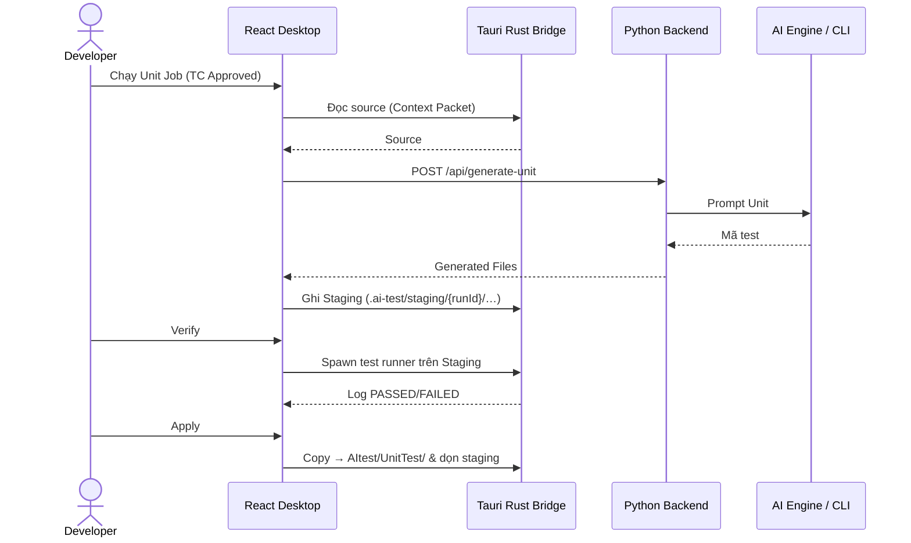

# SYSTEM MASTER DOCUMENTATION — AITEST PLATFORM
## Sách Trắng & Tài Liệu Tổng hợp Toàn Bộ Kiến Trúc, Quy Trình & Spec Hệ Thống

| Thông tin | Chi tiết |
|---|---|
| **Sản phẩm** | **AITest Platform** (AITest Desktop App & Backend Service) |
| **Mô hình Kiến trúc** | **Hybrid Architecture** (Desktop App + Local FS Bridge + Python REST Backend + PostgreSQL + AI CLI Service) |
| **Stack Sản phẩm** | **Frontend:** React 19 (Vite, TypeScript) + **Tauri v1** (Rust Native Bridge)<br>**Backend:** Python 3.12 (FastAPI, Uvicorn, Pydantic v2, SQLAlchemy 2.0, Alembic)<br>**Database:** PostgreSQL 16 (Port host **5433**)<br>**AI Engine:** AI CLI Adapters (Cursor / Gemini / Claude / Ollama CLI) |
| **Stack Dự án Người dùng** | **Không ràng buộc (Stack-Agnostic)** — C# (.NET), TypeScript/JavaScript (React/Vue/Angular), Python, Go, Java, v.v. |
| **Trạng thái Document** | **Single Source of Truth (SoT)** — đồng bộ với `api/` + `desktop/` (cập nhật theo layout E2E `_shared`, Verify tuần tự, Generate parallel) |

---

> [!IMPORTANT]
> **Triết lý Thiết kế Cốt lõi (Hybrid Architecture):**
> 1. **Desktop App (React + Tauri)** là nơi người dùng làm việc hàng ngày, đọc/ghi tệp mã nguồn local, tạo staging `.ai-test/`, chạy lệnh test và xem preview. Desktop **không** gọi LLM vendor trực tiếp và **không** lưu SoT dài hạn.
> 2. **Python Backend (FastAPI)** là trung tâm điều phối nghiệp vụ, Auth, Requirement Studio, Test Case, AI và báo cáo. Backend **không** là remote FS agent tùy ý; với E2E Playwright/Inspect/Auth-seed, API và Desktop cần **cùng máy** với `projectRoot` (ghi tạm dưới `AItest/` khi Verify/Heal).
> 3. **PostgreSQL** là **Source of Truth (SoT)** tập trung: Dự án, Requirement Workspaces, Knowledge, Snapshot, Test Cases, Jobs, Execution metadata. **Không** lưu full mã nguồn người dùng hay binary video/trace.

---

## MỤC LỤC TỔNG QUAN

- [Chương 1: Tổng Quan & Triết Lý Kiến Trúc System](#chương-1-tổng-quan--triết-lý-kiến-trúc-system)
- [Chương 2: Design vs Automate](#chương-2-kiến-trúc-phân-tách-hai-phase-độc-lập-design-vs-automate)
- [Chương 3: Requirement Studio & Coverage](#chương-3-requirement-studio--ma-trận-bao-phủ-coverage-matrix)
- [Chương 4: Unit Test Engine](#chương-4-động-cơ-sinh--điều-phối-unit-test-unit-test-engine)
- [Chương 5: E2E Test Engine](#chương-5-động-cơ-sinh--điều-phối-e2e-test-e2e-test-engine--ai-cli)
- [Chương 6: Output Layout `AItest/`](#chương-6-quy-chuẩn-cấu-trúc-thư-mục-đầu-ra-aitest-output-layout)
- [Chương 7: Deployment & Troubleshooting](#chương-7-hướng-dẫn-cấu-hình-đóng-gói--vận-hành-deployment--troubleshooting)

---

## CHƯƠNG 1: TỔNG QUAN & TRIẾT LÝ KIẾN TRÚC SYSTEM

### 1.1 Sơ đồ Kiến trúc Hệ thống

> Topology thực tế: React gọi Backend **trực tiếp** (`fetch` + JWT / `VITE_API_URL`).  
> Tauri là nhánh **song song** (dialog / FS / spawn test) — **không** proxy HTTP.  
> Local `projectRoot` được Desktop **và** Backend (co-located) cùng đọc/ghi.

```text
 ┌─────────────────────────────────────────────────────────────────────────────┐
 │                      CLIENT LAYER (Desktop = React + Tauri)                 │
 │                                                                             │
 │   ┌─────────────────────────────┐          Tauri IPC (invoke)               │
 │   │  Desktop App (React 19)     │ ──────────────────────────────────┐       │
 │   │  Studio · Coverage/Review   │                                   │       │
 │   │  Unit/E2E Generate·Verify   │                                   ▼       │
 │   │  Projects · Reports · Run   │                    ┌────────────────────┐ │
 │   └──────────────┬──────────────┘                    │ Tauri (Rust)       │ │
 │                  │                                   │ dialog · scan      │ │
 │                  │ HTTP/REST + JWT                   │ read/write/delete  │ │
 │                  │ (không qua Tauri)                 │ spawn test cmds    │ │
 │                  │                                   └─────────┬──────────┘ │
 └──────────────────┼─────────────────────────────────────────────┼────────────┘
                    │                                             │
                    ▼                                             │ FS I/O
 ┌──────────────────────────────────────────┐                     │
 │         BACKEND (Python FastAPI)         │                     │
 │  /api/auth · projects · connection       │                     │
 │  requirement-workspaces (Studio)         │                     │
 │  testcases · jobs · coverage-board       │                     │
 │  generate-unit · generate-e2e · api-test │                     │
 │  workspace · reporting · agent · …       │                     │
 │                                          │                     │
 │  ┌────────────────┐  ┌─────────────────┐ │   co-located FS     │
 │  │ Knowledge &    │  │ AI Engine       │ │   (/api/workspace,  │
 │  │ Coverage       │─▶│ CLI adapters    │ │    E2E Inspect/     │
 │  │ Builder·Board  │  │ Session Pool    │ │    Auth-seed/Heal)  │
 │  │ Heuristic FB   │  └────────┬────────┘ │         │           │
 │  └────────┬───────┘           │          │         │           │
 └───────────┼───────────────────┼──────────┘         │           │
             │ SQLAlchemy        │ Process Spawn      ▼           ▼
             ▼                   ▼              ┌─────────────────────────────┐
 ┌───────────────────────┐ ┌──────────────────┐ │ Local Project (cùng máy)   │
 │ PostgreSQL 16 (SoT)   │ │ AI CLI Runtimes  │ │ projectRoot (SUT source)  │
 │ host :5433 → :5432    │ │ Cursor · Gemini  │ │ .ai-test/staging/         │
 │ User·Project·WS·TC·   │ │ Claude · Ollama  │ │ .ai-test/auth/            │
 │ Jobs·Exec·Audit meta  │ │ · Custom script  │ │ AItest/UnitTest|E2ETest|  │
 └───────────────────────┘ └──────────────────┘ │         APITest/          │
                                                └─────────────────────────────┘
```

### 1.2 Bảng Phân Tách Trách Nhiệm (Boundary Matrix)

| Thành phần | Công nghệ | Chỉ làm | KHÔNG làm |
|---|---|---|---|
| **Desktop Client** | React 19 (Vite) | UI, `fetch` REST+JWT, staging preview, điều khiển Generate/Verify/Apply | Không lưu SoT dài hạn; không gọi LLM vendor trực tiếp; không proxy API qua Tauri |
| **Native Bridge** | Tauri v1 (Rust) | Dialog/scan, đọc/ghi/xóa FS local, spawn test process | Không quyết định logic AI / SoT nghiệp vụ; không thay HTTP client; không phải AI engine |
| **Python Backend** | FastAPI, SQLAlchemy | Auth, Project, Studio, Generate, Jobs, Audit, Reports; đọc/ghi `projectRoot` khi **cùng máy** (`/api/workspace`, E2E Inspect/Auth-seed/Heal) | Không phải remote FS agent cho máy khác |
| **Local Project** | FS trên host | SUT source · `.ai-test/staging|auth` · `AItest/{UnitTest\|E2ETest\|APITest}` | Không phải SoT nghiệp vụ (metadata vẫn ở Postgres) |
| **PostgreSQL** | PostgreSQL 16 (:5433) | SoT User/Project/Workspace/TC/Jobs/Reports metadata | Không lưu full source hay binary artifact |
| **AI LLM Layer** | CLI adapters (Cursor/Gemini/Claude/Ollama/Custom) | Sinh TC, Unit/E2E/API code, Knowledge theo prompt SoT | Không giữ state dài hạn của Platform |

---

## CHƯƠNG 2: KIẾN TRÚC PHÂN TÁCH HAI PHASE ĐỘC LẬP (REQUIREMENT VS AUTOMATE)

```text
 PHASE 1: REQUIREMENT                        PHASE 2: AUTOMATE (Dev / Automation)
┌─────────────────────────────┐        ┌────────────────────────────────────┐
│ Requirement Workspace       │        │ Approved Test Cases (unit / e2e) │
│   ├── Upload Tài liệu       │        │               +                    │
│   ├── Phân tích (Knowledge) │ ─────► │ Local Project Path                 │                                                 
│   └── Sinh & Duyệt Test Case│        │               ▼                    │
│       (Draft ──► APPROVED)  │        │ Staging (`.ai-test/staging/`)      │
└─────────────────────────────┘        │   ──► Verify ──► Apply → `AItest/` │
                                       └────────────────────────────────────┘
```

### 2.1 Phase 1: Design (Requirement Studio)
1. **Upload Tài liệu:** `.md`, `.docx`, `.pdf`, `.txt` → `document_chunks`.
2. **Phân tích (Knowledge):** LLM hoặc Heuristic → nhiều loại bản ghi (FEATURES, ACTORS, FLOWS, BR, FR, EXECUTION_CONTEXT, …).
3. **Sinh & Duyệt Test Case:** `Draft` → Review → `Approved` (Coverage Board / Review Queue: Duyệt tất cả).

### 2.2 Phase 2: Automate (Unit & E2E Engines)
1. **Đầu vào:** TC **`Approved`** + `ProjectPath` local.
2. **Sinh Code:** ghi staging `.ai-test/staging/{runId}/…` (Unit); E2E tương tự + sandbox có thể ghi tạm `AItest/` khi Verify/Heal rồi rollback chờ Apply.
3. **Verify:** chạy runner trên mã đã gen (Unit: stack runner; E2E: Playwright tuần tự).
4. **Apply:** copy vào `AItest/` rồi dọn staging.


## CHƯƠNG 3: REQUIREMENT STUDIO & MA TRẬN BAO PHỦ (COVERAGE MATRIX)

### 3.1 Cấu trúc Dữ liệu SoT trên PostgreSQL

```text
Project (projects)
  └── Requirement Workspace (requirement_workspaces)
        ├── Requirement Files → Document Chunks
        ├── Knowledge Base (knowledge_workspaces)
        ├── Chat Sessions & Messages
        └── Requirement Snapshots
              └── Test Cases [requirement_snapshot_id]
                    └── Jobs
```

### 3.2 Luồng Phân Tích & Knowledge

1. **Ingestion:** parse + chunk (mặc định ~1500 ký tự, overlap ~120, ưu tiên heading).
2. **Extraction:** nhiều loại bản ghi phân tích (không chỉ BR/FR/API).
3. **Coverage:** ma trận bao phủ trong workspace + **Coverage Board** project (`/api/projects/{id}/coverage-board`) và Review Queue.

### 3.3 Graceful Degradation & Heuristic Fallback

Khi LLM lỗi/quota: Heuristic/Regex nội bộ vẫn bóc khung TC cơ bản.

---

## CHƯƠNG 4: ĐỘNG CƠ SINH & ĐIỀU PHỐI UNIT TEST (UNIT TEST ENGINE)

### 4.1 Quy trình Sinh Unit Test

$$\text{INPUT} = \text{Approved TC} + \text{Context Packet (Tauri)}$$
$$\text{OUTPUT} = \texttt{.ai-test/staging/} \rightarrow \text{Verify} \rightarrow \texttt{AItest/UnitTest/\{Requirement\}/\{TC\}/}$$



### 4.2 Staging Overlay

- Path SoT: `{ProjectRoot}/.ai-test/staging/{runId}/overlay/…` (+ `manifest.json`).
- Không ghi đè mã sản xuất cho đến khi Apply.

### 4.3 Verify & Apply

- **Single / Batch:** `VerifyApplyConsole.tsx`, `BatchRunConsole.tsx` — Kiểm thử tất cả, Apply đã Pass, Pause/Resume.
- **Apply:** `applyManager.ts` → `AItest/UnitTest/{Requirement}/{TC}/…`.

### 4.4 Đa Ngôn Ngữ (Markers)

| Stack | Marker | Output | Runner gợi ý |
|---|---|---|---|
| C# | `*.csproj` / `*.sln` | `AItest/UnitTest/{Req}/{TC}/…Test.cs` | `dotnet test` |
| TS/JS | `package.json` | `…/{Req}/{TC}/…test.ts` / `…spec.js` | `vitest` / `jest` / `npm test` |
| Python | `pyproject.toml` / `requirements.txt` | `…/test_….py` | `pytest` |

---

## CHƯƠNG 5: ĐỘNG CƠ SINH & ĐIỀU PHỐI E2E TEST (E2E TEST ENGINE & AI CLI)

### 5.1 Vai trò E2E Engine

Playwright **TypeScript** + POM. Desktop gọi từng bước độc lập (không ép pipeline 1–5):

1. **Inspect** — DOM / routes (cache theo route+FE).
2. **Generate** — song song có giới hạn (**×3** mặc định, **×2** Cursor CLI).
3. **Verify** — **tuần tự** (`workers: 1`, lần lượt từng TC folder); materialize `playwright.config.ts` + `_shared/pages` nếu thiếu.
4. **Heal** (tuỳ chọn) — AI sửa khi `healFailures=true` (`maxRetries` 1–5; Verify thường = 1).
5. **Apply** — copy staging → `AItest/E2ETest/…`.

**Prompt AI (Generate/Heal):** System = E2ECG + journey (Phase C) + grounding pointer + project/user rules; User = TC + featurePath + DOM + FE. **Verify Playwright không gửi prompt** (trừ Heal).

**Guards sau LLM:** inject Auth → Feature entry → Act; Phase 2 order; Phase 3 fail-closed stubs; không invent route/role/credential.

### 5.2 Layout E2E (SoT)

```text
AItest/E2ETest/
├── _shared/
│   ├── pages/          # POM dùng chung (*.page.ts)
│   ├── fixtures/       # auth.helper, storageState, global.setup
│   └── types/          # playwright-shim.d.ts
└── {Requirement}/{TC}/
    ├── specs/          # *.spec.ts
    └── playwright.config.ts
```

Post-login TC cần `path:` / `featurePath:` (không invent `/admin/...`). Feature entry: deep-link theo TC → landmark → Act.

### 5.3 Auth modes (`e2e_auth_mode`)

| Mode | Khi nào | Cơ chế |
|---|---|---|
| **`storage`** | Có `storageState.json` hợp lệ | globalSetup + load state; feature Spec không login UI |
| **`ui_helper`** | App có login, chưa có state hợp lệ | `ensureAuthenticated` + `E2E_*` / `E2E_<ROLE>_*` |
| **`none`** | Login/Logout TC | UI-driven, không storage/helper inject |
| **`public`** | SRS/TC rõ không cần login | Không storage / globalSetup / ensureAuthenticated |

Checkbox «Dùng storageState» **không** đủ để bật `storage` nếu thiếu JSON hợp lệ.

### 5.4 API E2E chính

- `POST /api/generate-e2e` — POM + Spec (+ config scaffold).
- `POST /api/e2e-sandbox-module` — Verify module (tuần tự từng TC root).
- `POST /api/e2e-sandbox-repair` — Verify/Heal 1 spec.
- `POST /api/e2e-inspect` — DOM interactive.
- `POST /api/e2e-auth-discover` / `e2e-auth-ensure` — khám phá/seed auth.
- `POST /api/e2e-playwright-check` / `e2e-playwright-ensure` — runner sẵn sàng.
- `POST /api/e2e-artifacts-sync` — metadata video/trace/screenshot (relative path, không binary trong PG).

---

## CHƯƠNG 6: QUY CHUẨN CẤU TRÚC THƯ MỤC ĐẦU RA (`AITEST/` OUTPUT LAYOUT)

### 6.1 Cây `AItest/`

```text
{ProjectRoot}/
├── AItest/
│   ├── UnitTest/{Requirement}/{TC}/…
│   ├── IntegrationTest/          ← reserved
│   ├── APITest/                  ← reserved
│   ├── E2ETest/
│   │   ├── _shared/{pages|fixtures|types}/
│   │   └── {Requirement}/{TC}/{specs|playwright.config.ts}
│   ├── Reports/
│   ├── Coverage/
│   └── Metadata/
├── .ai-test/staging/{runId}/…    ← staging (không phải mã sản xuất)
└── src/ | app/ | …               ← mã nguồn SUT (giữ nguyên)
```

### 6.2 Path mapping

1. **Unit / E2E:** `{Requirement}` + `{TC title}` (đã sanitize/rút gọn segment Windows).
2. **Không** nhái full path FE kiểu `ClientApp/src/app/...` vào dưới `AItest/UnitTest/`.
3. **E2E POM/auth** nằm `_shared/`, không nhân bản theo từng TC (trừ legacy).

---

## CHƯƠNG 7: HƯỚNG DẪN CẤU HÌNH, ĐÓNG GÓI & VẬN HÀNH

### 7.1 Build Desktop (Tauri MSI)

- Node.js v20+, Rust/Cargo, WiX (Windows).
- `npm run desktop:build` → `desktop/src-tauri/target/release/bundle/msi/…msi`
- `tauri.conf.json`: bundle `targets: ["msi"]`, `icon: ["icons/icon.ico"]`.

### 7.2 CORS & API

```env
# api/.env
PORT=5088
CORS_ORIGINS=http://localhost:5173,http://127.0.0.1:5173,http://localhost:4200,http://localhost:4300,tauri://localhost,http://tauri.localhost,https://tauri.localhost
```

### 7.3 Local Dev

```powershell
npm run db      # PostgreSQL :5433
npm run api     # http://localhost:5088  (/health, /docs)
npm run desktop # Tauri + Vite
```

- **Admin mặc định:** `admin@aitest.com` / `Admin@123`

### 7.4 Troubleshooting

| Hiện tượng | Xử lý |
|---|---|
| `npm run tauri build` missing script | Dùng `npm run desktop:build` từ root |
| Bundle thiếu `.ico` | Thêm `"icon": ["icons/icon.ico"]` trong `tauri.conf.json` |
| Login Failed (CORS) | Thêm `tauri://localhost`, `http://tauri.localhost` vào `CORS_ORIGINS` |
| PG connection refused `:5433` | `npm run db` / `docker compose up -d postgres` |
| AI Not Ready | Settings → cấu hình AI → Verify → `Ready` |
| E2E thiếu `playwright.config` / `_shared/pages` | Restart API (materialize trước Verify); Generate lại nếu Spec lỗi Phase 2 |

---

> **AITest Platform System Specification** — giữ đồng bộ với SoT code (`test_output_layout`, `e2e_auth_mode`, `e2eJobRunner`, `e2e_orchestrator`).
