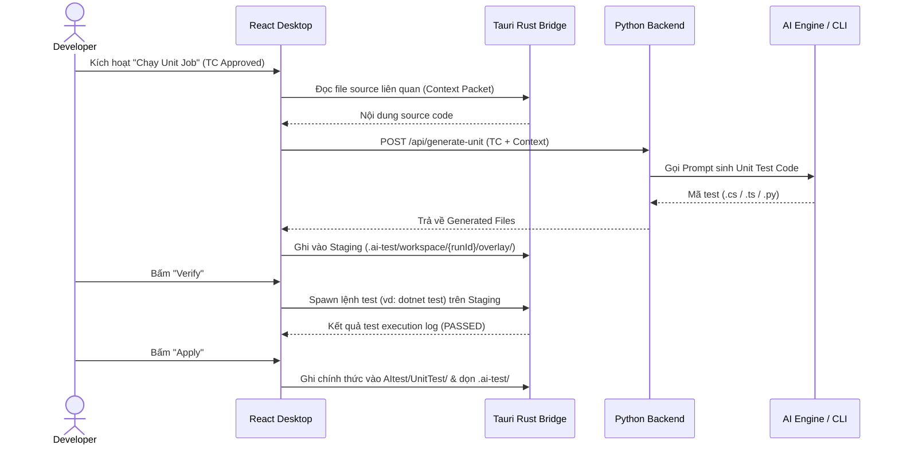

# SYSTEM MASTER DOCUMENTATION — AITEST PLATFORM
## Sách Trắng & Tài Liệu Tổng hợp Toàn Bộ Kiến Trúc, Quy Trình & Spec Hệ Thống

| Thông tin | Chi tiết |
|---|---|
| **Sản phẩm** | **AITest Platform** (AITest Desktop App & Backend Service) |
| **Phiên bản** | **v12.0** (Cập nhật 07/2026) |
| **Mô hình Kiến trúc** | **Hybrid Architecture** (Desktop App + Local FS Bridge + Python REST Backend + PostgreSQL + Multi-LLM Service) |
| **Stack Sản phẩm** | **Frontend:** React 19 (Vite, TypeScript, Custom Styling) + Tauri v1/v2 (Rust Native Bridge)<br>**Backend:** Python 3.12 (FastAPI, Uvicorn, Pydantic v2, SQLAlchemy 2.0, Alembic)<br>**Database:** PostgreSQL 16 (Port host **5433**)<br>**AI Engine:** Multi-LLM Adapter Layer (API Direct: OpenAI, Anthropic, Gemini, Ollama HTTP + AI CLI Adapters) |
| **Stack Dự án Người dùng** | **Không ràng buộc (Stack-Agnostic)** — C# (.NET), TypeScript/JavaScript (React/Vue/Angular), Python, Go, Java, v.v. |
| **Trạng thái Document** | **Single Source of Truth (SoT)** tổng hợp từ toàn bộ tài liệu dự án |

---

> [!IMPORTANT]
> **Triết lý Thiết kế Cốt lõi (Hybrid Architecture):**
> 1. **Desktop App (React + Tauri)** là nơi người dùng làm việc hàng ngày, đọc/ghi tệp mã nguồn local (`D:\Project\...`), tạo staging `.ai-test/`, chạy lệnh test và xem preview. Desktop **không** gọi LLM trực tiếp và **không** lưu trữ dữ liệu SoT dài hạn.
> 2. **Python Backend (FastAPI)** là trung tâm điều phối nghiệp vụ, quản lý Auth, Requirement Studio, Test Case, kết nối AI và thu thập báo cáo. Backend **không** đọc trực tiếp File System trên máy người dùng.
> 3. **PostgreSQL** là **Source of Truth (SoT)** tập trung lưu trữ toàn bộ dữ liệu nghiệp vụ: Dự án, Requirement Workspaces, Knowledge Base, Snapshot, Test Cases, Job Logs, Execution & Artifact Metadata. PostgreSQL **không** lưu snapshot full mã nguồn của người dùng.

---

## MỤC LỤC TỔNG QUAN

- [Chương 1: Tổng Quan & Triết Lý Kiến Trúc System](#chương-1-tổng-quan--triết-lý-kiến-trúc-system)
  - [1.1 Sơ đồ Kiến trúc Hệ thống](#11-sơ-đồ-kiến-trúc-hệ-thống)
  - [1.2 Bảng Phân Tách Trách Nhiệm (Boundary Matrix)](#12-bảng-phân-tách-trách-nhiệm-boundary-matrix)
- [Chương 2: Kiến Trúc Phân Tách Hai Phase Độc Lập (Design vs Automate)](#chương-2-kiến-trúc-phân-tách-hai-phase-độc-lập-design-vs-automate)
  - [2.1 Phase 1: Design (Requirement Studio)](#21-phase-1-design-requirement-studio)
  - [2.2 Phase 2: Automate (Unit & E2E Engines)](#22-phase-2-automate-unit--e2e-engines)
  - [2.3 Hệ thống Quy tắc Nghiệp vụ Cốt lõi (Business Rules BR-01 → BR-12)](#23-hệ-thống-quy-tắc-nghiệp-vụ-cốt-lõi-business-rules-br-01--br-12)
- [Chương 3: Requirement Studio & Ma Trận Bao Phủ (Coverage Matrix)](#chương-3-requirement-studio--ma-trận-bao-phủ-coverage-matrix)
  - [3.1 Cấu trúc Dữ liệu SoT trên PostgreSQL](#31-cấu-trúc-dữ-liệu-sot-trên-postgresql)
  - [3.2 Luồng Phân Tích Requirement & Trích Xuất Knowledge Base](#32-luồng-phân-tích-requirement--trích-xuất-knowledge-base)
  - [3.3 Graceful Degradation & Heuristic Engine Fallback](#33-graceful-degradation--heuristic-engine-fallback)
- [Chương 4: Động Cơ Sinh & Điều Phối Unit Test (Unit Test Engine)](#chương-4-động-cơ-sinh--điều-phối-unit-test-unit-test-engine)
  - [4.1 Quy trình Sinh Unit Test](#41-quy-trình-sinh-unit-test)
  - [4.2 Cơ chế Staging Overlay (`.ai-test/workspace/{runId}/`)](#42-cơ-chế-staging-overlay-ai-testworkspacerunid)
  - [4.3 Verify Engine, Batch Verify & Apply Manager](#43-verify-engine-batch-verify--apply-manager)
  - [4.4 Đa Ngôn Ngữ & Multi-Stack Hints](#44-đa-ngôn-ngữ--multi-stack-hints)
- [Chương 5: Động Cơ Sinh & Điều Phối E2E Test (E2E Test Engine & AI CLI)](#chương-5-động-cơ-sinh--điều-phối-e2e-test-e2e-test-engine--ai-cli)
  - [5.1 Lý Do Cần AI CLI Orchestrator Cho E2E Testing](#51-lý-do-cần-ai-cli-orchestrator-cho-e2e-testing)
  - [5.2 Mô hình Page Object Model (POM) & Playwright TS MVP](#52-mô-hình-page-object-model-pom--playwright-ts-mvp)
  - [5.3 Quy trình 5 Bước Điều Phối E2E Orchestration](#53-quy-trình-5-bước-điều-phối-e2e-orchestration)
  - [5.4 Chiến lược Quản lý Authentication (StorageState-First)](#54-chiến-lược-quản-lý-authentication-storagestate-first)
  - [5.5 API Contracts & Artifact Metadata Sync](#55-api-contracts--artifact-metadata-sync)
- [Chương 6: Quy Chuẩn Cấu Trúc Thư Mục Đầu Ra (`AItest/` Output Layout)](#chương-6-quy-chuẩn-cấu-trúc-thư-mục-đầu-ra-aitest-output-layout)
  - [6.1 Sơ đồ Cây Thư mục Output `AItest/`](#61-sơ-đồ-cây-thư-mục-output-aitest)
  - [6.2 Quy tắc Đặt tên & Phân cấp Module (Path Mapping Logic)](#62-quy-tắc-đặt-tên--phân-cấp-module-path-mapping-logic)
  - [6.3 Ví dụ Triển khai Thực tế theo Các Ngôn ngữ](#63-ví-dụ-triển-khai-thực-tế-theo-các-ngôn-ngữ)
- [Chương 7: Hướng Dẫn Cấu Hình, Đóng Gói & Vận Hành (Deployment & Troubleshooting)](#chương-7-hướng-dẫn-cấu-hình-đóng-gói--vận-hành-deployment--troubleshooting)
  - [7.1 Build & Đóng gói Desktop App (Tauri MSI Installer)](#71-build--đóng-gói-desktop-app-tauri-msi-installer)
  - [7.2 Cấu hình CORS & Kết nối Backend API](#72-cấu-hình-cors--kết-nối-backend-api)
  - [7.3 Khởi chạy Môi trường Phát triển (Local Dev Setup)](#73-khởi-chạy-môi-trường-phát-triển-local-dev-setup)
  - [7.4 Xử lý Lỗi Thường Gặp (Troubleshooting Guide)](#74-xử-lý-lỗi-thường-gặp-troubleshooting-guide)

---

## CHƯƠNG 1: TỔNG QUAN & TRIẾT LÝ KIẾN TRÚC SYSTEM

### 1.1 Sơ đồ Kiến trúc Hệ thống

```text
 ┌─────────────────────────────────────────────────────────────────────────────┐
 │                         CLIENT LAYER (Desktop & IDE)                        │
 │  ┌─────────────────────────────────┐   ┌─────────────────────────────────┐  │
 │  │      Desktop App (React 19)     │   │      IDE Plugin (Optional)      │  │
 │  │   - Requirement Studio UI       │   │   - Extension Host Bridge       │  │
 │  │   - Test Case Studio UI         │   │   - Viewer & File Opener        │  │
 │  │   - Code Generator & Execution  │   └─────────────────────────────────┘  │
 │  └────────────────┬────────────────┘                                        │
 │                   │ Tauri IPC (Rust Native Bridge)                          │
 │  ┌────────────────▼────────────────┐                                        │
 │  │    Tauri Subsystem (Rust)       │ ───► Local File System (`D:\Project`)   │
 │  │  - Folder Dialog & Process Spawn│ ───► Run `dotnet test` / `npm test`    │
 │  └────────────────┬────────────────┘                                        │
 └───────────────────┼─────────────────────────────────────────────────────────┘
                     │ HTTP / REST API (JWT Authenticated)
 ┌───────────────────▼─────────────────────────────────────────────────────────┐
 │                        BACKEND LAYER (Python FastAPI)                       │
 │  ┌───────────────────────────────────────────────────────────────────────┐  │
 │  │                          FastAPI Router Layer                         │  │
 │  │   /api/v1/auth    /api/v1/projects    /api/v1/requirements          │  │
 │  │   /api/v1/chat    /api/v1/testcases   /api/v1/generate-unit          │  │
 │  │   /api/v1/agent   /api/v1/generate-e2e /api/v1/e2e-sandbox          │  │
 │  └──────────────────┬─────────────────────────────────┬──────────────────┘  │
 │                     │                                 │                     │
 │  ┌──────────────────▼──────────────────┐   ┌──────────▼──────────────────┐  │
 │  │       Knowledge & Coverage          │   │      AI Engine & Adapters   │  │
 │  │  - Knowledge Builder Engine         │   │  - API Direct (OpenAI/Gemini)│  │
 │  │  - Coverage Matrix Analyzer         │   │  - AI CLI Adapters           │  │
 │  │  - Heuristic Engine Fallback        │   │  - Multi-LLM Provider Router │  │
 │  └──────────────────┬──────────────────┘   └──────────┬──────────────────┘  │
 └─────────────────────┼─────────────────────────────────┼─────────────────────┘
                       │ SQLAlchemy 2.0 ORM              │ HTTP / Process Spawn
 ┌─────────────────────▼──────────────────┐   ┌──────────▼──────────────────┐
 │       PostgreSQL (Database SoT)        │   │   LLM Providers & AI CLIs    │
 │ - Users, Projects, Workspaces          │   │ - Ollama (http://127.0.0.1) │
 │ - Documents, Chunks, Knowledge Base    │   │ - OpenAI / Gemini / Claude   │
 │ - TestCases, Connections, Jobs, Logs   │   │ - AI CLI (Cursor / Gemini)   │
 └────────────────────────────────────────┘   └─────────────────────────────┘
```

### 1.2 Bảng Phân Tách Trách Nhiệm (Boundary Matrix)

| Thành phần | Công nghệ | Chỉ làm (Responsibilities) | KHÔNG làm (Anti-Patterns) |
|---|---|---|---|
| **Desktop Client** | React 19 (Vite) | Quản lý UI/UX, chuyển hướng màn hình, gửi lệnh REST API, hiển thị log & preview staging. | KHÔNG lưu SoT dài hạn; KHÔNG gọi trực tiếp LLM vendor từ client. |
| **Native Bridge** | Tauri v1/v2 (Rust) | Mở dialog chọn thư mục, thao tác tệp local, spawn tiến trình HĐH (`dotnet test`, `npm test`, `pytest`). | KHÔNG lưu dữ liệu nghiệp vụ; KHÔNG tự đưa ra quyết định logic AI. |
| **Python Backend** | FastAPI, SQLAlchemy | Xử lý Auth, Project, Requirement Studio, phân tích tài liệu, điều phối AI Adapter, quản lý Job & Audit log. | KHÔNG đọc/ghi trực tiếp File System trên máy người dùng. |
| **PostgreSQL DB** | PostgreSQL 16 | Source of Truth (SoT) cho User, Projects, Requirement Workspaces, Knowledge Base, TestCases, Execution Logs. | KHÔNG lưu trữ full source code của dự án người dùng. |
| **AI LLM Layer** | Multi-LLM Adapters | Sinh Test Cases, sinh code Unit/E2E test, trích xuất Knowledge từ tài liệu theo Prompt được tối ưu. | KHÔNG tự lưu trữ state dài hạn của Platform. |

---

## CHƯƠNG 2: KIẾN TRÚC PHÂN TÁCH HAI PHASE ĐỘC LẬP (DESIGN VS AUTOMATE)

Hệ thống AITest phân tách hoàn toàn thành 2 Phase độc lập nhằm phục vụ chính xác 2 nhóm đối tượng người dùng: **QA / Analyst** (Tạo & Duyệt Kịch bản) và **Developer / Automation Engineer** (Sinh & Thực thi Code Test).

```text
 PHASE 1: DESIGN (QA / Lead)             PHASE 2: AUTOMATE (Dev / Automation)
┌─────────────────────────────┐        ┌────────────────────────────────────┐
│ Requirement Workspace       │        │ Approved Test Cases (type=unit/e2e)│
│   ├── Upload Tài liệu (Files)│        │               +                    │
│   ├── Phân tích (Knowledge) │ ─────► │ Local Project Path (`D:\Project`)  │
│   ├── Chốt Snapshot        │        │               │                    │
│   └── Sinh & Duyệt Test Case│        │               ▼                    │
│       (Draft ──► APPROVED)  │        │ Staging (`.ai-test/`) ──► Verify   │
└─────────────────────────────┘        │               │                    │
                                       │               ▼                    │
                                       │ Apply ──► `AItest/` Folder          │
                                       └────────────────────────────────────┘
```

### 2.1 Phase 1: Design (Requirement Studio)
1. **Upload Tài liệu:** Người dùng tải file yêu cầu (.md, .docx, .pdf, .txt). Hệ thống tự động chia nhỏ thành các `document_chunks`.
2. **Phân tích (Knowledge Base):** Kích hoạt LLM (hoặc Heuristic Engine) để trích xuất Business Rules (BR), Functional Requirements (FR), và API Specifications.
3. **Chốt Snapshot (Freeze):** Đóng gói tài liệu + kết quả Phân tích + Test Case hiện tại thành một `requirement_snapshot` bất biến.
4. **Sinh & Duyệt Test Case:** AI tạo danh sách kịch bản test nháp (`test_cases` trạng thái `Draft`). QA tiến hành Review và chuyển trạng thái thành `Approved`.

### 2.2 Phase 2: Automate (Unit & E2E Engines)
1. **Đầu vào:** Chỉ lấy các Test Case có trạng thái **`Approved`** kết hợp với thư mục mã nguồn cục bộ (`ProjectPath`).
2. **Sinh Code & Staging:** AI (API Direct hoặc AI CLI) sinh mã test và ghi tạm vào thư mục staging `.ai-test/workspace/{runId}/overlay/`.
3. **Verify:** Chạy kiểm thử tự động trên vùng staging để đảm bảo mã test biên dịch và pass 100%.
4. **Apply:** Chuyển mã test đã Verify thành công từ staging sang thư mục chính thức `AItest/` nằm tại gốc dự án người dùng, sau đó tự động dọn dẹp thư mục staging `.ai-test/`.

### 2.3 Hệ thống Quy tắc Nghiệp vụ Cốt lõi (Business Rules BR-01 → BR-12)

> [!NOTE]
> Các quy tắc dưới đây phải được tuân thủ nghiêm ngặt trong mọi luồng xử lý của hệ thống:

- **BR-01 (Authentication Gate):** Yêu cầu Token JWT hợp lệ đối với mọi API nghiệp vụ.
- **BR-02 (Project Binding Gate):** Phase Automate bắt buộc phải được gán `ProjectPath` local thông qua Tauri Dialog trước khi thực thi sinh hay chạy test.
- **BR-03 (Approval Gate):** **CHỈ CÓ** các Test Case ở trạng thái `Approved` mới được đưa vào luồng sinh mã test Unit / E2E.
- **BR-04 (AI Readiness Gate):** Nếu cấu hình AI chưa ở trạng thái `Ready` (thiếu API Key hoặc CLI chưa xác thực), hệ thống sẽ từ chối gọi LLM và hướng dẫn người dùng tới màn hình Cấu hình AI.
- **BR-05 (Context Limitation):** Không upload toàn bộ mã nguồn repo người dùng lên Backend; chỉ đóng gói `contextPacket` giới hạn cho lớp hàm/component cần test.
- **BR-06 (No Remote FS Access):** Python Backend tuyệt đối không trực tiếp đọc hoặc ghi vào ổ đĩa của máy người dùng.
- **BR-07 (Security & Privacy):** API Key của các nhà cung cấp AI được mã hóa AES khi lưu DB và không bao giờ trả về dạng plaintext ở client.
- **BR-08 (Review Workflow):** Vòng đời Test Case bắt buộc tuân theo: `Draft` $\rightarrow$ `Approved` (hoặc `Rejected`).
- **BR-09 (Design Isolation):** Việc sinh Test Case ở Phase Design dựa hoàn toàn vào Tài liệu & Knowledge Base, không phụ thuộc vào mã nguồn dự án.
- **BR-10 (Staging & Safety):** Mã test tự động sinh bắt buộc phải đi qua vùng tạm `.ai-test/` trước khi được người dùng Apply chính thức vào `AItest/`.
- **BR-11 (Dynamic Test Runner):** Lệnh chạy test (`dotnet test`, `pytest`, `npm test`) được phát hiện động theo stack dự án, không hardcode.
- **BR-12 (Optional IDE Integration):** Plugin IDE (VS Code / Antigravity Extension) đóng vai trò phụ trợ (mở file, xem preview), không nằm trên Happy Path bắt buộc của Desktop App.

---

## CHƯƠNG 3: REQUIREMENT STUDIO & MA TRẬN BAO PHỦ (COVERAGE MATRIX)

### 3.1 Cấu trúc Dữ liệu SoT trên PostgreSQL

```text
Project (projects)
  └── Requirement Workspace (requirement_workspaces)
        ├── Requirement Files (requirement_files)
        │     └── Document Chunks (document_chunks)
        ├── Knowledge Base (knowledge_workspaces)
        ├── Chat Sessions & Messages (chat_sessions / chat_messages)
        └── Requirement Snapshots (requirement_snapshots)
              └── Test Cases (test_cases) [Filter: requirement_snapshot_id]
                    └── Generation Jobs (jobs)
```

### 3.2 Luồng Phân Tích Requirement & Trích Xuất Knowledge Base

1. **Document Ingestion:** File yêu cầu tải lên được parse và cắt nhỏ theo thuật toán Window Sliding (kích thước chunk 1000 - 2000 kí tự).
2. **Knowledge Extraction:** AI Service gửi các chunks tới Provider để trích xuất các đối tượng Tri thức:
   - **BR (Business Rules):** Các quy tắc nghiệp vụ ràng buộc (Ví dụ: *"Tuổi người dùng phải $\ge 18$ mới được đăng ký"*).
   - **FR (Functional Requirements):** Các tính năng hệ thống cần cung cấp.
   - **API Specs:** Định dạng Request/Response endpoint.
3. **Coverage Matrix Analyzer:** Hệ thống tự động lập bảng chiếu giữa danh sách Yêu cầu chức năng (FR) và các Test Cases đã được tạo ra để tính toán tỷ lệ bao phủ (% Requirement Coverage).

### 3.3 Graceful Degradation & Heuristic Engine Fallback

Khi mạng bị gián đoạn hoặc kết nối LLM thất bại (chưa bật Ollama local hoặc hết quota API Key), hệ thống tự động kích hoạt **Heuristic Engine**:
- Dùng thuật toán Regex & NLP quy tắc nội bộ để bóc tách câu từ tài liệu.
- Đảm bảo người dùng vẫn tạo được kịch bản Test Case khung cơ bản mà không bị sập hay treo ứng dụng.

---

## CHƯƠNG 4: ĐỘNG CƠ SINH & ĐIỀU PHỐI UNIT TEST (UNIT TEST ENGINE)

### 4.1 Quy trình Sinh Unit Test

Công thức Source of Truth (SoT) cho Unit Test Engine:

$$\text{INPUT} = \text{Approved Test Case (Ý định)} + \text{Context Packet (Mã nguồn local trích xuất via Tauri)}$$
$$\text{OUTPUT} = \text{Mã test sinh tại Staging } (\texttt{.ai-test/}) \longrightarrow \text{Verify Pass} \longrightarrow \text{Apply vào } \texttt{AItest/UnitTest/}$$



### 4.2 Cơ chế Staging Overlay (`.ai-test/workspace/{runId}/`)

Để đảm bảo không làm hỏng hay đè nhầm mã nguồn sản xuất của dự án:
- Mọi file được tạo ra trong quá trình sinh test sẽ được lưu tại:
  `{ProjectRoot}/.ai-test/workspace/{runId}/overlay/AItest/UnitTest/{Module}/{SourceStem}.test.*`
- Kèm theo file `manifest.json` ghi lại lịch sử tạo và trạng thái xác minh.

### 4.3 Verify Engine, Batch Verify & Apply Manager

- **Single Verify (`VerifyApplyConsole.tsx`):** Chạy kiểm thử đơn lẻ cho 1 Test Case. Parse trực tiếp log từ Jest, Vitest, pytest, `dotnet test`, hoặc Go test để đưa ra summary chips (Passed / Failed / Error).
- **Batch Verify (`BatchRunConsole.tsx`):** Quản lý danh sách hàng chờ sinh và verify nhiều Test Case cùng lúc (`combinedBatchVerify`). Hỗ trợ các nút điều khiển: *Verify Tất Cả*, *Apply Tất Cả Đã Pass*, *Pause/Resume*.
- **Apply Manager (`applyManager.ts`):** Copy chính xác các file đã Verify thành công từ vùng Staging vào gốc dự án `AItest/UnitTest/` và dọn dẹp sạch thư mục `.ai-test/`.

### 4.4 Đa Ngôn Ngữ & Multi-Stack Hints

Hệ thống tự động phát hiện Stack dự án dựa trên các file Marker tại gốc repo:

| Ngôn ngữ / Framework | Marker Detect | Vị trí sinh Unit Test | Lệnh Test mặc định |
|---|---|---|---|
| **C# (.NET Core)** | `*.csproj`, `*.sln` | `AItest/UnitTest/{Module}/...Test.cs` | `dotnet test` |
| **TypeScript (React / Vite)** | `package.json`, `vite.config.ts` | `AItest/UnitTest/{Module}/...test.ts` | `npm test` / `npx vitest` |
| **JavaScript (Node / Angular)** | `package.json`, `angular.json` | `AItest/UnitTest/{Module}/...spec.js` | `npm test` / `npx jest` |
| **Python** | `requirements.txt`, `pyproject.toml` | `AItest/UnitTest/{Module}/test_....py` | `pytest` |
| **Golang** | `go.mod` | `AItest/UnitTest/{Module}/..._test.go` | `go test ./...` |

---

## CHƯƠNG 5: ĐỘNG CƠ SINH & ĐIỀU PHỐI E2E TEST (E2E TEST ENGINE & AI CLI)

### 5.1 Lý Do Cần AI CLI Orchestrator Cho E2E Testing

E2E Testing (End-to-End) mô phỏng toàn bộ luồng người dùng qua giao diện UI và API thật. Việc viết E2E thủ công thường gặp 4 vấn đề lớn:
1. **Flaky Selectors:** UI thay đổi làm gãy kịch bản E2E cũ.
2. **Viết Page Object Model (POM) tốn thời gian.**
3. **Quản lý Session/Auth phức tạp.**
4. **Thời gian chạy lâu và khó debug.**

**Giải pháp của AI CLI Engine:**
- Tự động quét DOM tree để sinh ra cấu trúc **Page Object Model (POM)** chuẩn.
- Tự chọn **Robust Selectors** (`data-testid`, `aria-label`, `role` thay vì CSS class dễ gãy).
- **Auto-Healing Selector:** Khi E2E test bị fail do UI thay đổi selector, AI CLI tự động chụp DOM snapshot tại thời điểm lỗi, tìm selector mới tương đương và cập nhật lại file POM ngầm.

### 5.2 Mô hình Page Object Model (POM) & Playwright TS MVP

Hệ thống chọn **Playwright TypeScript** làm Framework MVP chuẩn cho E2E Engine. Cấu trúc mã test E2E được chia tách bạch thành 2 thành phần:

```text
AItest/E2ETest/{Requirement}/{TC}/
├── pages/           # Page Object Models (*.page.ts) — Chứa selectors & thao tác UI
├── specs/           # Test Specs (*.spec.ts) — Chứa kịch bản test thực sự
├── fixtures/        # storageState.json + global.setup.ts (Lưu Auth Token / Cookie)
└── playwright.config.ts
```

### 5.3 Quy trình 5 Bước Điều Phối E2E Orchestration

```text
 ┌─────────────────────────────────────────────────────────────────────────────┐
 │                         AI CLI E2E Orchestrator                             │
 └──────────────────────────────────────┬──────────────────────────────────────┘
                                        │
 ┌──────────────────────────────────────▼──────────────────────────────────────┐
 │ Phase 1: Requirement & DOM Inspection (Đọc Approved E2E Flows & Page DOM)  │
 └──────────────────────────────────────┬──────────────────────────────────────┘
                                        │
 ┌──────────────────────────────────────▼──────────────────────────────────────┐
 │ Phase 2: Page Object Model (POM) & Test Spec Generation via AI CLI          │
 └──────────────────────────────────────┬──────────────────────────────────────┘
                                        │
 ┌──────────────────────────────────────▼──────────────────────────────────────┐
 │ Phase 3: Environment Setup & Test Data Seeding (storageState-first)         │
 └──────────────────────────────────────┬──────────────────────────────────────┘
                                        │
 ┌──────────────────────────────────────▼──────────────────────────────────────┐
 │ Phase 4: Headless Sandbox Execution & Auto-Healing Selector Loop            │
 └──────────────────────────────────────┬──────────────────────────────────────┘
                                        │
 ┌──────────────────────────────────────▼──────────────────────────────────────┐
 │ Phase 5: Artifact Parsing & Sync to PostgreSQL (Video, Trace, Screenshot)   │
 └─────────────────────────────────────────────────────────────────────────────┘
```

### 5.4 Chiến lược Quản lý Authentication (StorageState-First)

Nhằm tối ưu tốc độ chạy E2E và tránh lặp lại bước Login ở mọi spec:

| Auth Mode | Điều kiện áp dụng | Cơ chế thực hiện | Đặc điểm |
|---|---|---|---|
| **`storage` (Khuyên dùng)** | Bật tùy chọn "Dùng storageState" | Chạy `globalSetup` 1 lần để login và lưu `storageState.json` (cookies, JWT, localStorage). Các spec load lại file này. | Tốc độ chạy cực nhanh; các spec không cần đi qua màn hình Login. |
| **`ui_helper`** | Tắt storageState | Mỗi spec gọi hàm helper `ensureAuthenticated()` đi qua UI Login. | Dùng khi test trực tiếp luồng Login/Logout. |
| **`none`** | Kịch bản test chuyên biệt cho Login | Không lưu session; thao tác trực tiếp trên trang Auth. | Dùng riêng cho tính năng Authentication. |

### 5.5 API Contracts & Artifact Metadata Sync

Backend cung cấp các API Endpoints chuyên biệt cho E2E Engine:

- `POST /api/generate-e2e`: Sinh mã POM + Spec + Config từ Approved Test Case.
- `POST /api/e2e-sandbox-repair`: Thực thi Playwright Headless trên 1 spec; tự động kích hoạt **Auto-Heal** khi `healFailures=true` (số lần thử lại $\le 2$).
- `POST /api/e2e-sandbox-module`: Thực thi toàn bộ danh sách specs trong một Module E2E.
- `POST /api/e2e-inspect`: Render trang web Target URL bằng Chromium ngầm để thu thập danh sách thẻ interactive.
- `POST /api/e2e-artifacts-sync`: Thu thập đường dẫn Video, Trace.zip, Screenshot sau khi test chạy xong và đồng bộ metadata vào PostgreSQL (`ReportRecord`).

> [!TIP]
> **Lưu trữ Artifacts An toàn:** PostgreSQL **KHÔNG** lưu file nhị phân (binary) của Video hay Trace log mà chỉ lưu đường dẫn tương đối (relative path) trên ổ đĩa local nhằm giữ cho Cơ sở dữ liệu luôn nhẹ và đạt hiệu năng tối ưu.

---

## CHƯƠNG 6: QUY CHUẨN CẤU TRÚC THƯ MỤC ĐẦU RA (`AITEST/` OUTPUT LAYOUT)

### 6.1 Sơ đồ Cây Thư mục Output `AItest/`

Mọi mã test được Apply chính thức sẽ nằm trong thư mục **`AItest/`** tại gốc của dự án người dùng (tách biệt hoàn toàn với mã nguồn sản xuất):

```text
{ProjectRoot}/
├── AItest/                         ← Thư mục duy nhất chứa toàn bộ mã test sinh ra
│   ├── UnitTest/
│   │   └── {Module}/               ← Tên Module theo Test Case Approved
│   │       └── {SourceStem}.test.*
│   ├── IntegrationTest/
│   ├── APITest/
│   ├── E2ETest/
│   │   └── {Requirement}/{TC}/
│   │       ├── pages/              ← Page Object Models (*.page.ts)
│   │       ├── specs/              ← Kịch bản E2E Specs (*.spec.ts)
│   │       ├── fixtures/           ← storageState.json, test data
│   │       └── playwright.config.ts
│   ├── Reports/                    ← Báo cáo kết quả kiểm thử HTML/JSON
│   ├── Coverage/                   ← Báo cáo độ bao phủ mã nguồn
│   └── Metadata/                   ← Metadata lưu lịch sử sync
├── src/ (hoặc app/, ClientApp/...)  ← Mã nguồn ứng dụng gốc (ĐƯỢC GIỮ NGUYÊN)
└── package.json / *.csproj
```

### 6.2 Quy tắc Đặt tên & Phân cấp Module (Path Mapping Logic)

1. **Ưu tiên Module tên TC:** Lấy trường `module` trong Test Case Approved làm tên thư mục con dưới folder loại test (ví dụ: `AItest/UnitTest/Auth/`).
2. **Rút gọn đường dẫn (Short Path fallback):** Nếu Test Case không có module, tự động trích xuất tên thư mục ngắn từ source code — loại bỏ các từ khóa tiền tố như `ClientApp`, `src`, `app`, `shells` (Tối đa 2 phân đoạn segment). Tuyệt đối không bao giờ nhái lại đường dẫn dài lằng ngoằng dạng `AItest/UnitTest/ClientApp/src/app/admin/users/...`.

### 6.3 Ví dụ Triển khai Thực tế theo Các Ngôn ngữ

- **Dự án .NET C#:**
  - Source: `Services/OrderService.cs` (Module: `Ordering`)
  - Target Output: `AItest/UnitTest/Ordering/OrderServiceTest.cs`
- **Dự án Angular / React:**
  - Source: `src/app/admin/case-record/evidence-update-modal.component.ts` (Module: `Forensic`)
  - Target Output: `AItest/UnitTest/Forensic/evidence-update-modal.component.test.ts`
- **Dự án Python:**
  - Source: `app/services/payment.py` (Module: `Payment`)
  - Target Output: `AItest/UnitTest/Payment/test_payment.py`

---

## CHƯƠNG 7: HƯỚNG DẪN CẤU HÌNH, ĐÓNG GÓI & VẬN HÀNH (DEPLOYMENT & TROUBLESHOOTING)

### 7.1 Build & Đóng gói Desktop App (Tauri MSI Installer)

#### Điều kiện tiên quyết:
- Node.js v20+
- Rust & Cargo
- WiX Toolset (Tự động tải khi build trên Windows)

#### Cấu hình File `tauri.conf.json`:
Đảm bảo khai báo đường dẫn icon trong khối `bundle`:

```json
"bundle": {
  "active": true,
  "targets": ["msi"],
  "identifier": "com.aitest.desktop",
  "icon": [
    "icons/icon.ico"
  ]
}
```

#### Lệnh thực hiện Build Installer:
Từ thư mục gốc dự án:
```powershell
# Chạy lệnh build đã được tích hợp shortcut
npm run desktop:build
```
File cài đặt Windows `.msi` sẽ được sinh ra tại:
`desktop/src-tauri/target/release/bundle/msi/AITest Desktop_0.1.0_x64_en-US.msi`

---

### 7.2 Cấu hình CORS & Kết nối Backend API

Khi ứng dụng Desktop Tauri đóng gói dưới dạng ứng dụng Native (.msi), trình duyệt WebView2 trên Windows sẽ hoạt động dưới Origin mặc định là `http://tauri.localhost` hoặc `tauri://localhost`.

Để Backend cho phép ứng dụng Desktop kết nối và đăng nhập thành công, file cấu hình `api/.env` và `api/app/config.py` phải chứa danh sách **CORS_ORIGINS** như sau:

```env
# api/.env
PORT=5088
CORS_ORIGINS=http://localhost:5173,http://127.0.0.1:5173,http://localhost:4200,http://localhost:4300,tauri://localhost,http://tauri.localhost,https://tauri.localhost
```

---

### 7.3 Khởi chạy Môi trường Phát triển (Local Dev Setup)

#### Bước 1: Khởi động Cơ sở dữ liệu PostgreSQL (Docker)
```powershell
npm run db
# Đảm bảo PostgreSQL chạy thành công ở port 5433
```

#### Bước 2: Khởi động Python Backend API
```powershell
npm run api
# Backend API sẵn sàng tại: http://localhost:5088
# Endpoint Health Check: http://localhost:5088/health
# Tài liệu Swagger API: http://localhost:5088/docs
```

#### Bước 3: Khởi chạy Desktop App (Chế độ Dev)
```powershell
npm run desktop
# Ứng dụng React + Tauri Dev khởi động kết nối tới API 5088
```

#### Thông tin Đăng nhập Mặc định (Default Admin Credentials):
- **Email:** `admin@aitest.com`
- **Password:** `Admin@123`

---

### 7.4 Xử lý Lỗi Thường Gặp (Troubleshooting Guide)

| Hiện tượng Lỗi | Nguyên nhân | Cách xử lý |
|---|---|---|
| **Bấm `npm run tauri build` báo missing script** | Chạy nhầm lệnh ở thư mục gốc repo. | Dùng lệnh `npm run desktop:build` từ thư mục gốc hoặc `cd desktop` rồi chạy `npm run build`. |
| **Build Tauri báo: `the bundle config must have a .ico icon`** | Thiếu khai báo thuộc tính `"icon"` trong khối `bundle` của file `tauri.conf.json`. | Mở [tauri.conf.json](file:///d:/Xlab/AITest/desktop/src-tauri/tauri.conf.json) và bổ sung `"icon": ["icons/icon.ico"]`. |
| **App Desktop báo `Login Failed` mặc dù Backend đã bật** | Trình duyệt Tauri bị chặn bởi cơ chế CORS do thiếu `http://tauri.localhost` trong cấu hình Backend. | Cập nhật `CORS_ORIGINS` trong [api/.env](file:///d:/Xlab/AITest/api/.env) bổ sung `tauri://localhost,http://tauri.localhost`. |
| **Lỗi kết nối CSDL PostgreSQL (`Connection Refused 5433`)** | Container Docker PostgreSQL chưa bật hoặc bị trùng port host. | Chạy lệnh `npm run db` hoặc `docker compose up -d postgres` để kiểm tra container status. |
| **AI báo lỗi "Connection Not Ready" khi Phân tích / Sinh Test Case** | Chưa cấu hình API Key hoặc AI Provider chưa được kích hoạt. | Vào mục **Settings -> Cấu hình AI** trên Desktop App, nhập API Key (OpenAI / Gemini / Ollama) và bấm **Verify** để chuyển trạng thái kết nối sang `Ready`. |

---

> **AITest Platform System Specification — Documented & Approved.**
