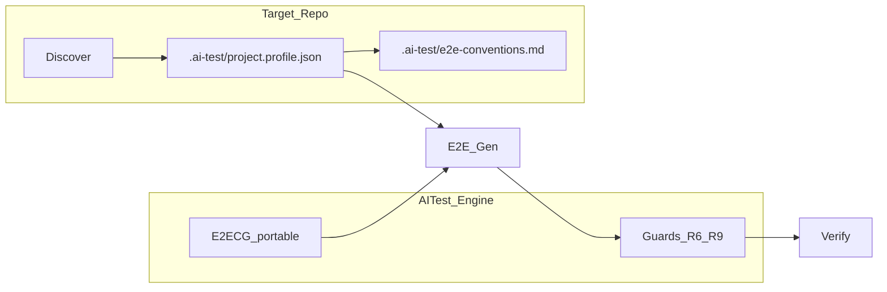

# Plan: Rule đích + Gen E2E theo Project Profile

> **Mục tiêu:** Tách **rule engine portable** (AITest) khỏi **convention dự án** (repo SUT).  
> Discover → ghi `.ai-test/project.profile.json` trên source đích → Gen E2E đọc profile trước prompt/guard.  
> **Ngày:** 2026-08-06  
> **Liên quan:** [`E2E_STABILITY_BEFORE_PERF_PLAN.md`](E2E_STABILITY_BEFORE_PERF_PLAN.md), [`AI_TEST_RULES.md`](AI_TEST_RULES.md), [`CODEGEN_PERF_BATCH_SNAPSHOT_WORKER_PLAN.md`](CODEGEN_PERF_BATCH_SNAPSHOT_WORKER_PLAN.md) (chỉ mở sau G1–G6 smoke).

---

## 1. Vì sao refactor

| Vấn đề hôm nay | Hệ quả (S5 / Gen thật) |
|----------------|-------------------------|
| Convention đoán trong Job Runner / index rank | `featurePath` lệch domain (vd. evidence TC → `case-person`) |
| E2ECG + heuristic nhồi mỗi Gen | Prompt nặng, retry nhiều, wall-clock cao |
| Fork `AItest/E2ETest/_shared` | Không reuse fixture/page của repo đích |
| Rule “luật chơi app” nằm trong Tool | Khó đa dự án; dễ hardcode product |

**Hướng đi:** Gen test **dựa trên rule đã sinh trên hệ thống đích** + engine an toàn vẫn ở AITest.

---

## 2. Hai lớp rule (SoT)

| Lớp | Sở hữu | Nội dung | Ví dụ |
|-----|--------|----------|--------|
| **Engine (AITest)** | Repo AITest | Journey Auth→Entry→Act, locator-contract, R6/R9, taxonomy, E2ECG portable | [`api/app/llm/e2e_codegen_rules.py`](../api/app/llm/e2e_codegen_rules.py), [`e2e_codegen_guard.py`](../api/app/services/e2e_codegen_guard.py) |
| **Target (SUT)** | Repo dự án dưới test | runner, testRoot, auth, locatorPolicy, reuseRoots, moduleMap, forbidden | `.ai-test/project.profile.json` |

- Không copy tên module/route Forensic vào runtime AITest.  
- Profile đích = machine SoT; `.ai-test/e2e-conventions.md` **sinh từ profile** (người đọc / inject LLM), không SoT riêng.

---

## 3. Kiến trúc mục tiêu (3 lớp)

```text
┌─────────────────────────────────────────────────────────────┐
│  A. Project Adapter (Discover)                              │
│     scan SUT → upsert .ai-test/project.profile.json         │
│              → render .ai-test/e2e-conventions.md            │
└───────────────────────────┬─────────────────────────────────┘
                            │
┌───────────────────────────▼─────────────────────────────────┐
│  B. Generation Engine                                       │
│     E2ECG slice (AITest) + conventions.md + TC + FE/DOM     │
│     featurePath: TC marker → moduleMap → catalog/FE         │
└───────────────────────────┬─────────────────────────────────┘
                            │
┌───────────────────────────▼─────────────────────────────────┐
│  C. Quality Gate                                            │
│     R6/R9 + profile.required + moduleMap mismatch           │
│     → Verify Playwright                                     │
└─────────────────────────────────────────────────────────────┘
```



---

## 4. Schema `project.profile.json` (v1)

Đường dẫn trên **projectRoot SUT:** `.ai-test/project.profile.json`

```json
{
  "schema": "aitest-project-profile-v1",
  "projectName": "<from folder>",
  "runner": "playwright",
  "testRoot": "<detected or AItest/E2ETest>",
  "baseURLEnv": "E2E_BASE_URL",
  "auth": {
    "strategy": "storageState|uiLogin|apiLogin",
    "roles": [],
    "storageDir": ".ai-test/auth",
    "loginPath": ""
  },
  "locatorPolicy": ["testid", "role", "label", "id", "css"],
  "reuseRoots": [],
  "moduleMap": {},
  "forbidden": [
    "generic main/nav assert as business pass",
    "placeholder test data",
    "invent featurePath without map/TC"
  ],
  "contentHash": "<optional>",
  "updatedAt": "<iso>"
}
```

### Discover portable (không tên product)

| Tín hiệu | Gán field |
|----------|-----------|
| `playwright.config.*` / `cypress.config.*` | `runner` |
| Thư mục `e2e` / `E2ETest` / `support/pages` / `support/fixtures` | `testRoot`, `reuseRoots` |
| `data-testid` / `data-cy` / `formControlName` trong FE mẫu | `locatorPolicy` order |
| Route files (catalog hiện có) | gợi ý `moduleMap` (score ≥ ngưỡng) |
| `.ai-test/auth` / storageState patterns | `auth.strategy`, `storageDir` |

User/override tay trong JSON **không bị Discover xóa** khi merge (đặc biệt `moduleMap` keys đã có).

---

## 5. Lợi ích (Gen theo rule đích)

1. **Đúng app** — ít invent path/locator lệch domain.  
2. **Reuse-first** — ưu tiên fixture/page của repo.  
3. **DoR rõ** — thiếu runner/auth strategy → `ContextMissing` sớm.  
4. **Assert có nghĩa** — BR từ expected + convention; cấm heal giả `main\|nav`.  
5. **Đa dự án** — một Tool, nhiều profile.  
6. **Perf Gen** — prompt slice ngắn hơn, ít re-rank/Inspect/retry (trước Worker Pool).

---

## 6. Phạm vi Phase 1

| In scope | Out of scope (sau) |
|----------|---------------------|
| E2E Gen / Inspect / Verify | Unit codegen profile |
| Desktop Discover + bind + Gen preflight | Analysis/TC-gen profile |
| API nhận `projectRules` (conventions excerpt) | Job Builder / Worker Pool |
| UI «Đồng bộ project profile» | VI↔EN synonym table cứng |

---

## 7. Phases triển khai

### P0 — Foundation

- Module: `desktop/src/lib/projectProfile/`  
  - `types.ts`, `discoverProjectProfile.ts`, `loadSaveProfile.ts`, `renderConventionsMd.ts`  
  - IO Tauri (cùng pattern `codeIndex/tauriIo`)
- Discover khi **bind source root** và trước **Generate batch** nếu profile thiếu/stale.
- Unit tests: detect playwright; merge `moduleMap` giữ tay user; render md ổn định.

### P1 — Wire Gen đọc profile

- [`e2eJobRunner.ts`](../desktop/src/lib/e2eWorkspace/e2eJobRunner.ts):  
  1. load profile  
  2. `featurePath`: **TC marker → moduleMap[module] → catalog/FE**  
  3. ưu tiên `reuseRoots` khi resolve FE  
  4. gửi API: conventions excerpt → `projectRules`
- [`generate_e2e.py`](../api/app/routers/generate_e2e.py) + [`base.py`](../api/app/llm/base.py): prepend `projectRules` **sau** E2ECG pointer (không thay engine).
- Selective E2ECG theo `locatorPolicy` / `auth.strategy` (tags registry).

### P2 — Gate theo profile

- Feature TC thiếu `runner` / `auth.strategy` → `ContextMissing` (hint «Đồng bộ profile»).  
- `moduleMap` khớp module TC mà path Gen lệch → override theo map hoặc fail-closed.  
- Giữ R6 (cấm heal giả) / R9 (syntax gate).

### P3 — UI + docs

- E2ETestPage: nút «Đồng bộ project profile»; hiện `testRoot`, `#moduleMap`.  
- Cập nhật pointer trong `AI_TEST_RULES.md` + stability plan.  
- **Không** mở perf batch/worker đến khi S5 G1–G6 đạt trên smoke thật.

### P4 — Backlog

- Unit profile slice.  
- Cache profile in-memory theo `projectRoot` trong batch.  
- Snapshot conventions vào Job Builder (sau ổn định).

---

## 8. File đụng chính

| # | Path | Việc |
|---|------|------|
| 1 | `desktop/src/lib/projectProfile/*` | New — Discover / load / save / render |
| 2 | `desktop/src/lib/workspaceManager/bindSourceRoot.ts` | Gọi Discover sau bind |
| 3 | `desktop/src/lib/e2eWorkspace/e2eJobRunner.ts` | Load profile + resolve featurePath + gửi rules |
| 4 | `desktop/src/lib/e2eWorkspace/e2eRouteCatalog.ts` | Hỗ trợ gợi ý moduleMap |
| 5 | `api/app/routers/generate_e2e.py`, `api/app/llm/base.py` | Nhận / inject projectRules từ body |
| 6 | `desktop/src/features/e2e-test/E2ETestPage.tsx` | UI sync profile |
| 7 | `docs/AI_TEST_RULES.md`, doc này | SoT pointers |

---

## 9. Acceptance (Phase 1 done)

- [ ] Bind repo mẫu → có `.ai-test/project.profile.json` + `e2e-conventions.md`.  
- [ ] Log Gen: `profile loaded` + `featurePath from moduleMap|TC|catalog`.  
- [ ] Module đã map → không invent folder lệch chỉ vì rank shape.  
- [ ] S5 Smoke: giảm Gen 400 do thiếu convention; G1 (đúng FE domain) cải thiện.  
- [ ] E2ECG engine vẫn apply; không noun product trong AITest runtime.

---

## 10. Rủi ro / giảm thiểu

| Rủi ro | Giảm thiểu |
|--------|------------|
| Discover sai `testRoot` | Ưu tiên `playwright.config` gần FE; user override trong profile |
| `moduleMap` trống (VI ↔ EN) | Map chỉ **boost**; vẫn TC path + FE soft path |
| Profile stale | `contentHash` + nút sync; Gen warn nếu index mới hơn |
| Prompt vẫn dài | `e2e-conventions.md` ≤ ~2–3k chars; E2ECG selective |

---

## 11. Thứ tự làm việc (checklist)

1. P0 module + tests  
2. P0 wire bind + Gen preflight  
3. P1 Gen + API inject  
4. P1 featurePath order  
5. P2 gates  
6. P3 UI + docs  
7. Chạy S5 Smoke trên project gắn → ghi kết quả vào stability plan  

**Một câu tóm tắt:** Discover rule trên đích → Gen theo contract repo → Gate engine AITest; ổn định trước, perf worker sau.
