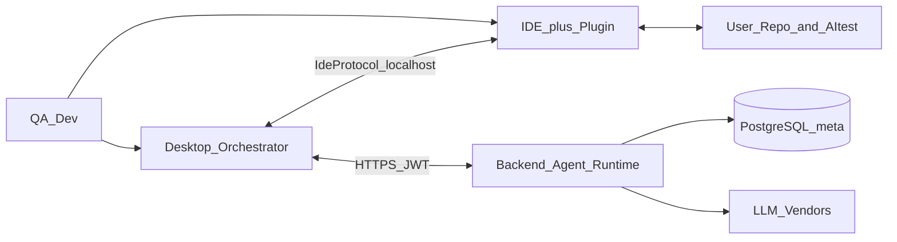
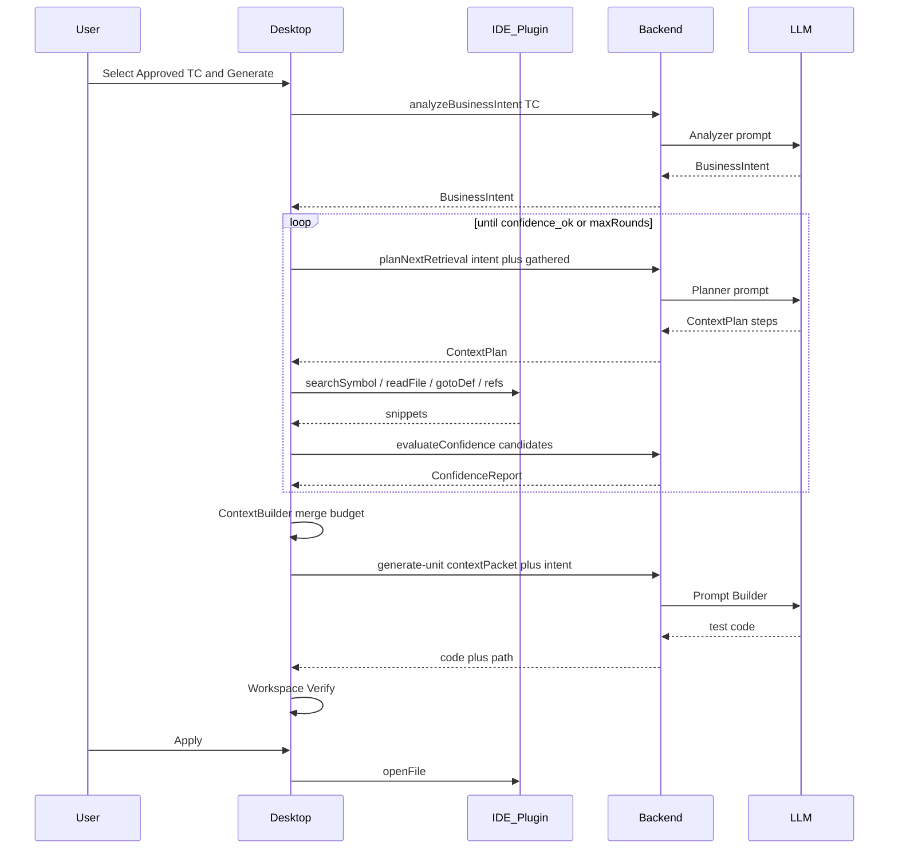
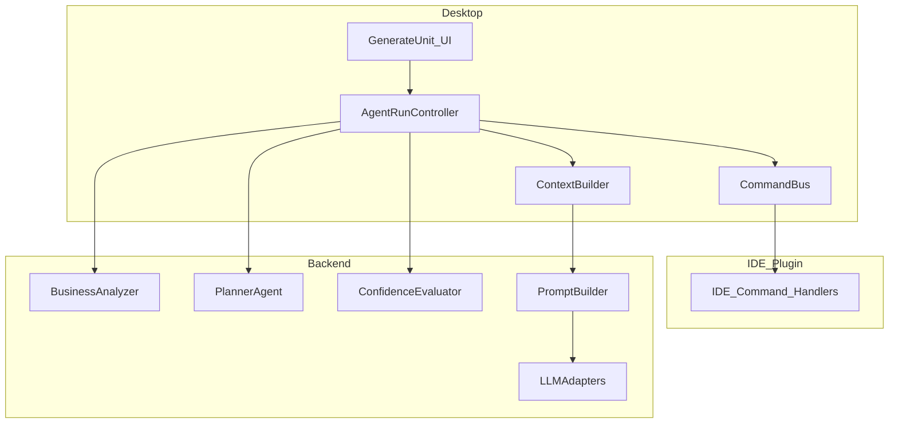
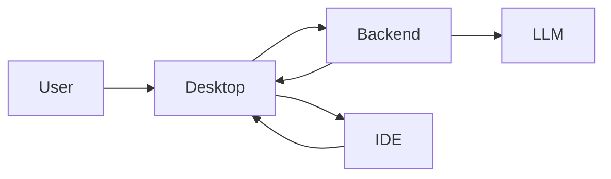
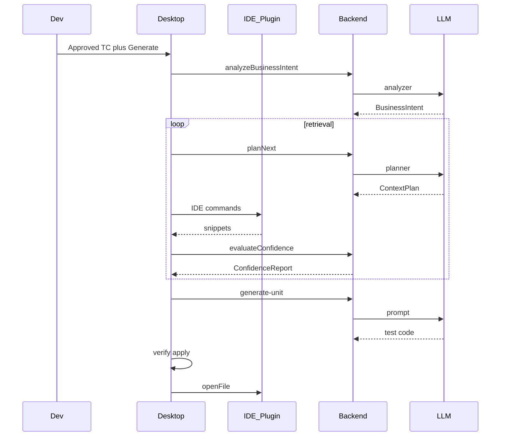

# AI Test Desktop Tool — Architecture Document Version 2.1 (Agentic IDE Context)

| | |
|--|--|
| **Sản phẩm** | AI Test Desktop Tool |
| **Version** | **2.1 (Agentic IDE Context)** |
| **Ngày** | 23/07/2026 |
| **Trạng thái** | Design SoT — foundation P0–P5.7 + P9–P10 đã ship; tiếp theo **P11** Planner |
| **Thay thế** | Không vá [`KIEN_TRUC_DU_AN.md`](../KIEN_TRUC_DU_AN.md) (v11). File này là kiến trúc mục tiêu. |
| **Supersedes** | V2.0 caret-first assumptions trong cùng path file |
| **Audience** | Architect, Tech Lead, Desktop/IDE/Backend engineers, UX |

> **North star:** Người dùng chọn **Test Case Approved** (business behavior) → hệ thống **phân tích intent → lập kế hoạch → lấy source qua IDE Commands từng bước → đánh giá confidence → sinh Unit Test** → Workspace → Verify → Apply → Run.  
> Source **không** được coi là “đống text để scan”. Context đến từ **IDE Command Layer** theo kế hoạch của Planner — **không bao giờ** gửi cả repo cho LLM.  
> Caret trong IDE là **tín hiệu phụ (boost)**, không phải điều kiện bắt buộc để sinh unit từ TC.

---

## Mục lục

1. [Executive Summary](#1-executive-summary)
2. [Business Goals](#2-business-goals)
3. [System Context (C4 L1)](#3-system-context-c4-l1)
4. [Functional Architecture](#4-functional-architecture)
5. [Technical / Logical Architecture](#5-technical--logical-architecture)
6. [Physical & Deployment](#6-physical--deployment)
7. [Component Diagram & Adapters](#7-component-diagram--adapters)
8. [IDE Protocol & Commands](#8-ide-protocol--commands)
9. [Agent Runtime — Business Analyzer, Planner, Confidence](#9-agent-runtime--business-analyzer-planner-confidence)
10. [Context Builder & Prompt Builder](#10-context-builder--prompt-builder)
11. [Workspace Pipeline](#11-workspace-pipeline)
12. [Generate Flows by Test Kind](#12-generate-flows-by-test-kind)
13. [Coverage & Report Flows](#13-coverage--report-flows)
14. [UI/UX Architecture](#14-uiux-architecture)
15. [Module & Layer Responsibility](#15-module--layer-responsibility)
16. [Business Rules (BR-V2)](#16-business-rules-br-v2)
17. [State Machines](#17-state-machines)
18. [Data Flow & Database](#18-data-flow--database)
19. [Security / Scalability / Extensibility](#19-security--scalability--extensibility)
20. [Error / Retry / Offline](#20-error--retry--offline)
21. [Folder Structure](#21-folder-structure)
22. [Migration v11 / V2.0 → V2.1](#22-migration-v11--v20--v21)
23. [Roadmap Phases (executable)](#23-roadmap-phases-executable)
24. [Future Roadmap](#24-future-roadmap)
25. [Glossary](#25-glossary)

---

## 1. Executive Summary

AI Test V2.1 là **AI Coding Agent chuyên Unit/Test automation** (cùng họ Cursor / Claude Code / Copilot / Cline), hẹp hơn về miền:

- Test Case Generation (từ Requirement)
- **Unit generation từ TC + context IDE incremental**
- Integration / API / E2E (cùng pipeline, khác plan profile)
- Execute, Coverage, Report
- Workspace staging (không ghi thẳng production)

### Vấn đề V2.0 đã sửa

| Giả định sai (V2.0 / v11) | Thiết kế đúng (V2.1) |
|---------------------------|----------------------|
| TC đủ để AI “biết” file nào | TC = **business**; implementation cần **resolve** |
| Caret = luôn đúng chỗ sinh unit | Caret = **optional boost** |
| Một lần `getSemanticContext` là đủ | **Planner loop** lấy thêm file khi thiếu |
| Scan / dump tree khi không chắc | **Cấm** full-project scan |

### Bốn trụ

1. **IDE Plugin** — Context Provider (LSP/PSI/Roslyn commands); không reasoning  
2. **Desktop Orchestrator** — UI, relay IDE commands, Agent Run UX, Workspace, Run (không phân tích source)  
3. **Backend Agent Runtime** — Business Analyzer, Planner, Confidence, **Context Builder**, Prompt Builder, LLM Adapter  
4. **PostgreSQL** — meta SoT (Project, Requirement, TC, Jobs, Execution) — **không** source

---

## 2. Business Goals

| ID | Goal | KPI gợi ý |
|----|------|-----------|
| BG-01 | Sinh unit từ TC Approved với context đúng implementation | ≥70% run có `primarySymbol` confidence ≥ 0.8 |
| BG-02 | Không bịa API / class | Related files chỉ từ IDE commands trong plan |
| BG-03 | Đa IDE / đa ngôn ngữ | Adapter matrix; thêm IDE = plugin mới |
| BG-04 | QA/Dev cộng tác qua TC Approved trên PG | Giữ hybrid SoT meta |
| BG-05 | An toàn source | Không persist source trên server; snippets ephemeral |
| BG-06 | UX agent rõ ràng | User thấy Analyze → Plan → Fetch → Confidence → Generate |
| BG-07 | Không full-repo LLM | 0 generate path gửi toàn bộ workspace tree |

---

## 3. System Context (C4 L1)



**Người ngoài hệ thống:** User, LLM Vendor, (tuỳ chọn) CI runner sau này.

---

## 4. Functional Architecture

```text
┌─ Product Capabilities ─────────────────────────────────────┐
│  Identity  │  Project Meta  │  Requirement/TC Lifecycle    │
│  Generate* │  Agent Run     │  Workspace / Execute / Report│
│  IDE Link  │  Settings AI   │  Activity / Audit            │
└────────────────────────────────────────────────────────────┘
* Generate = TC | Unit | Integration | API | E2E (+ future kinds)
```

### Capability → Owner

| Capability | IDE Plugin | Desktop | Backend |
|------------|:----------:|:-------:|:-------:|
| Search / read / goto / refs | **X** | invoke | |
| Business Analyzer | | UI show | **X** |
| Planner Agent | | execute steps | **X** |
| Confidence Evaluator | | UI bars | **X** |
| Context merge / budget | | relay | **X** |
| Prompt + LLM generate | | | **X** |
| Workspace staging / verify / apply | open file | **X** | meta audit |
| Auth / TC / Requirement SoT | | UI | **X** |

---

## 5. Technical / Logical Architecture

### 5.1 Logical layers

```text
┌─────────────────────────────────────────────────────────────┐
│ Presentation                                                │
│  Desktop React UI  ·  IDE Plugin (status / commands)        │
├─────────────────────────────────────────────────────────────┤
│ Application / Orchestration (Desktop)                       │
│  AgentRunController · Command Bus · Workspace FSM · Runner  │
├─────────────────────────────────────────────────────────────┤
│ Domain Context (local)                                      │
│  Context Builder · merge RetrievalResults → AITestContextPacket │
├─────────────────────────────────────────────────────────────┤
│ Adapters                                                    │
│  IIDEAdapter · ILanguageAdapter · IRunner · ICoverage       │
│  IReportExporter · ILLMAdapter (server-side)                │
├─────────────────────────────────────────────────────────────┤
│ Agent Runtime (Backend)                                     │
│  BusinessAnalyzer · Planner · ConfidenceEvaluator           │
│  PromptBuilder · LLMAdapter · Auth/TC domain                │
├─────────────────────────────────────────────────────────────┤
│ Persistence                                                 │
│  PostgreSQL (meta only)  ·  Local Workspace (.ai-test/)     │
└─────────────────────────────────────────────────────────────┘
```

### 5.2 Technical stack (product)

| Layer | Tech |
|-------|------|
| Desktop | React + Tauri (orchestrator UI + native spawn) |
| IDE Plugin #1 | VS Code / Cursor Extension (TypeScript) |
| IDE Plugin #2+ | JetBrains Plugin (Kotlin), VS (C#/Roslyn) |
| Protocol | JSON-RPC 2.0 over WebSocket `ws://127.0.0.1:<port>` |
| Backend | Python FastAPI |
| DB | PostgreSQL |
| LLM | Adapter OpenAI / Anthropic / Gemini / Ollama |

### 5.3 Communication — Unit generate (agentic)



---

## 6. Physical & Deployment

```text
[Dev machine]
  IDE + Plugin ──localhost── Desktop App
                              │ HTTPS
[Company / Cloud]
  Backend API ── PostgreSQL
  Backend ────── LLM Vendor APIs
```

| Artifact | Deploy |
|----------|--------|
| `desktop/` | Cài trên PC user (Tauri) |
| `ide-plugins/vscode/` | Marketplace / VSIX sideload |
| `api/` | Docker / VM nội bộ |
| PG | Managed / on-prem |

**Không** deploy source user lên server.

---

## 7. Component Diagram & Adapters



### 7.1 `IIDEAdapter` (contract)

```text
connect() / disconnect() / health()
getWorkspace()
getCurrentFile() / getCurrentSelection() / getCurrentMethod() / getCurrentClass()
searchSymbol(query, kinds?)
searchText(query, glob?)
searchClass(name) / searchMethod(name, container?)
goToDefinition(symbolId | position)
findReferences(symbolId)
findImplementations(symbolId)
getCallHierarchy(symbolId)
readFile(path, range?)
getConstructor() / getImports() / getNamespace()
createTestFile(path, content)
openGeneratedTest(path)
runCurrentTest(filter?)
```

Mỗi IDE implement adapter; Desktop chỉ gọi interface. **IDE không gọi LLM.**

### 7.2 Other adapters

| Interface | Ví dụ |
|-----------|--------|
| `ILanguageAdapter` | C#, TS, Python, Go, Java — conventions, path hints |
| `ITestFrameworkAdapter` | xUnit, Jest, Vitest, pytest, JUnit |
| `IRunnerAdapter` | `dotnet test`, `npm test`, `pytest` |
| `ICoverageParser` | cobertura, lcov, istanbul, TRX |
| `IReportExporter` | HTML, JUnit XML, JSON |
| `ILLMAdapter` | vendor chat completions |

---

## 8. IDE Protocol & Commands

### 8.1 Transport

- WebSocket JSON-RPC 2.0  
- Discovery: `%USERPROFILE%\.aitest\ide-bridge.json` `{ port, token, ide, version }`  
- Auth: session token Desktop ↔ Plugin  

### 8.2 Packet: `IdeSemanticPacket` (focus snapshot)

Vẫn dùng cho **caret boost** và round retrieval đầu nếu user đang focus. Không thay thế BusinessIntent/Plan.

### 8.3 IDE Command Layer (Desktop → Plugin)

| Command | Mục đích |
|---------|----------|
| `aitest/searchSymbol` | Tìm symbol theo tên / fuzzy |
| `aitest/searchText` | Text search có giới hạn kết quả |
| `aitest/goToDefinition` | Nhảy định nghĩa |
| `aitest/findReferences` | Usages |
| `aitest/getSemanticContext` | Packet quanh caret / symbol |
| `aitest/readFile` | Đọc range / file (có max bytes) |
| `workspace.createTestFile` | Apply qua IDE |
| `workspace.openFile` | Mở test vừa gen |
| `test.run` | Run filter |

**Giới hạn cứng:** mỗi command trả về tối đa N hits / M KB snippet — không dump workspace.

### 8.4 Shared agent types (protocol / API)

```text
BusinessIntent {
  action, entity, expectedResults[], businessRules[],
  validationRules[], externalDeps[], domainTerms[],
  searchHints[]   // tokens gợi ý Planner (EN/VN aliases)
}

ContextPlan {
  round, rationale, steps: [{ op, query, reason }],
  stopWhen: { minConfidence, maxFiles }
}

RetrievalResult {
  files: [{ path, role, snippet, symbolIds[] }],
  evidence: string[]
}

ConfidenceReport {
  candidates: [{ symbol, path, score, rationale }],
  overall: number,
  enough: boolean,
  missingHints: string[]
}
```

---

## 9. Agent Runtime — Business Analyzer, Planner, Confidence

**Vị trí:** Backend (LLM). Desktop chỉ orchestrate và hiển thị.

### 9.1 Business Analyzer

**Input:** Approved Test Case (title, steps, expected, module, preconditions, testData).  
**Output:** `BusinessIntent`.

Ví dụ TC «Tạo vật chứng thành công» → Action=`Create`, Entity=`Evidence`, Expected=`save`, `evidenceCode`, `uploadImage`, `auditLog`.

**Không** đọc source. **Không** đoán path file.

### 9.2 Planner Agent

**Input:** `BusinessIntent` + `RetrievalResult[]` đã có + optional caret packet + `codeAliases` meta.  
**Output:** `ContextPlan` (1..k steps).

Nguyên tắc:

- Chỉ request những gì còn thiếu  
- Ưu tiên: Service/Handler entity → Command/DTO → Validator → Repository (theo stack)  
- Dùng synonym / `projects.meta.codeAliases` cho tiếng Việt → token code  
- `maxRounds` (mặc định 3–5), `maxFiles` (mặc định 8–12)

### 9.3 Confidence Evaluator

Chấm từng candidate (vd. EvidenceService 0.95, EvidenceCommand 0.87, CaseRecordService 0.62).

- `overall >= threshold` (vd. 0.8) và có primary rõ → `enough=true` → Generate  
- Thấp → trả `missingHints` → Planner round tiếp  
- Hết rounds mà chưa đủ → **không** generate im lặng; UI hỏi user bổ sung caret / chọn candidate

### 9.4 Incremental retrieval (Desktop)

```text
Need Service? → searchSymbol → readFile
Need dep type? → goToDefinition → readFile
Need callers? → findReferences (budget)
Enough? → Context Builder → Generate
```

---

## 10. Context Builder & Prompt Builder

### Context Builder (Desktop)

1. Merge `RetrievalResult` + optional caret packet  
2. Dedupe path, rank (primary > ctor deps > validators > misc)  
3. Token budget / truncate  
4. Gắn testing stack (Ensure runner / language adapter)  
5. Xuất `AITestContextPacket` ephemeral  

**Không:** full disk scan làm nguồn chính; gọi LLM; persist source.

### Prompt Builder (Backend)

Input: `BusinessIntent` + Approved TC + `AITestContextPacket` + ConfidenceReport summary.  
Output: messages → LLM → test code + `suggestedPath` dưới `AItest/UnitTest/{Module}/`.

---

## 11. Workspace Pipeline

```text
Generate → Workspace (.ai-test/workspace/<run>/)
        → Verify → Repair? → Preview
        → Apply → {ProjectRoot}/AItest/{Kind}/{Module}/file
        → Open in IDE
```

Layout: `AItest/UnitTest|IntegrationTest|APITest|E2ETest/{Module}/` — không mirror `ClientApp/...`.

---

## 12. Generate Flows by Test Kind

### 12.1 Unit Test (primary — V2.1)

```text
Approved TC
  → Business Analyzer → BusinessIntent
  → Planner loop ↔ IDE Command Layer
  → Confidence gate
  → Context Builder → generate-unit
  → Workspace → Verify → Apply → Run
```

Optional: user caret → inject vào round 0 làm prior.

### 12.2 Integration / API / E2E

Cùng agent loop; khác `planProfile` (boundary modules / OpenAPI / UI selectors) và output folder.

### 12.3 Test Case (Requirement phase)

Không bắt buộc IDE. `useSourceContext=true` chỉ overview symbol tối thiểu — không full scan.

---

## 13. Coverage & Report Flows

```text
Desktop RunnerAdapter.run(command)
  → parse coverage
  → POST Execution meta → PG
  → Report Viewer
```

---

## 14. UI/UX Architecture

### 14.1 North-star UX

> “Tôi chọn TC đã duyệt → xem agent phân tích & lấy đúng Service → Sinh unit → Staging → Apply.”

Không: “Đoán file trong combobox” · “Scan cả repo” · “Bắt buộc caret trước khi có TC”.

### 14.2 Information Architecture

| Khu vực | Mục đích |
|---------|----------|
| Home | Checklist: AI · Requirement · Duyệt TC · IDE Connected |
| Requirement | Spec + TC review |
| **Unit test** | Agent Run + Staging |
| Chạy test / Báo cáo / Activity / AI settings | Giữ |

**Root Apply** = disk cho Apply/Run/ensure runner — **không** phải semantic source.

### 14.3 Journey J2 — Daily Unit (agentic)

```text
1. IDE bridge Connected (extension AITest :port)
2. Desktop · chọn TC Approved
3. [Sinh unit] → Agent panel:
   - Intent chips
   - Plan steps + files retrieved
   - Confidence bars
4. enough → Generate → Staging → Verify → Apply → openFile
```

### 14.4 Wireframe — Generate Unit

```text
┌─ Unit test ───────────────────────────────────────────────┐
│ IDE ● Connected   (optional Focus: Class.method boost)    │
│ Root Apply ▸ collapsed   Framework ensure ▸               │
├───────────────────────────────────────────────────────────┤
│ TC Approved: [Select ▾]     [Sinh unit]                   │
├─ Agent Run ───────────────────────────────────────────────┤
│ ○ Phân tích TC → ● Lấy context → ○ Confidence → ○ Sinh   │
│ Intent: Create · Evidence · save · auditLog               │
│ Files: EvidenceService.ts (0.95) · EvidenceCommand (0.87) │
│ [Tiếp tục lấy context]  [Sinh khi đủ]                     │
├─ Staging │ Verify │ Apply ────────────────────────────────┤
└───────────────────────────────────────────────────────────┘
```

### 14.5 Anti-patterns

| Cấm | Thay bằng |
|-----|-----------|
| Full repo → LLM | Plan + IDE commands + budget |
| Generate khi confidence thấp im lặng | Gate + hỏi user |
| BE đọc disk user | Packet / snippets only |
| File picker làm happy path | Agent retrieval |
| Ghi cạnh production | Workspace → `AItest/` |

### 14.6 Legacy cleanup (đã làm P5.5)

Workspace Host / old Dashboard / ProductFlowStrip removed; redirects giữ bookmark.

---

## 15. Module & Layer Responsibility

| Module | Responsibility | Non-responsibility |
|--------|----------------|--------------------|
| `ide-plugins/*` | IDE commands, snippets | LLM, PG, planning |
| `packages/ide-protocol` | RPC + agent DTOs | Business UI |
| `desktop` AgentRunController | Loop plan↔IDE↔confidence | Prompt strings dài |
| `desktop` Context Builder | Merge/rank/budget | LLM |
| `api` Analyzer/Planner/Confidence | Reasoning | Filesystem user |
| `api` Prompt/LLM | Generate test | Discover source blindly |

---

## 16. Business Rules (BR-V2)

| ID | Rule |
|----|------|
| BR-V2-01 | Chưa login → không API nghiệp vụ |
| BR-V2-02 | Generate Unit cần TC **Approved** |
| BR-V2-03 | AI chưa Ready → không gọi LLM |
| BR-V2-04 | Semantic retrieval **qua IDE Plugin**; FS chỉ fallback offline advanced |
| BR-V2-05 | Backend **không** đọc filesystem user; không persist full source |
| BR-V2-06 | `contextPacket` thắng `workspaceId` khi có nội dung |
| BR-V2-07 | Apply chỉ qua Workspace pipeline |
| BR-V2-08 | Output `AItest/{Kind}/{Module}/` |
| BR-V2-09 | Packet/snippets ephemeral |
| BR-V2-10 | Mọi IDE qua `IIDEAdapter` |
| BR-V2-11 | **Cấm** full-project scan / dump tree vào LLM |
| BR-V2-12 | Generate Unit **blocked** nếu `ConfidenceReport.enough=false` (trừ user override có audit) |
| BR-V2-13 | Planner `maxRounds` / `maxFiles` bắt buộc |
| BR-V2-14 | Business Analyzer **không** đọc source |
| BR-V2-15 | IDE Plugin **không** gọi LLM |

---

## 17. State Machines

### 17.1 Test Case review

```text
Draft → InReview → Approved | Rejected
```

### 17.2 Agent Run

```text
Idle → Analyzing → Planning → Retrieving → Evaluating
                 ↖─────────────────────────┘ (if not enough)
Evaluating → Generating → WorkspaceCreated → …
Evaluating → NeedsUserInput → Planning | Cancelled
```

### 17.3 Workspace run

```text
Created → Generated → Verifying → Pass|Fail → Repairing? → Applied
```

### 17.4 IDE Bridge

```text
Disconnected → Connecting → Connected → Degraded → Disconnected
```

---

## 18. Data Flow & Database

| Data | IDE | Desktop | Backend/PG |
|------|-----|---------|------------|
| Source snippets | yes | ephemeral | **no** (transit only in memory for prompt) |
| BusinessIntent / Plan / Confidence | no | session UI | ephemeral + optional audit meta |
| Requirement / TC | no | UI | **SoT** |
| Generated test staging | open | `.ai-test/` | audit meta |
| Execution / coverage | optional | parse | **SoT meta** |

`projects.meta`: language, stacks, `codeAliases`, testFrameworks — **không** `sourceSnapshot`.

---

## 19. Security / Scalability / Extensibility

- JWT; API keys encrypted; IDE localhost + token  
- Snippets không ghi PG; logs redacted  
- Path jail Apply  
- Agent rounds giới hạn chi phí LLM  
- New IDE = adapter; new kind = plan profile + folder  

---

## 20. Error / Retry / Offline

| Situation | Behavior |
|-----------|----------|
| IDE disconnected | Block agent retrieval; advanced FS only với cảnh báo |
| Confidence low sau maxRounds | NeedsUserInput — chọn candidate / đặt caret / bổ sung hint |
| LLM fail | Retry backoff; giữ Agent Run state |
| Verify fail | Repair loop |
| Offline Backend | Generate/Analyze blocked |

---

## 21. Folder Structure

```text
AITest/
  desktop/                 # Orchestrator + AgentRun UI
  api/                     # FastAPI + Agent Runtime
  packages/
    ide-protocol/          # RPC + BusinessIntent/Plan/Confidence types
  ide-plugins/
    vscode/                # P1 foundation + P10 commands
    jetbrains/             # P6
    visualstudio/          # P7
  docs/
    ARCHITECTURE_V2_IDE_FIRST.md
    AITEST_OUTPUT_LAYOUT.md
```

---

## 22. Migration v11 / V2.0 → V2.1

| Artifact | Fate |
|----------|------|
| Caret-first happy path | **Optional boost**; không còn primary DoD |
| `getSemanticContext` one-shot generate | Round 0 / boost only |
| FS `buildGenerateContext` | Offline advanced fallback |
| P0–P5.6 code | **Foundation — giữ** |
| Local FS combobox hero | Removed from happy path (P5.5) |

---

## 23. Roadmap Phases (executable)

> Làm **tuần tự**. Mỗi phase có DoD — không nhảy.  
> Foundation P0–P5.7 giữ. Agentic = **P9→P14**.  
> **Cấm mọi phase:** full-project scan / dump repo vào LLM.

### Ownership (chốt)

| Thành phần | Owner | Không làm |
|------------|-------|-----------|
| Connect IDE, workflow UI, relay IDE cmds, Review/Apply/Run/Report | **Desktop** | Phân tích AST / đoán file từ TC |
| Business Analyzer, Planner, Confidence, Context Builder, Prompt, LLM | **Backend** | Đọc disk user / scan repo |
| Search / Read / Goto / Refs / Write / Run tests | **IDE Plugin** | Reasoning / generate unit |
| Generate Unit Test code | **LLM** (qua Backend) | Search workspace |

**Relay:** Backend không nối IDE. Desktop nhận `ContextPlan` → gọi IDE → gửi snippets → BE Context Builder / Confidence / Generate.



### Foundation — đã xong

| Phase | Nội dung | Status |
|-------|----------|--------|
| P0 | ide-protocol + mock | ✅ |
| P1 | VS Code/Cursor bridge + focus | ✅ |
| P2 | Desktop Connect IDE | ✅ |
| P3 | Context budget (local; migrate sang BE ở P12) | ✅ partial |
| P4 | BE packet-only generate | ✅ |
| P5 | Workspace Verify/Apply + AItest/ | ✅ |
| P5.5 | UI IDE-first cleanup | ✅ |
| P5.6 | Ensure test runner | ✅ |
| P5.7 | Agent Run UI shell + heuristic intent | ✅ shell |
| **P9** | Business Analyzer API (`/agent/analyze-intent`) | ✅ Done |
| **P10** | IDE Command Layer (search/read/goto/refs) | ✅ Done |

### Agentic — làm tiếp (bắt buộc theo thứ tự)

#### P9 — Business Analyzer (Backend) — ✅

| | |
|--|--|
| **Mục tiêu** | TC → `BusinessIntent` (LLM). Không đọc source. |
| **Đã ship** | `POST /api/agent/analyze-intent`; heuristic fallback; Desktop Agent panel gọi API |
| **DoD** | Intent từ BE (hoặc heuristic nếu AI chưa Ready); không đọc source |

#### P10 — IDE Command Layer (Plugin) — ✅

| | |
|--|--|
| **Mục tiêu** | IDE = Context Provider: Search / Read / Goto / Refs (giới hạn hits + bytes) |
| **Đã ship** | RPC `searchSymbol`, `searchText`, `goToDefinition`, `findReferences`, `readFile`; mock + tests; VS Code handlers; Desktop `retrieveViaIdeCommands` |
| **DoD** | Desktop gọi từng lệnh; 0 dump workspace |
| **Limits** | `IdeCommandLimits` (≤20 hits, ≤32KB read) |

#### P11 — Planner + retrieval loop

| | |
|--|--|
| **Mục tiêu** | BE Planner → Desktop relay IDE → lặp đến đủ / maxRounds |
| **Làm** | `POST /agent/plan-next`; AgentRunController; maxFiles/maxRounds |
| **DoD** | 1 TC → ≤ N snippets; không full-tree |
| **Owner** | Backend + Desktop |
| **Phụ thuộc** | P9, P10 |
| **Không** | Generate khi chưa qua confidence |

#### P12 — Context Builder + Confidence (Backend)

| | |
|--|--|
| **Mục tiêu** | BE merge/dedupe/graph nhẹ + chấm confidence; Desktop không “hiểu” source |
| **Làm** | evaluate-confidence + build packet ephemeral; threshold gate |
| **DoD** | Score candidates; `enough=false` → block generate (override có audit) |
| **Owner** | Backend; Desktop chỉ UI bars |
| **Phụ thuộc** | P11 |
| **Migrate** | Rank/budget từ Desktop P3 → BE |

#### P13 — Prompt + Generate Unit E2E

| | |
|--|--|
| **Mục tiêu** | Prompt = TC + Intent + context + framework → LLM → test |
| **Làm** | Harden generate-unit; path AItest/UnitTest/{Module}/ |
| **DoD** | Analyze→Plan→Fetch→Confidence→Generate→Staging trên 1 repo thật |
| **Owner** | Backend; Desktop staging P5 |
| **Phụ thuộc** | P12, P5 |

#### P14 — Review → Write → Run → Coverage

| | |
|--|--|
| **Mục tiêu** | Desktop Review → Write IDE → Run → Coverage |
| **Làm** | Timeline production; NeedsUserInput; openFile; coverage meta |
| **DoD** | Không cần file combobox; low confidence có CTA rõ |
| **Owner** | Desktop + IDE write/run |
| **Phụ thuộc** | P13, P5, P5.6 |

### Sau agent ổn

| Phase | Mục tiêu | Khi |
|-------|----------|-----|
| P6 | JetBrains (cùng commands) | Sau P10 |
| P7 | Visual Studio / Roslyn | Sau P10 |
| P8 | Integration/API/E2E profiles | Sau P14 |

```text
P0…P5.7
  → P9 Analyzer
  → P10 IDE Commands
  → P11 Planner loop
  → P12 Context + Confidence (BE)
  → P13 Generate E2E
  → P14 Review/Write/Run
       → P6/P7 · P8
```

### Bạn đang ở đâu?

| Hiện trạng | Phase tiếp |
|------------|------------|
| P5 + Agent UI stub | ~~P9~~ ✅ |
| Intent API OK | ~~P10~~ ✅ |
| **IDE search/read OK (hiện tại)** | **P11** |
| Loop lấy đúng vài file | **P12** |
| Confidence tin cậy | **P13** |
| Generate ổn 1 project | **P14** |

> **Thứ tự bắt buộc (agentic):** P9 → P10 → P11 → P12 → P13 → P14.  
> **P6 / P7** = adapter IDE khác (cùng command layer P10) — làm **song song hoặc sau** khi agent ổn trên VS Code/Cursor, không chèn giữa P10→P11.  
> **P8** = nhiều loại test — **sau P14**.

### Anti-goals

- Không scan all / index full repo → LLM  
- Không Backend đọc disk user  
- Không IDE gọi LLM  
- Không generate khi confidence thấp mà không hỏi user  

---

## 24. Future Roadmap

- CI agent generate-on-PR  
- Shared prompt policies  
- Mutation / contract / perf packs  
- Multi-repo workspaces  

---

## 25. Glossary

| Term | Nghĩa |
|------|--------|
| BusinessIntent | Intent nghiệp vụ có cấu trúc từ TC |
| ContextPlan | Kế hoạch retrieval của Planner |
| ConfidenceReport | Điểm tin cậy candidate symbols |
| IDE Command Layer | RPC search/read/goto — không AI |
| AgentRunController | Desktop loop orchestrating agents + IDE |
| IdeSemanticPacket | Snapshot caret / symbol (boost) |
| AITestContextPacket | Packet gửi Prompt sau merge |
| Workspace | Staging `.ai-test/` trước Apply |

---

## Phụ lục A — Sequence: Unit Test E2E (Agentic)



## Phụ lục B — Class sketch

```text
«interface» IIDEAdapter
  +searchSymbol(q): SymbolHit[]
  +goToDefinition(id): Location
  +readFile(path, range?): string
  +findReferences(id): SymbolRef[]

BusinessAnalyzer
  +analyze(tc): BusinessIntent

PlannerAgent
  +nextPlan(intent, gathered): ContextPlan

ConfidenceEvaluator
  +evaluate(intent, gathered): ConfidenceReport

AgentRunController
  +run(tc, opts): AgentRunResult

ContextBuilder
  +fromRetrieval(results, policy): AITestContextPacket
```

## Phụ lục C — UX copy (VI)

| Tình huống | Copy |
|------------|------|
| Chưa nối IDE | “Bật AITest bridge trong Cursor/VS Code — agent cần IDE để tìm code, không quét cả ổ đĩa.” |
| Đang phân tích | “Đang hiểu Test Case (action / entity / kết quả mong đợi)…” |
| Confidence thấp | “Chưa chắc đúng class — đặt caret vào Service hoặc chọn candidate.” |
| Đủ context | “Độ tin cậy đủ — có thể Sinh unit.” |
| Apply xong | “Đã Apply vào AItest/… — đã mở trong IDE.” |

---

**Document owner:** Architecture  
**Foundation complete through:** P5.6  
**Next action:** Implement **P9** (Business Analyzer) + Agent Run UI shell trên Desktop.
